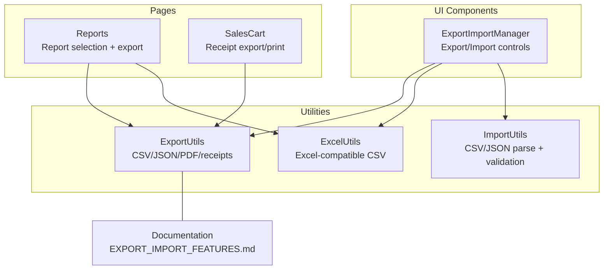
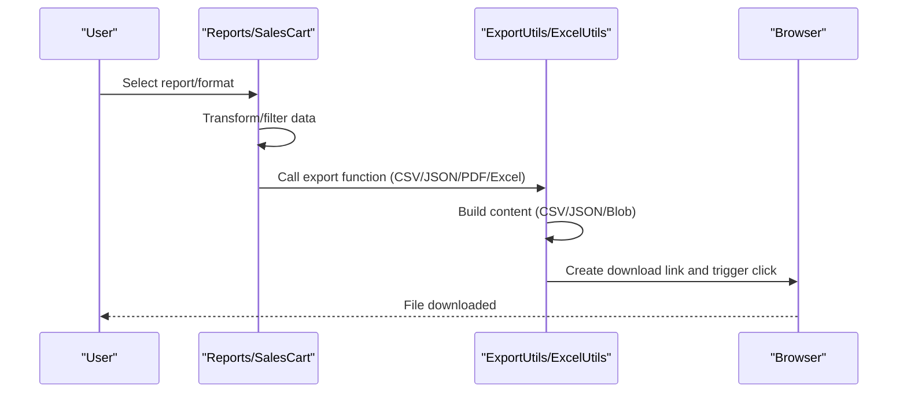
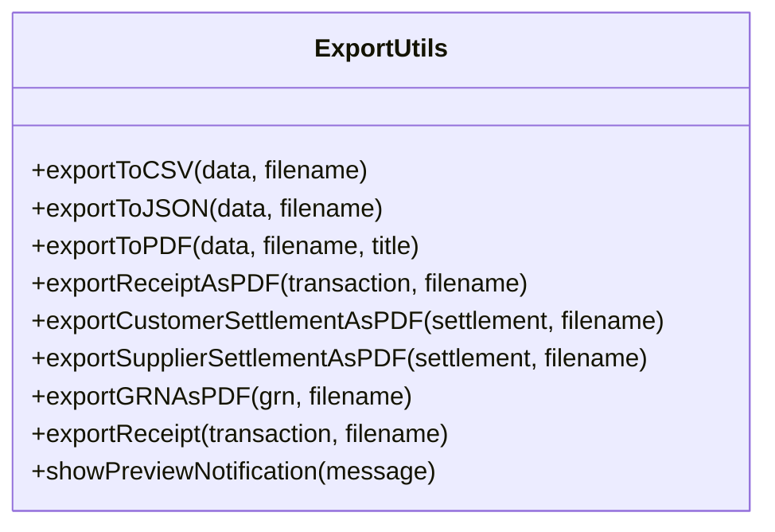
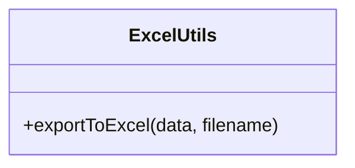
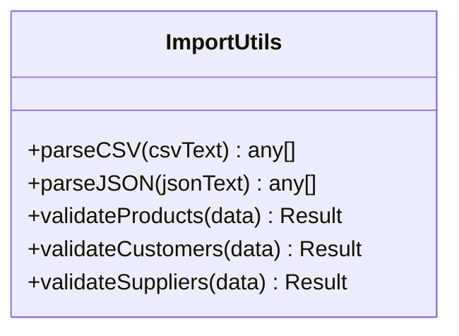
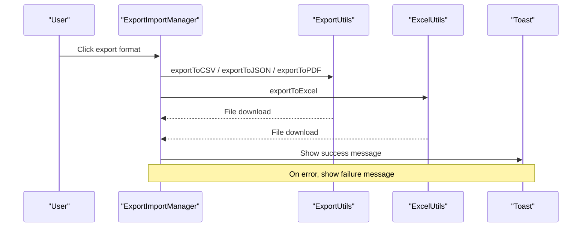
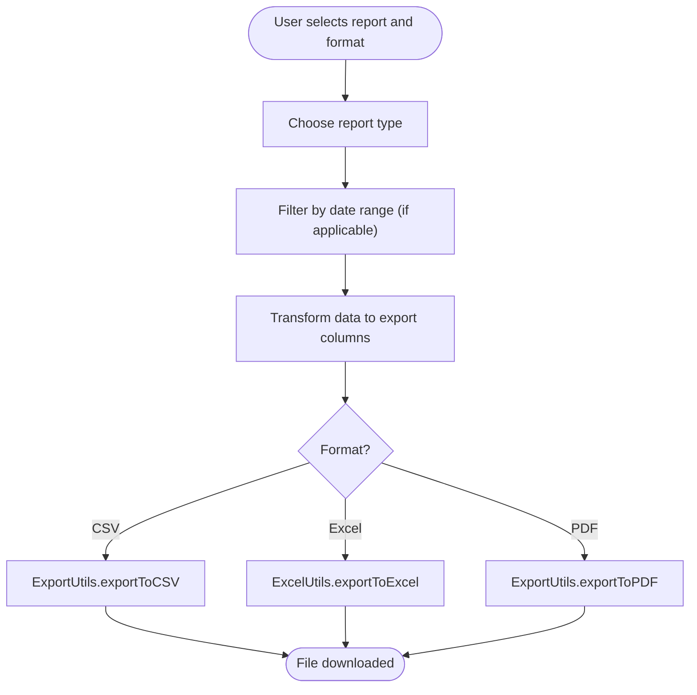
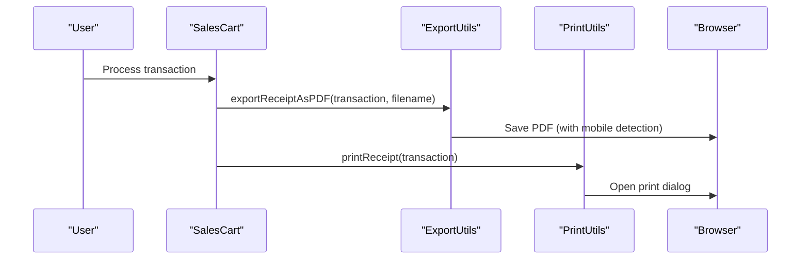
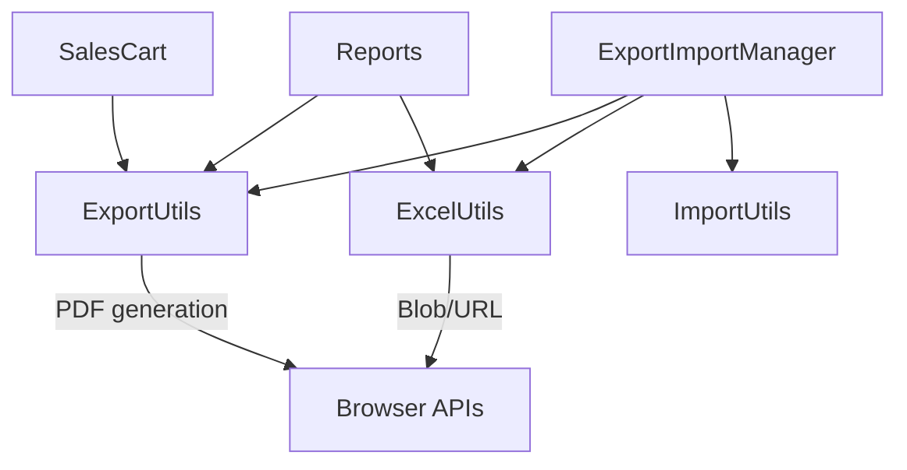

# Data Export Capabilities

<cite>
**Referenced Files in This Document**
- [exportUtils.ts](file://src/utils/exportUtils.ts)
- [excelUtils.ts](file://src/utils/excelUtils.ts)
- [importUtils.ts](file://src/utils/importUtils.ts)
- [ExportImportManager.tsx](file://src/components/ExportImportManager.tsx)
- [Reports.tsx](file://src/pages/Reports.tsx)
- [SalesCart.tsx](file://src/pages/SalesCart.tsx)
- [EXPORT_IMPORT_FEATURES.md](file://src/docs/EXPORT_IMPORT_FEATURES.md)
- [PDF_MOBILE_VIEWING.md](file://PDF_MOBILE_VIEWING.md)
</cite>

## Table of Contents
1. [Introduction](#introduction)
2. [Project Structure](#project-structure)
3. [Core Components](#core-components)
4. [Architecture Overview](#architecture-overview)
5. [Detailed Component Analysis](#detailed-component-analysis)
6. [Dependency Analysis](#dependency-analysis)
7. [Performance Considerations](#performance-considerations)
8. [Troubleshooting Guide](#troubleshooting-guide)
9. [Conclusion](#conclusion)
10. [Appendices](#appendices)

## Introduction
This document explains the data export system in Royal POS Modern, covering export to CSV, Excel, and PDF, along with related import and printing features. It documents the ExportUtils and ExcelUtils implementations, data transformation processes, export formatting options, and the end-to-end export workflow from report selection to file generation. It also addresses error handling, validation, practical examples, performance considerations for large datasets, and browser compatibility.

## Project Structure
The export system is implemented primarily in utility modules and integrated into reusable components and pages:
- Utilities: ExportUtils (CSV, JSON, PDF, receipts), ExcelUtils (Excel-compatible CSV), ImportUtils (CSV/JSON parsing and validation)
- Components: ExportImportManager (centralized export/import UI)
- Pages: Reports (report selection and export), SalesCart (receipt export and printing)
- Documentation: EXPORT_IMPORT_FEATURES.md and PDF_MOBILE_VIEWING.md

**Diagram sources**
- [exportUtils.ts:12-785](file://src/utils/exportUtils.ts#L12-L785)
- [excelUtils.ts:1-36](file://src/utils/excelUtils.ts#L1-L36)
- [importUtils.ts:1-114](file://src/utils/importUtils.ts#L1-L114)
- [ExportImportManager.tsx:1-259](file://src/components/ExportImportManager.tsx#L1-L259)
- [Reports.tsx:328-409](file://src/pages/Reports.tsx#L328-L409)
- [SalesCart.tsx:1560-1577](file://src/pages/SalesCart.tsx#L1560-L1577)
- [EXPORT_IMPORT_FEATURES.md:1-169](file://src/docs/EXPORT_IMPORT_FEATURES.md#L1-L169)

**Section sources**
- [exportUtils.ts:12-785](file://src/utils/exportUtils.ts#L12-L785)
- [excelUtils.ts:1-36](file://src/utils/excelUtils.ts#L1-L36)
- [importUtils.ts:1-114](file://src/utils/importUtils.ts#L1-L114)
- [ExportImportManager.tsx:1-259](file://src/components/ExportImportManager.tsx#L1-L259)
- [Reports.tsx:328-409](file://src/pages/Reports.tsx#L328-L409)
- [SalesCart.tsx:1560-1577](file://src/pages/SalesCart.tsx#L1560-L1577)
- [EXPORT_IMPORT_FEATURES.md:1-169](file://src/docs/EXPORT_IMPORT_FEATURES.md#L1-L169)

## Core Components
- ExportUtils: Provides exportToCSV, exportToJSON, exportToPDF, exportReceiptAsPDF, exportCustomerSettlementAsPDF, exportSupplierSettlementAsPDF, exportGRNAsPDF, and plain-text exportReceipt. Includes mobile detection and notifications for PDF saving.
- ExcelUtils: Exports Excel-compatible CSV with UTF-8 BOM and .xlsx extension for better Excel recognition.
- ImportUtils: Parses CSV and JSON, validates product/customer/supplier data structures.
- ExportImportManager: Reusable UI component to trigger exports (CSV, Excel, JSON, PDF) and imports (CSV, JSON) with validation and feedback.
- Reports page: Orchestrates report selection, filters by date range, transforms data, and invokes export functions.
- SalesCart: Integrates receipt export and printing, including plain text receipts and PDF receipts.

Key export formats and capabilities:
- CSV: exportToCSV(data, filename)
- JSON: exportToJSON(data, filename)
- Excel: exportToExcel(data, filename) produces Excel-compatible CSV with BOM
- PDF: exportToPDF(data, filename, title) for generic tables; specialized PDFs for receipts, settlements, and GRNs

**Section sources**
- [exportUtils.ts:14-109](file://src/utils/exportUtils.ts#L14-L109)
- [excelUtils.ts:4-35](file://src/utils/excelUtils.ts#L4-L35)
- [importUtils.ts:4-47](file://src/utils/importUtils.ts#L4-L47)
- [ExportImportManager.tsx:34-67](file://src/components/ExportImportManager.tsx#L34-L67)
- [Reports.tsx:328-409](file://src/pages/Reports.tsx#L328-L409)
- [SalesCart.tsx:1560-1577](file://src/pages/SalesCart.tsx#L1560-L1577)

## Architecture Overview
The export pipeline follows a consistent pattern:
- Data preparation: transform raw data into export-ready structures (field mapping, filtering by date range)
- Format selection: choose export function based on user choice
- File generation: create Blob, attach download link, trigger download
- Specialized formats: receipts, settlements, and GRNs use dedicated templates via jsPDF

**Diagram sources**
- [Reports.tsx:328-409](file://src/pages/Reports.tsx#L328-L409)
- [exportUtils.ts:14-109](file://src/utils/exportUtils.ts#L14-L109)
- [excelUtils.ts:4-35](file://src/utils/excelUtils.ts#L4-L35)

## Detailed Component Analysis

### ExportUtils
Responsibilities:
- CSV export: escape commas and quotes, join rows, create Blob and download link
- JSON export: stringify with indentation, create Blob and download link
- PDF export: create jsPDF with autoTable, add title, headers, rows, styles, margins
- Receipt PDF export: layout receipt-sized PDF with business info, customer info, items, totals, payment info
- Settlement PDF exports: customer and supplier settlement receipts with structured details
- GRN PDF export: goods received note with supplier, items, totals
- Plain text receipt export: human-readable receipt content
- Mobile optimization: detect mobile device, save PDF, show notification

**Diagram sources**
- [exportUtils.ts:12-785](file://src/utils/exportUtils.ts#L12-L785)

**Section sources**
- [exportUtils.ts:12-785](file://src/utils/exportUtils.ts#L12-L785)

### ExcelUtils
Responsibilities:
- Export Excel-compatible CSV with UTF-8 BOM and .xlsx extension
- Escape commas and quotes in values
- Create Blob and download link

**Diagram sources**
- [excelUtils.ts:2-36](file://src/utils/excelUtils.ts#L2-L36)

**Section sources**
- [excelUtils.ts:1-36](file://src/utils/excelUtils.ts#L1-L36)

### ImportUtils
Responsibilities:
- Parse CSV: split lines, trim headers, unescape quoted values, convert numbers
- Parse JSON: wrap single objects in array if needed
- Validate product/customer/supplier data structures with specific rules

**Diagram sources**
- [importUtils.ts:2-114](file://src/utils/importUtils.ts#L2-L114)

**Section sources**
- [importUtils.ts:1-114](file://src/utils/importUtils.ts#L1-L114)

### ExportImportManager
Responsibilities:
- Provide unified export/import UI
- Export: CSV, Excel, JSON, PDF via ExportUtils/ExcelUtils
- Import: CSV/JSON via ImportUtils, manual paste, validation per dataType
- Toast notifications for success/failure

**Diagram sources**
- [ExportImportManager.tsx:34-67](file://src/components/ExportImportManager.tsx#L34-L67)

**Section sources**
- [ExportImportManager.tsx:28-161](file://src/components/ExportImportManager.tsx#L28-L161)

### Reports Page Export Workflow
Responsibilities:
- Report selection: inventory, customers, suppliers, expenses, sales, saved invoices, saved customer settlements, saved deliveries
- Date filtering: filterDataByDateRange applied to time-series reports
- Data transformation: map raw fields to standardized export column names
- Export invocation: call ExportUtils.exportToCSV/ExcelUtils.exportToExcel/ExportUtils.exportToPDF

**Diagram sources**
- [Reports.tsx:328-409](file://src/pages/Reports.tsx#L328-L409)

**Section sources**
- [Reports.tsx:328-409](file://src/pages/Reports.tsx#L328-L409)

### SalesCart Receipt Export and Printing
Responsibilities:
- Receipt export: plain text receipt via ExportUtils.exportReceipt
- Receipt PDF: receipt-sized PDF via ExportUtils.exportReceiptAsPDF
- Printing: PrintUtils.printReceipt for browser print dialog

**Diagram sources**
- [SalesCart.tsx:1560-1577](file://src/pages/SalesCart.tsx#L1560-L1577)
- [exportUtils.ts:112-271](file://src/utils/exportUtils.ts#L112-L271)
- [EXPORT_IMPORT_FEATURES.md:28-36](file://src/docs/EXPORT_IMPORT_FEATURES.md#L28-L36)

**Section sources**
- [SalesCart.tsx:1560-1577](file://src/pages/SalesCart.tsx#L1560-L1577)
- [exportUtils.ts:112-271](file://src/utils/exportUtils.ts#L112-L271)
- [EXPORT_IMPORT_FEATURES.md:28-36](file://src/docs/EXPORT_IMPORT_FEATURES.md#L28-L36)

## Dependency Analysis
- ExportUtils depends on jsPDF and jspdf-autotable for PDF generation and table rendering.
- ExcelUtils depends on Blob and URL.createObjectURL for file download.
- ExportImportManager depends on ExportUtils, ExcelUtils, and ImportUtils.
- Reports page depends on ExportUtils and ExcelUtils for export, and on filter functions for date range filtering.
- SalesCart integrates ExportUtils for receipts and PrintUtils for browser printing.

**Diagram sources**
- [exportUtils.ts:1-10](file://src/utils/exportUtils.ts#L1-L10)
- [excelUtils.ts:1-36](file://src/utils/excelUtils.ts#L1-L36)
- [ExportImportManager.tsx:18-20](file://src/components/ExportImportManager.tsx#L18-L20)
- [Reports.tsx:328-409](file://src/pages/Reports.tsx#L328-L409)
- [SalesCart.tsx:1560-1577](file://src/pages/SalesCart.tsx#L1560-L1577)

**Section sources**
- [exportUtils.ts:1-10](file://src/utils/exportUtils.ts#L1-L10)
- [excelUtils.ts:1-36](file://src/utils/excelUtils.ts#L1-L36)
- [ExportImportManager.tsx:18-20](file://src/components/ExportImportManager.tsx#L18-L20)
- [Reports.tsx:328-409](file://src/pages/Reports.tsx#L328-L409)
- [SalesCart.tsx:1560-1577](file://src/pages/SalesCart.tsx#L1560-L1577)

## Performance Considerations
- Large datasets: CSV and JSON exports create Blobs in memory; very large arrays may impact memory usage. Consider chunking or server-side export for extremely large datasets.
- PDF generation: jsPDF with autoTable can be heavy for very large tables. Prefer CSV/Excel for bulk exports; use PDF for smaller, focused reports.
- Mobile optimization: ExportUtils detects mobile devices and saves PDFs directly, avoiding print dialog overhead.
- Excel compatibility: ExcelUtils adds a UTF-8 BOM and .xlsx extension to improve Excel recognition and character encoding.

[No sources needed since this section provides general guidance]

## Troubleshooting Guide
Common issues and resolutions:
- Empty or missing data: Ensure data arrays are non-empty before export; ExportUtils checks for empty data and returns early.
- Unsupported format: ExportImportManager throws an error for unsupported formats; verify format selection.
- Import validation failures: ImportUtils returns validation errors with row indices; review the first few errors shown in the toast.
- Mobile PDF download: ExportUtils.mobile detection triggers save and shows a notification; check device user agent detection.
- Excel encoding issues: Use ExcelUtils.exportToExcel to ensure UTF-8 BOM and .xlsx extension for proper Excel recognition.

**Section sources**
- [exportUtils.ts:14-109](file://src/utils/exportUtils.ts#L14-L109)
- [excelUtils.ts:4-35](file://src/utils/excelUtils.ts#L4-L35)
- [ExportImportManager.tsx:52-66](file://src/components/ExportImportManager.tsx#L52-L66)
- [importUtils.ts:49-113](file://src/utils/importUtils.ts#L49-L113)

## Conclusion
Royal POS Modern’s export system provides flexible, user-friendly export to CSV, Excel, JSON, and PDF, with specialized receipt and settlement exports. The system integrates cleanly through ExportUtils, ExcelUtils, and ImportUtils, and is surfaced via ExportImportManager and page-specific workflows in Reports and SalesCart. Mobile optimization and validation help ensure reliable exports across environments.

[No sources needed since this section summarizes without analyzing specific files]

## Appendices

### Export Data Structure and Field Mapping
- Generic reports (sales, expenses, saved invoices, settlements, deliveries): transformed to standardized columns before export.
- Inventory report: product fields mapped to export columns (e.g., productName, category, sku, barcode, currentStock, minStockLevel, maxStockLevel, unitOfMeasure, costPrice, sellingPrice, wholesalePrice, totalValue, status).
- Saved deliveries report: delivery fields mapped to export columns (e.g., deliveryNoteNumber, date, customer, items, total, vehicle, driver, status, paymentMethod).

**Section sources**
- [Reports.tsx:334-406](file://src/pages/Reports.tsx#L334-L406)

### Export Formatting Options
- CSV: Comma-separated values with escaped commas and quotes.
- JSON: Pretty-printed JSON with two-space indentation.
- Excel: CSV with UTF-8 BOM and .xlsx extension for Excel recognition.
- PDF: A4 portrait with autoTable, centered title, styled headers and alternating rows, margins, and mobile-specific save behavior.

**Section sources**
- [exportUtils.ts:14-109](file://src/utils/exportUtils.ts#L14-L109)
- [excelUtils.ts:4-35](file://src/utils/excelUtils.ts#L4-L35)

### Browser Compatibility and Mobile Notes
- PDF generation uses jsPDF with jspdf-autotable for cross-browser compatibility.
- Mobile detection triggers direct PDF save and shows a notification; desktop uses the browser print dialog.
- Excel exports rely on UTF-8 BOM and .xlsx extension to improve recognition and character display.

**Section sources**
- [exportUtils.ts:59-109](file://src/utils/exportUtils.ts#L59-L109)
- [PDF_MOBILE_VIEWING.md:1-23](file://PDF_MOBILE_VIEWING.md#L1-L23)

### Practical Examples
- Exporting a sales report: select “sales” report type, choose format (CSV/Excel/PDF), apply date range if needed, and trigger export from the Reports page.
- Exporting inventory as Excel: select “inventory” report type, choose Excel, and download the file.
- Exporting a receipt as PDF: process a transaction in SalesCart, choose “Export Receipt PDF,” and save on mobile or print on desktop.
- Importing product data: use ExportImportManager to upload CSV or paste JSON, choose format, and validate before import.

**Section sources**
- [Reports.tsx:328-409](file://src/pages/Reports.tsx#L328-L409)
- [SalesCart.tsx:1560-1577](file://src/pages/SalesCart.tsx#L1560-L1577)
- [ExportImportManager.tsx:69-161](file://src/components/ExportImportManager.tsx#L69-L161)
- [EXPORT_IMPORT_FEATURES.md:143-169](file://src/docs/EXPORT_IMPORT_FEATURES.md#L143-L169)