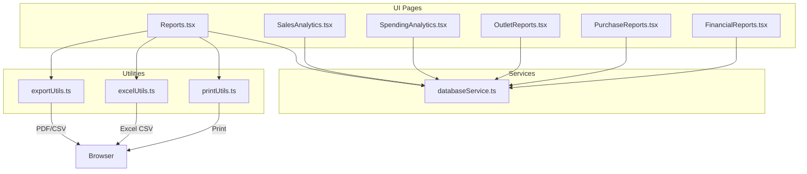
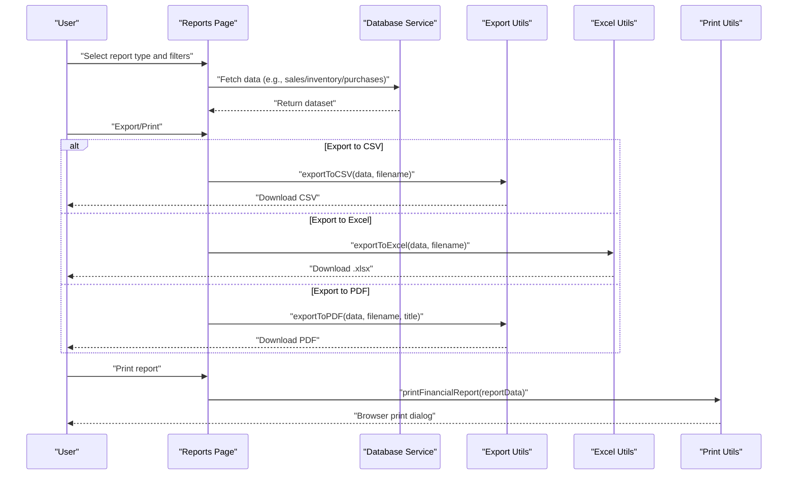
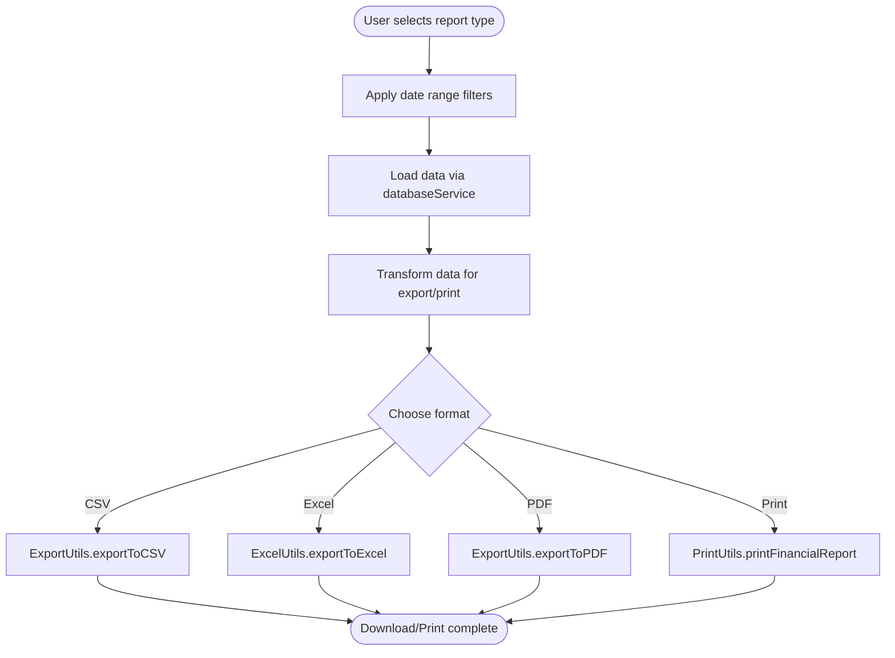
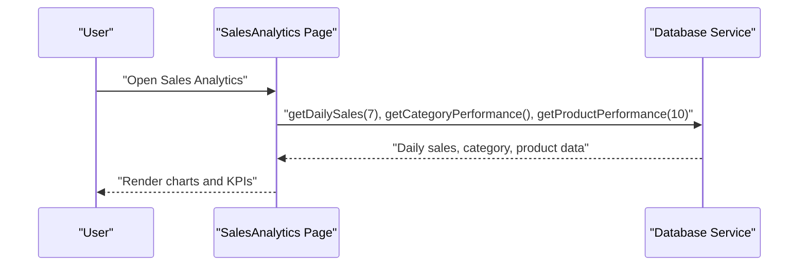
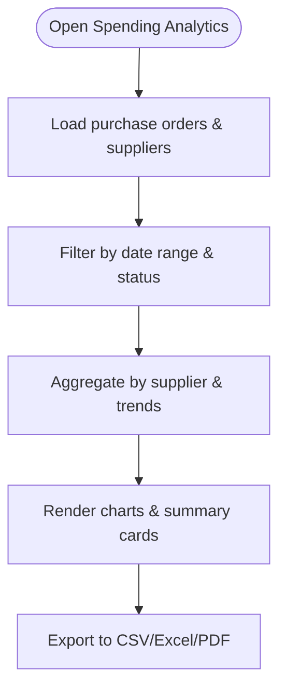
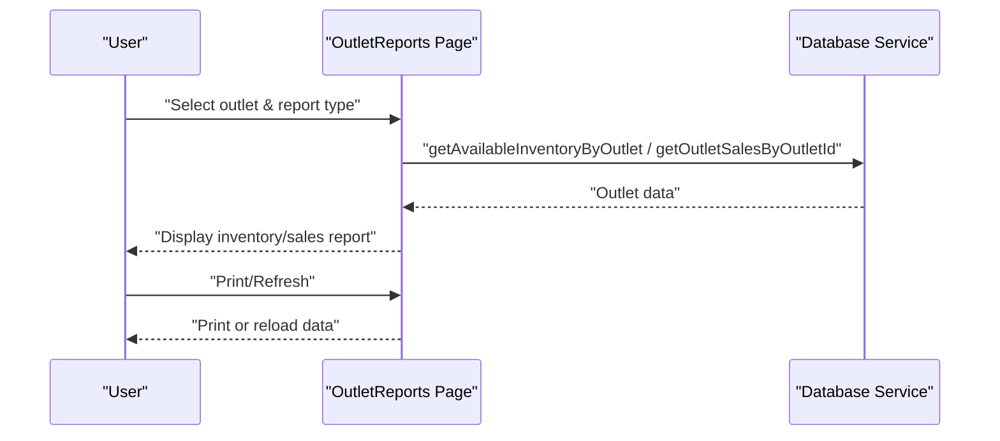
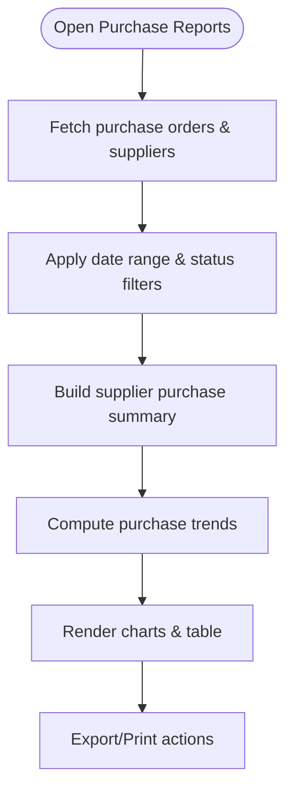
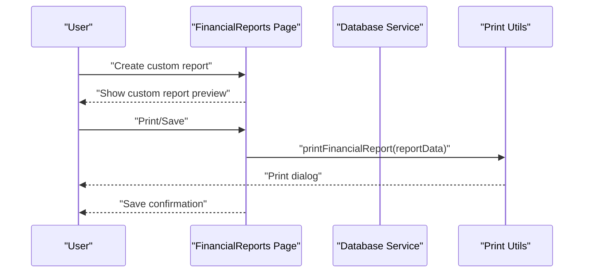
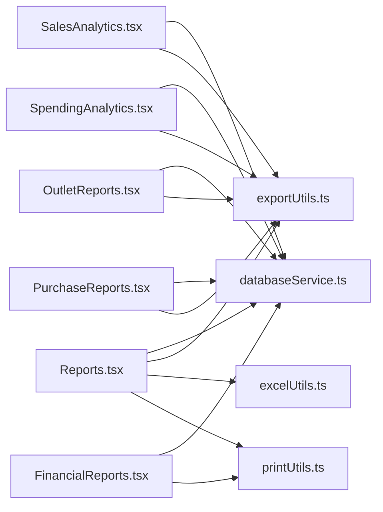

# Reports and Analytics

<cite>
**Referenced Files in This Document**
- [Reports.tsx](file://src/pages/Reports.tsx)
- [SalesAnalytics.tsx](file://src/pages/SalesAnalytics.tsx)
- [SpendingAnalytics.tsx](file://src/pages/SpendingAnalytics.tsx)
- [OutletReports.tsx](file://src/pages/OutletReports.tsx)
- [PurchaseReports.tsx](file://src/pages/PurchaseReports.tsx)
- [FinancialReports.tsx](file://src/pages/FinancialReports.tsx)
- [exportUtils.ts](file://src/utils/exportUtils.ts)
- [excelUtils.ts](file://src/utils/excelUtils.ts)
- [printUtils.ts](file://src/utils/printUtils.ts)
- [databaseService.ts](file://src/services/databaseService.ts)
</cite>

## Table of Contents
1. [Introduction](#introduction)
2. [Project Structure](#project-structure)
3. [Core Components](#core-components)
4. [Architecture Overview](#architecture-overview)
5. [Detailed Component Analysis](#detailed-component-analysis)
6. [Dependency Analysis](#dependency-analysis)
7. [Performance Considerations](#performance-considerations)
8. [Troubleshooting Guide](#troubleshooting-guide)
9. [Conclusion](#conclusion)

## Introduction
This document explains the reporting and analytics capabilities of the Royal POS Modern system. It covers:
- Custom report generation and filtering
- Data export to PDF, Excel, and CSV
- Sales analytics dashboard with revenue tracking and trend analysis
- Spending analytics for expense and purchase tracking
- Reporting engine architecture, data aggregation, and filtering
- Practical examples for generating reports, exporting data, and interpreting insights
- Integration points with external BI tools via exports

## Project Structure
The reporting system is organized around dedicated pages for each report type, shared utilities for exporting and printing, and a centralized database service for data access.

**Diagram sources**
- [Reports.tsx:1-800](file://src/pages/Reports.tsx#L1-800)
- [SalesAnalytics.tsx:1-496](file://src/pages/SalesAnalytics.tsx#L1-496)
- [SpendingAnalytics.tsx:1-441](file://src/pages/SpendingAnalytics.tsx#L1-441)
- [OutletReports.tsx:1-800](file://src/pages/OutletReports.tsx#L1-800)
- [PurchaseReports.tsx:1-439](file://src/pages/PurchaseReports.tsx#L1-439)
- [FinancialReports.tsx:1-800](file://src/pages/FinancialReports.tsx#L1-800)
- [exportUtils.ts:1-785](file://src/utils/exportUtils.ts#L1-785)
- [excelUtils.ts:1-36](file://src/utils/excelUtils.ts#L1-36)
- [printUtils.ts:1-800](file://src/utils/printUtils.ts#L1-800)
- [databaseService.ts:1-800](file://src/services/databaseService.ts#L1-800)

**Section sources**
- [Reports.tsx:1-800](file://src/pages/Reports.tsx#L1-800)
- [SalesAnalytics.tsx:1-496](file://src/pages/SalesAnalytics.tsx#L1-496)
- [SpendingAnalytics.tsx:1-441](file://src/pages/SpendingAnalytics.tsx#L1-441)
- [OutletReports.tsx:1-800](file://src/pages/OutletReports.tsx#L1-800)
- [PurchaseReports.tsx:1-439](file://src/pages/PurchaseReports.tsx#L1-439)
- [FinancialReports.tsx:1-800](file://src/pages/FinancialReports.tsx#L1-800)
- [exportUtils.ts:1-785](file://src/utils/exportUtils.ts#L1-785)
- [excelUtils.ts:1-36](file://src/utils/excelUtils.ts#L1-36)
- [printUtils.ts:1-800](file://src/utils/printUtils.ts#L1-800)
- [databaseService.ts:1-800](file://src/services/databaseService.ts#L1-800)

## Core Components
- Reports page: Central hub for selecting report types, applying date filters, and exporting/printing data.
- Sales analytics: Revenue, transactions, and performance metrics with charts and KPIs.
- Spending analytics: Purchase orders, supplier trends, and spending summaries.
- Outlet reports: Outlet-specific inventory, sales, and performance views.
- Purchase reports: Supplier purchase summaries and trends.
- Financial reports: Built-in financial statements and custom report builder.
- Export/print utilities: Unified export to CSV/PDF/Excel and printing.
- Database service: Data access for sales, inventory, purchases, and financial records.

**Section sources**
- [Reports.tsx:67-409](file://src/pages/Reports.tsx#L67-409)
- [SalesAnalytics.tsx:114-156](file://src/pages/SalesAnalytics.tsx#L114-156)
- [SpendingAnalytics.tsx:40-77](file://src/pages/SpendingAnalytics.tsx#L40-77)
- [OutletReports.tsx:113-188](file://src/pages/OutletReports.tsx#L113-188)
- [PurchaseReports.tsx:36-73](file://src/pages/PurchaseReports.tsx#L36-73)
- [FinancialReports.tsx:70-630](file://src/pages/FinancialReports.tsx#L70-630)
- [exportUtils.ts:12-109](file://src/utils/exportUtils.ts#L12-109)
- [excelUtils.ts:2-35](file://src/utils/excelUtils.ts#L2-35)
- [printUtils.ts:7-45](file://src/utils/printUtils.ts#L7-45)
- [databaseService.ts:497-510](file://src/services/databaseService.ts#L497-510)

## Architecture Overview
The reporting engine follows a layered pattern:
- UI pages orchestrate user interactions, filters, and actions.
- Utilities encapsulate export/print logic.
- Services abstract data access to the backend.

**Diagram sources**
- [Reports.tsx:327-409](file://src/pages/Reports.tsx#L327-409)
- [exportUtils.ts:14-41](file://src/utils/exportUtils.ts#L14-41)
- [excelUtils.ts:4-35](file://src/utils/excelUtils.ts#L4-35)
- [printUtils.ts:47-418](file://src/utils/printUtils.ts#L47-418)
- [databaseService.ts:497-510](file://src/services/databaseService.ts#L497-510)

## Detailed Component Analysis

### Reports Page: Custom Report Generation and Export
- Supports multiple report types (sales, inventory, customers, suppliers, expenses, saved invoices/settlements/deliveries).
- Date range filtering with presets (today, yesterday, this week/month/year/all-time).
- Export to CSV, Excel (.xlsx), and PDF; print financial reports.
- Real-time filtering transforms raw data into export-friendly structures.

**Diagram sources**
- [Reports.tsx:67-409](file://src/pages/Reports.tsx#L67-409)
- [exportUtils.ts:14-109](file://src/utils/exportUtils.ts#L14-109)
- [excelUtils.ts:4-35](file://src/utils/excelUtils.ts#L4-35)
- [printUtils.ts:47-418](file://src/utils/printUtils.ts#L47-418)
- [databaseService.ts:497-510](file://src/services/databaseService.ts#L497-510)

**Section sources**
- [Reports.tsx:67-409](file://src/pages/Reports.tsx#L67-409)
- [exportUtils.ts:14-109](file://src/utils/exportUtils.ts#L14-109)
- [excelUtils.ts:4-35](file://src/utils/excelUtils.ts#L4-35)
- [printUtils.ts:47-418](file://src/utils/printUtils.ts#L47-418)
- [databaseService.ts:497-510](file://src/services/databaseService.ts#L497-510)

### Sales Analytics Dashboard
- Displays KPIs (revenue, transactions, AOV, active customers).
- Charts: weekly sales (bar), customer retention (line), payment methods (pie).
- View modes: category vs product performance.
- Data fetched in parallel for responsiveness.

**Diagram sources**
- [SalesAnalytics.tsx:130-156](file://src/pages/SalesAnalytics.tsx#L130-156)
- [databaseService.ts:497-510](file://src/services/databaseService.ts#L497-510)

**Section sources**
- [SalesAnalytics.tsx:114-496](file://src/pages/SalesAnalytics.tsx#L114-496)
- [databaseService.ts:497-510](file://src/services/databaseService.ts#L497-510)

### Spending Analytics
- Filters purchase orders by date range and status.
- Calculates spending by supplier, trends, and summaries.
- Provides charts for spending trends and supplier distribution.

**Diagram sources**
- [SpendingAnalytics.tsx:48-187](file://src/pages/SpendingAnalytics.tsx#L48-187)
- [databaseService.ts:185-210](file://src/services/databaseService.ts#L185-210)

**Section sources**
- [SpendingAnalytics.tsx:40-441](file://src/pages/SpendingAnalytics.tsx#L40-441)
- [databaseService.ts:185-210](file://src/services/databaseService.ts#L185-210)

### Outlet Reports
- Outlet-specific inventory and sales views.
- Inventory report with category breakdown, stock status, and alerts.
- Sales report with date-range selection and product performance.

**Diagram sources**
- [OutletReports.tsx:113-188](file://src/pages/OutletReports.tsx#L113-188)
- [databaseService.ts:129-149](file://src/services/databaseService.ts#L129-149)

**Section sources**
- [OutletReports.tsx:113-800](file://src/pages/OutletReports.tsx#L113-800)
- [databaseService.ts:129-149](file://src/services/databaseService.ts#L129-149)

### Purchase Reports
- Supplier purchase summaries and performance.
- Purchase trends chart and supplier performance pie.
- Export to CSV and print/report actions.

**Diagram sources**
- [PurchaseReports.tsx:36-183](file://src/pages/PurchaseReports.tsx#L36-183)
- [databaseService.ts:185-210](file://src/services/databaseService.ts#L185-210)

**Section sources**
- [PurchaseReports.tsx:36-439](file://src/pages/PurchaseReports.tsx#L36-439)
- [databaseService.ts:185-210](file://src/services/databaseService.ts#L185-210)

### Financial Reports: Custom Reports and Statements
- Built-in financial statements (Income, Balance, Cash Flow, Fund Flow, Trial Balance, Expense, Tax Summary, Profitability).
- Custom report builder with title, description, and date range.
- Printing and saving workflows for custom reports.

**Diagram sources**
- [FinancialReports.tsx:492-630](file://src/pages/FinancialReports.tsx#L492-630)
- [printUtils.ts:47-418](file://src/utils/printUtils.ts#L47-418)
- [databaseService.ts:311-326](file://src/services/databaseService.ts#L311-326)

**Section sources**
- [FinancialReports.tsx:70-800](file://src/pages/FinancialReports.tsx#L70-800)
- [printUtils.ts:47-418](file://src/utils/printUtils.ts#L47-418)
- [databaseService.ts:311-326](file://src/services/databaseService.ts#L311-326)

## Dependency Analysis
- UI pages depend on databaseService for data retrieval.
- Export/print utilities are reusable across pages.
- Filtering logic is centralized in the Reports page and reused in others.

**Diagram sources**
- [Reports.tsx:1-800](file://src/pages/Reports.tsx#L1-800)
- [SalesAnalytics.tsx:1-496](file://src/pages/SalesAnalytics.tsx#L1-496)
- [SpendingAnalytics.tsx:1-441](file://src/pages/SpendingAnalytics.tsx#L1-441)
- [OutletReports.tsx:1-800](file://src/pages/OutletReports.tsx#L1-800)
- [PurchaseReports.tsx:1-439](file://src/pages/PurchaseReports.tsx#L1-439)
- [FinancialReports.tsx:1-800](file://src/pages/FinancialReports.tsx#L1-800)
- [exportUtils.ts:1-785](file://src/utils/exportUtils.ts#L1-785)
- [excelUtils.ts:1-36](file://src/utils/excelUtils.ts#L1-36)
- [printUtils.ts:1-800](file://src/utils/printUtils.ts#L1-800)
- [databaseService.ts:1-800](file://src/services/databaseService.ts#L1-800)

**Section sources**
- [Reports.tsx:1-800](file://src/pages/Reports.tsx#L1-800)
- [SalesAnalytics.tsx:1-496](file://src/pages/SalesAnalytics.tsx#L1-496)
- [SpendingAnalytics.tsx:1-441](file://src/pages/SpendingAnalytics.tsx#L1-441)
- [OutletReports.tsx:1-800](file://src/pages/OutletReports.tsx#L1-800)
- [PurchaseReports.tsx:1-439](file://src/pages/PurchaseReports.tsx#L1-439)
- [FinancialReports.tsx:1-800](file://src/pages/FinancialReports.tsx#L1-800)
- [exportUtils.ts:1-785](file://src/utils/exportUtils.ts#L1-785)
- [excelUtils.ts:1-36](file://src/utils/excelUtils.ts#L1-36)
- [printUtils.ts:1-800](file://src/utils/printUtils.ts#L1-800)
- [databaseService.ts:1-800](file://src/services/databaseService.ts#L1-800)

## Performance Considerations
- Parallel data fetching in analytics pages reduces latency.
- Client-side filtering and aggregation keep UI responsive; consider server-side aggregation for very large datasets.
- Export utilities stream downloads; ensure large datasets are paginated or pre-aggregated.

[No sources needed since this section provides general guidance]

## Troubleshooting Guide
- Export failures: Verify data arrays are non-empty before exporting; confirm browser supports Blob/download.
- Print issues: Mobile devices may require saving PDFs; ensure print templates render correctly.
- Data not loading: Confirm databaseService calls succeed and toast notifications surface errors.
- Filtering anomalies: Validate date parsing and range boundaries.

**Section sources**
- [Reports.tsx:327-409](file://src/pages/Reports.tsx#L327-409)
- [exportUtils.ts:14-41](file://src/utils/exportUtils.ts#L14-41)
- [printUtils.ts:47-418](file://src/utils/printUtils.ts#L47-418)
- [SpendingAnalytics.tsx:64-77](file://src/pages/SpendingAnalytics.tsx#L64-77)

## Conclusion
Royal POS Modern’s reporting system provides a robust foundation for custom report generation, export, and analytics. The modular architecture enables consistent data access, flexible filtering, and multiple output formats. By leveraging built-in dashboards and utilities, users can track sales performance, spending trends, and outlet-specific metrics while exporting data for external analysis and BI tool integration.