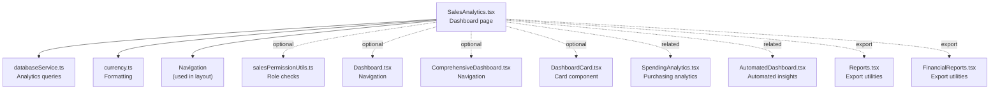
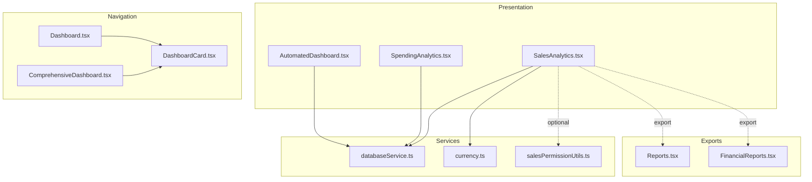
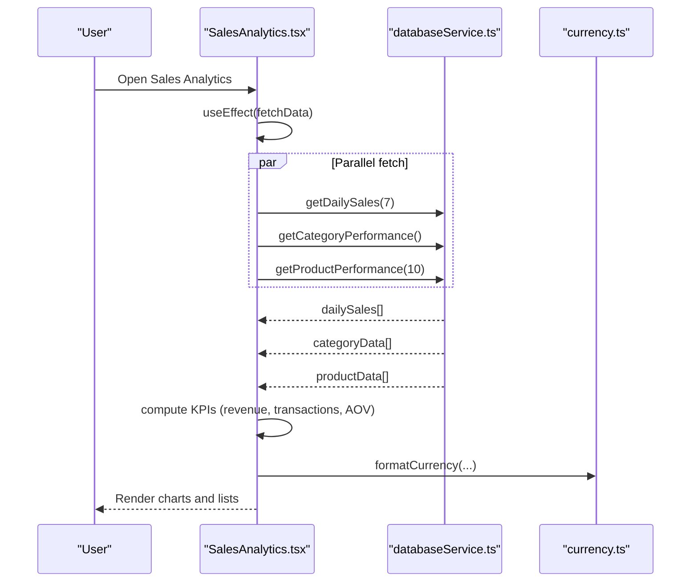
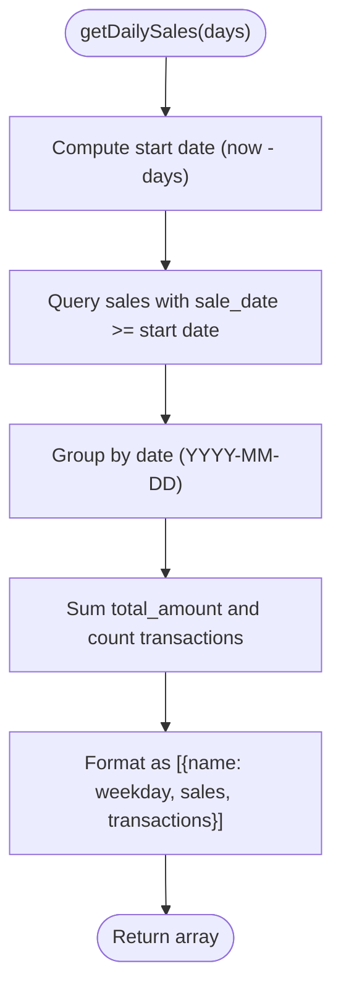
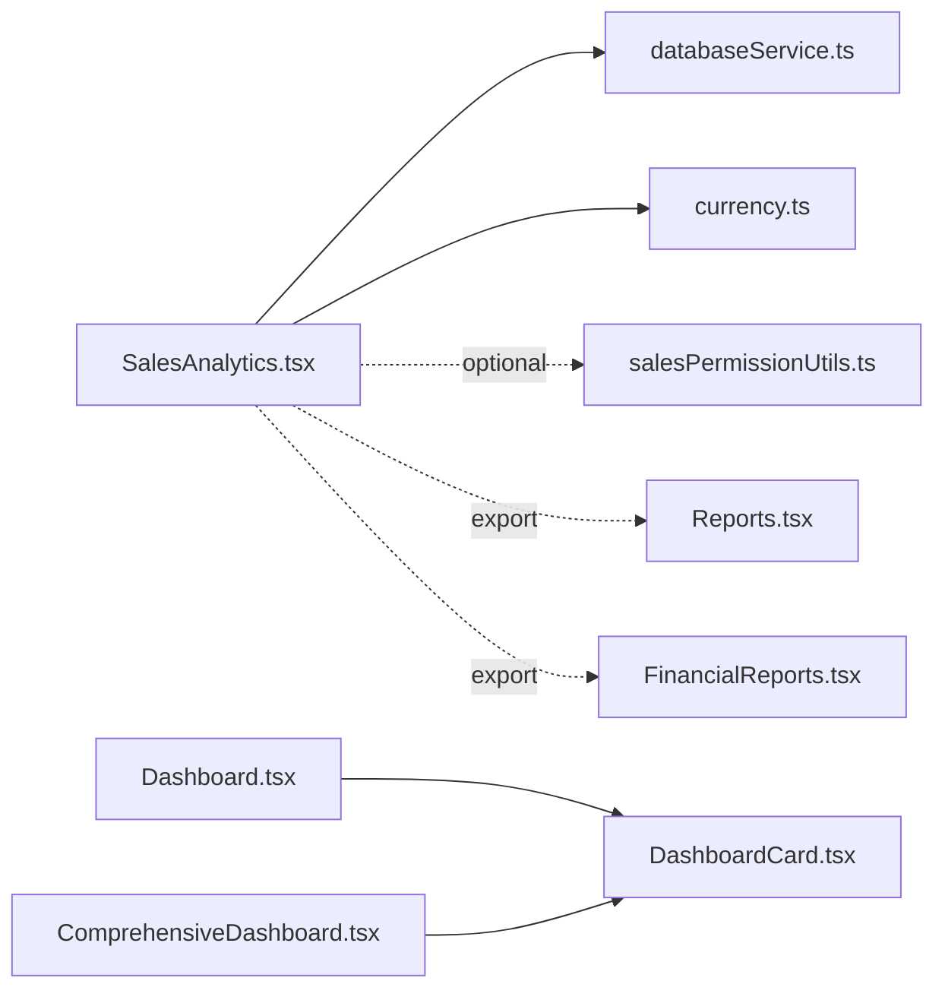

# Sales Analytics Dashboard

<cite>
**Referenced Files in This Document**
- [SalesAnalytics.tsx](file://src/pages/SalesAnalytics.tsx)
- [databaseService.ts](file://src/services/databaseService.ts)
- [currency.ts](file://src/lib/currency.ts)
- [salesPermissionUtils.ts](file://src/utils/salesPermissionUtils.ts)
- [Dashboard.tsx](file://src/pages/Dashboard.tsx)
- [ComprehensiveDashboard.tsx](file://src/pages/ComprehensiveDashboard.tsx)
- [DashboardCard.tsx](file://src/components/DashboardCard.tsx)
- [SpendingAnalytics.tsx](file://src/pages/SpendingAnalytics.tsx)
- [AutomatedDashboard.tsx](file://src/pages/AutomatedDashboard.tsx)
- [Reports.tsx](file://src/pages/Reports.tsx)
- [FinancialReports.tsx](file://src/pages/FinancialReports.tsx)
</cite>

## Table of Contents
1. [Introduction](#introduction)
2. [Project Structure](#project-structure)
3. [Core Components](#core-components)
4. [Architecture Overview](#architecture-overview)
5. [Detailed Component Analysis](#detailed-component-analysis)
6. [Dependency Analysis](#dependency-analysis)
7. [Performance Considerations](#performance-considerations)
8. [Troubleshooting Guide](#troubleshooting-guide)
9. [Conclusion](#conclusion)
10. [Appendices](#appendices)

## Introduction
This document explains the sales analytics dashboard system, focusing on sales performance metrics, revenue tracking, and trend analysis. It covers dashboard components such as revenue charts, sales trends, top-selling products, and customer analytics. It also documents data aggregation methods, time-series analysis, comparative reporting, integration with sales transactions, inventory data, and customer information. Guidance is included for real-time data updates, historical analysis, forecasting, customization, filters, and export functionality.

## Project Structure
The analytics dashboard is implemented as a React page component that integrates with a Supabase-backed data service. The dashboard supports role-based navigation to related dashboards and modules.

**Diagram sources**
- [SalesAnalytics.tsx:114-496](file://src/pages/SalesAnalytics.tsx#L114-L496)
- [databaseService.ts:2806-2973](file://src/services/databaseService.ts#L2806-L2973)
- [currency.ts:6-14](file://src/lib/currency.ts#L6-L14)
- [salesPermissionUtils.ts:94-171](file://src/utils/salesPermissionUtils.ts#L94-L171)
- [Dashboard.tsx:33-215](file://src/pages/Dashboard.tsx#L33-L215)
- [ComprehensiveDashboard.tsx:38-403](file://src/pages/ComprehensiveDashboard.tsx#L38-L403)
- [DashboardCard.tsx:13-51](file://src/components/DashboardCard.tsx#L13-L51)
- [SpendingAnalytics.tsx:40-441](file://src/pages/SpendingAnalytics.tsx#L40-L441)
- [AutomatedDashboard.tsx:62-151](file://src/pages/AutomatedDashboard.tsx#L62-L151)
- [Reports.tsx:329-355](file://src/pages/Reports.tsx#L329-L355)
- [FinancialReports.tsx:485-525](file://src/pages/FinancialReports.tsx#L485-L525)

**Section sources**
- [SalesAnalytics.tsx:114-496](file://src/pages/SalesAnalytics.tsx#L114-L496)
- [databaseService.ts:2806-2973](file://src/services/databaseService.ts#L2806-L2973)
- [currency.ts:6-14](file://src/lib/currency.ts#L6-L14)
- [salesPermissionUtils.ts:94-171](file://src/utils/salesPermissionUtils.ts#L94-L171)
- [Dashboard.tsx:33-215](file://src/pages/Dashboard.tsx#L33-L215)
- [ComprehensiveDashboard.tsx:38-403](file://src/pages/ComprehensiveDashboard.tsx#L38-L403)
- [DashboardCard.tsx:13-51](file://src/components/DashboardCard.tsx#L13-L51)
- [SpendingAnalytics.tsx:40-441](file://src/pages/SpendingAnalytics.tsx#L40-L441)
- [AutomatedDashboard.tsx:62-151](file://src/pages/AutomatedDashboard.tsx#L62-L151)
- [Reports.tsx:329-355](file://src/pages/Reports.tsx#L329-L355)
- [FinancialReports.tsx:485-525](file://src/pages/FinancialReports.tsx#L485-L525)

## Core Components
- SalesAnalytics page: Renders KPI cards, weekly sales bar chart, customer retention line chart, category/product performance lists, payment methods pie chart, and recent activity.
- Analytics data service: Provides functions to fetch daily sales, category performance, and product performance with time windows and aggregations.
- Currency formatting: Formats amounts in TZS for display consistency.
- Role-based navigation: Dashboard pages and cards support role-aware module access.

Key responsibilities:
- Data fetching: Parallel fetches for daily sales, category performance, and top products.
- Aggregation: Summation of sales and transactions, averages, and growth calculations.
- Visualization: Recharts-based charts and responsive containers.
- Formatting: Currency formatting and tooltip helpers.

**Section sources**
- [SalesAnalytics.tsx:114-496](file://src/pages/SalesAnalytics.tsx#L114-L496)
- [databaseService.ts:2806-2973](file://src/services/databaseService.ts#L2806-L2973)
- [currency.ts:6-14](file://src/lib/currency.ts#L6-L14)
- [salesPermissionUtils.ts:94-171](file://src/utils/salesPermissionUtils.ts#L94-L171)

## Architecture Overview
The dashboard architecture follows a layered pattern:
- Presentation layer: SalesAnalytics page renders UI and charts.
- Service layer: databaseService.ts encapsulates Supabase queries for analytics.
- Utility layer: currency.ts provides formatting; salesPermissionUtils.ts enforces access control.
- Navigation layer: Dashboard.tsx and ComprehensiveDashboard.tsx provide role-aware module navigation.

**Diagram sources**
- [SalesAnalytics.tsx:114-496](file://src/pages/SalesAnalytics.tsx#L114-L496)
- [databaseService.ts:2806-2973](file://src/services/databaseService.ts#L2806-L2973)
- [currency.ts:6-14](file://src/lib/currency.ts#L6-L14)
- [salesPermissionUtils.ts:94-171](file://src/utils/salesPermissionUtils.ts#L94-L171)
- [Dashboard.tsx:33-215](file://src/pages/Dashboard.tsx#L33-L215)
- [ComprehensiveDashboard.tsx:38-403](file://src/pages/ComprehensiveDashboard.tsx#L38-L403)
- [DashboardCard.tsx:13-51](file://src/components/DashboardCard.tsx#L13-L51)
- [SpendingAnalytics.tsx:40-441](file://src/pages/SpendingAnalytics.tsx#L40-L441)
- [AutomatedDashboard.tsx:62-151](file://src/pages/AutomatedDashboard.tsx#L62-L151)
- [Reports.tsx:329-355](file://src/pages/Reports.tsx#L329-L355)
- [FinancialReports.tsx:485-525](file://src/pages/FinancialReports.tsx#L485-L525)

## Detailed Component Analysis

### SalesAnalytics Page
Responsibilities:
- Fetches analytics data in parallel: daily sales, category performance, product performance.
- Computes KPIs: total revenue, transactions, average order value, active customers, conversion rate, CLV, average transaction time.
- Renders:
  - KPI summary cards with trend indicators.
  - Weekly sales bar chart (sales vs transactions).
  - Customer retention line chart.
  - Category vs product performance lists with growth indicators.
  - Payment methods pie chart.
  - Recent activity list.

Data sources and transformations:
- Daily sales grouped by weekday and aggregated by sales and transaction counts.
- Category performance aggregated by category sales and quantities.
- Product performance aggregated by product sales and quantities, enriched with category names.

**Diagram sources**
- [SalesAnalytics.tsx:130-156](file://src/pages/SalesAnalytics.tsx#L130-L156)
- [databaseService.ts:2806-2841](file://src/services/databaseService.ts#L2806-L2841)
- [databaseService.ts:2844-2892](file://src/services/databaseService.ts#L2844-L2892)
- [databaseService.ts:2894-2962](file://src/services/databaseService.ts#L2894-L2962)
- [currency.ts:6-14](file://src/lib/currency.ts#L6-L14)

**Section sources**
- [SalesAnalytics.tsx:114-496](file://src/pages/SalesAnalytics.tsx#L114-L496)
- [databaseService.ts:2806-2973](file://src/services/databaseService.ts#L2806-L2973)
- [currency.ts:6-14](file://src/lib/currency.ts#L6-L14)

### Analytics Data Service
Functions:
- getDailySales(days): Groups sales by date within a rolling window and aggregates sales and transaction counts.
- getCategoryPerformance(): Joins sale items with products and categories, sums sales and quantities for the last 30 days, and computes growth.
- getProductPerformance(limit): Similar aggregation by product, sorts by sales, limits results, enriches with category names, and computes growth.
- Helper: calculateGrowth(current, previous), formatDate(date).

**Diagram sources**
- [databaseService.ts:2806-2841](file://src/services/databaseService.ts#L2806-L2841)

**Section sources**
- [databaseService.ts:2806-2973](file://src/services/databaseService.ts#L2806-L2973)

### Currency Formatting
- formatCurrency(amount): Formats numeric amounts as Tanzanian Shillings (TZS) with two decimals and grouping.
- parseCurrency(currencyString): Parses formatted currency strings back to numbers.

**Section sources**
- [currency.ts:6-14](file://src/lib/currency.ts#L6-L14)

### Role-Based Navigation
- getCurrentUserRole(): Resolves current user role from Supabase auth and users table.
- hasModuleAccess(role, module): Enforces role-based access to modules in dashboards.

**Section sources**
- [salesPermissionUtils.ts:26-86](file://src/utils/salesPermissionUtils.ts#L26-L86)
- [salesPermissionUtils.ts:94-171](file://src/utils/salesPermissionUtils.ts#L94-L171)
- [Dashboard.tsx:33-215](file://src/pages/Dashboard.tsx#L33-L215)
- [ComprehensiveDashboard.tsx:38-403](file://src/pages/ComprehensiveDashboard.tsx#L38-L403)
- [DashboardCard.tsx:13-51](file://src/components/DashboardCard.tsx#L13-L51)

### Related Dashboards and Integrations
- SpendingAnalytics: Purchase orders, supplier spending, trends, filters, and refresh actions.
- AutomatedDashboard: Automated insights, recommendations, and periodic refresh.

**Section sources**
- [SpendingAnalytics.tsx:40-441](file://src/pages/SpendingAnalytics.tsx#L40-L441)
- [AutomatedDashboard.tsx:62-151](file://src/pages/AutomatedDashboard.tsx#L62-L151)

## Dependency Analysis
- SalesAnalytics depends on:
  - databaseService.ts for analytics queries.
  - currency.ts for formatting.
  - Optional: salesPermissionUtils.ts for role checks.
  - Optional: Dashboard.tsx/ComprehensiveDashboard.tsx for navigation.
- databaseService.ts depends on Supabase client for data access.
- Export functionality integrates with Reports.tsx and FinancialReports.tsx.

**Diagram sources**
- [SalesAnalytics.tsx:114-496](file://src/pages/SalesAnalytics.tsx#L114-L496)
- [databaseService.ts:2806-2973](file://src/services/databaseService.ts#L2806-L2973)
- [currency.ts:6-14](file://src/lib/currency.ts#L6-L14)
- [salesPermissionUtils.ts:94-171](file://src/utils/salesPermissionUtils.ts#L94-L171)
- [Dashboard.tsx:33-215](file://src/pages/Dashboard.tsx#L33-L215)
- [ComprehensiveDashboard.tsx:38-403](file://src/pages/ComprehensiveDashboard.tsx#L38-L403)
- [DashboardCard.tsx:13-51](file://src/components/DashboardCard.tsx#L13-L51)
- [Reports.tsx:329-355](file://src/pages/Reports.tsx#L329-L355)
- [FinancialReports.tsx:485-525](file://src/pages/FinancialReports.tsx#L485-L525)

**Section sources**
- [SalesAnalytics.tsx:114-496](file://src/pages/SalesAnalytics.tsx#L114-L496)
- [databaseService.ts:2806-2973](file://src/services/databaseService.ts#L2806-L2973)
- [currency.ts:6-14](file://src/lib/currency.ts#L6-L14)
- [salesPermissionUtils.ts:94-171](file://src/utils/salesPermissionUtils.ts#L94-L171)
- [Dashboard.tsx:33-215](file://src/pages/Dashboard.tsx#L33-L215)
- [ComprehensiveDashboard.tsx:38-403](file://src/pages/ComprehensiveDashboard.tsx#L38-L403)
- [DashboardCard.tsx:13-51](file://src/components/DashboardCard.tsx#L13-L51)
- [Reports.tsx:329-355](file://src/pages/Reports.tsx#L329-L355)
- [FinancialReports.tsx:485-525](file://src/pages/FinancialReports.tsx#L485-L525)

## Performance Considerations
- Parallel data fetching: The dashboard fetches daily sales, category performance, and product performance concurrently to reduce load time.
- Aggregation windows: Time windows (e.g., last 7 days for daily sales, last 30 days for category/product) balance responsiveness with meaningful insights.
- Chart rendering: Recharts components are wrapped in responsive containers; avoid excessive re-renders by memoizing computed KPIs and data arrays.
- Currency formatting: Centralized formatting reduces repeated locale computations.

[No sources needed since this section provides general guidance]

## Troubleshooting Guide
Common issues and resolutions:
- Data loading errors: The dashboard displays an error state with a retry option when analytics queries fail.
- Empty datasets: Ensure Supabase tables (sales, sale_items, categories, products) are populated and accessible.
- Role access: If navigation modules are missing, verify getCurrentUserRole and hasModuleAccess logic.
- Export failures: Confirm export handlers in Reports.tsx and FinancialReports.tsx are invoked with valid parameters.

**Section sources**
- [SalesAnalytics.tsx:180-190](file://src/pages/SalesAnalytics.tsx#L180-L190)
- [salesPermissionUtils.ts:26-86](file://src/utils/salesPermissionUtils.ts#L26-L86)
- [salesPermissionUtils.ts:94-171](file://src/utils/salesPermissionUtils.ts#L94-L171)
- [Reports.tsx:329-355](file://src/pages/Reports.tsx#L329-L355)
- [FinancialReports.tsx:485-525](file://src/pages/FinancialReports.tsx#L485-L525)

## Conclusion
The sales analytics dashboard provides a comprehensive view of sales performance with KPIs, time-series charts, category/product breakdowns, and payment analytics. It leverages Supabase for data aggregation, Recharts for visualization, and role-based navigation for access control. The system supports filtering, exporting, and can be extended with forecasting and real-time updates.

[No sources needed since this section summarizes without analyzing specific files]

## Appendices

### Practical Examples and Interpretation
- Interpreting weekly sales: Compare sales and transaction bars to identify peak days and trends; use tooltips for precise values.
- Category/product performance: Focus on growth percentages to spot emerging or declining items; use “By Category” vs “By Product” views to drill down.
- Payment methods: Monitor cash vs card mix to inform collection strategies and POS availability.
- Recent activity: Track recent sales and statuses to reconcile discrepancies.

[No sources needed since this section provides general guidance]

### Integration Notes
- Sales transactions: Daily sales aggregation uses the sales table; category/product performance uses sale_items joined with products and categories.
- Inventory data: Inventory dashboards and analytics are available in separate modules; ensure consistent product identifiers across systems.
- Customer information: Customer analytics can be integrated by joining sales with customer records; current dashboard focuses on transaction-level metrics.

[No sources needed since this section provides general guidance]

### Customization, Filters, and Exports
- Customization: Switch between category and product performance views; adjust date ranges in related dashboards (e.g., SpendingAnalytics).
- Filters: Apply date range and status filters in spending analytics; similar patterns can be adopted for sales filters.
- Exports: Use export handlers in Reports.tsx and FinancialReports.tsx to export to CSV, Excel, or PDF formats.

**Section sources**
- [SpendingAnalytics.tsx:79-104](file://src/pages/SpendingAnalytics.tsx#L79-L104)
- [Reports.tsx:329-355](file://src/pages/Reports.tsx#L329-L355)
- [FinancialReports.tsx:485-525](file://src/pages/FinancialReports.tsx#L485-L525)