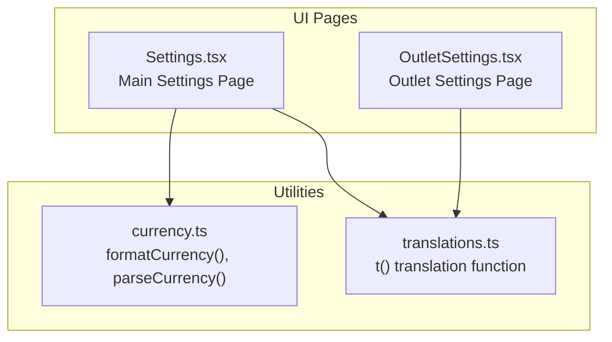
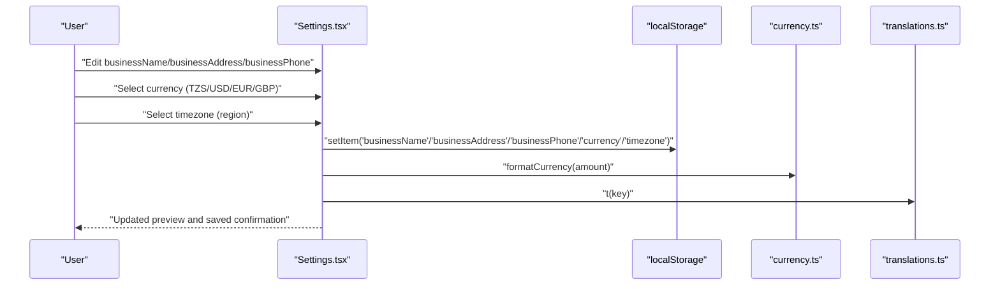
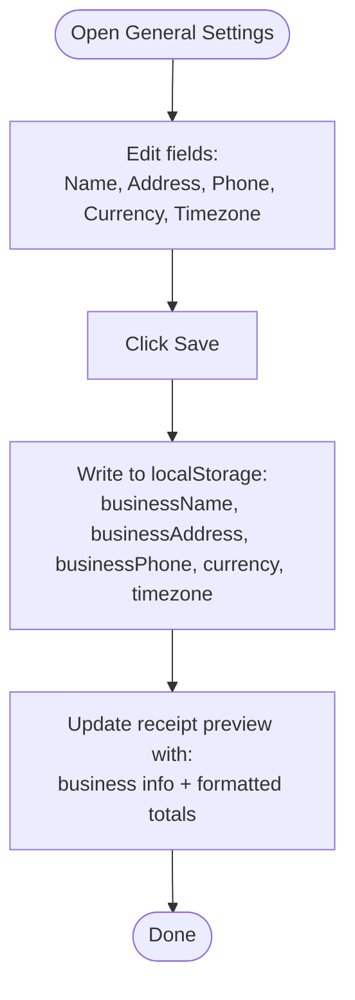
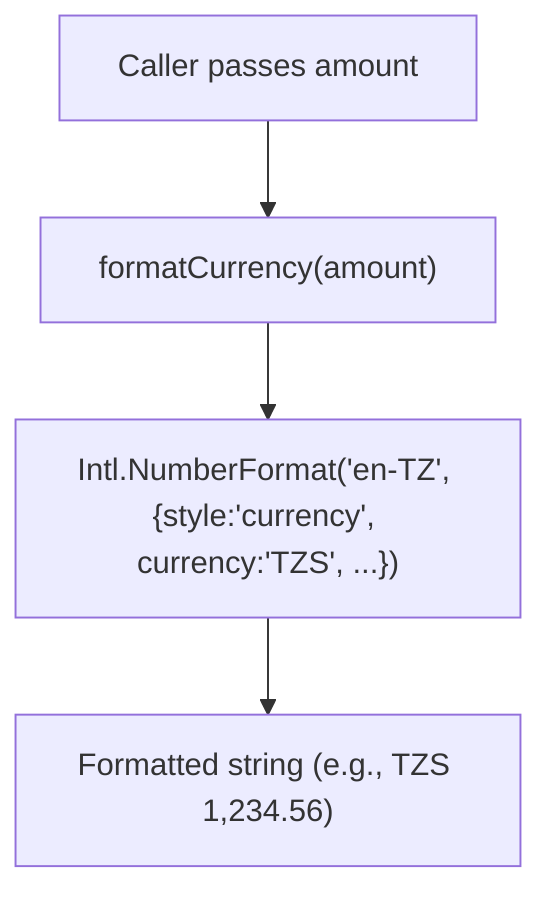
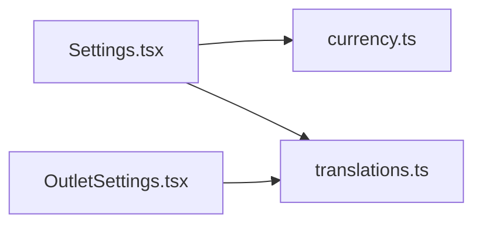

# General Settings

<cite>
**Referenced Files in This Document**
- [Settings.tsx](file://src/pages/Settings.tsx)
- [OutletSettings.tsx](file://src/pages/OutletSettings.tsx)
- [currency.ts](file://src/lib/currency.ts)
- [translations.ts](file://src/lib/translations.ts)
</cite>

## Table of Contents
1. [Introduction](#introduction)
2. [Project Structure](#project-structure)
3. [Core Components](#core-components)
4. [Architecture Overview](#architecture-overview)
5. [Detailed Component Analysis](#detailed-component-analysis)
6. [Dependency Analysis](#dependency-analysis)
7. [Performance Considerations](#performance-considerations)
8. [Troubleshooting Guide](#troubleshooting-guide)
9. [Conclusion](#conclusion)

## Introduction
This document explains the General Settings section of Royal POS Modern with a focus on business configuration. It covers how to set and maintain the business name, address, phone number, currency, and timezone. It also describes how these settings influence system-wide display formatting, pricing presentation, and date/time rendering across the application. Practical examples, supported values, validation rules, and troubleshooting guidance are included to help administrators keep the system accurate and consistent.

## Project Structure
The General Settings functionality is implemented as part of the main Settings page and a per-outlet settings page. Business-related fields are stored locally and applied immediately in the UI and receipts preview. Currency formatting is centralized in a dedicated utility module.

**Diagram sources**
- [Settings.tsx:40-508](file://src/pages/Settings.tsx#L40-L508)
- [OutletSettings.tsx:25-56](file://src/pages/OutletSettings.tsx#L25-L56)
- [currency.ts:1-25](file://src/lib/currency.ts#L1-L25)
- [translations.ts:1-332](file://src/lib/translations.ts#L1-L332)

**Section sources**
- [Settings.tsx:40-508](file://src/pages/Settings.tsx#L40-L508)
- [OutletSettings.tsx:25-56](file://src/pages/OutletSettings.tsx#L25-L56)
- [currency.ts:1-25](file://src/lib/currency.ts#L1-L25)
- [translations.ts:1-332](file://src/lib/translations.ts#L1-L332)

## Core Components
- Business identity fields (businessName, businessAddress, businessPhone) are editable in the General tab and persisted to local storage.
- Currency selection supports TZS, USD, EUR, GBP and influences receipt previews and totals formatting.
- Timezone selection supports Africa/Dar_es_Salaam, America/New_York, Europe/London, Asia/Tokyo and affects date/time display in previews and templates.
- Local storage is used to persist settings across browser sessions.
- Receipt preview demonstrates how business info and formatted totals appear with selected currency and timezone.

**Section sources**
- [Settings.tsx:40-508](file://src/pages/Settings.tsx#L40-L508)
- [Settings.tsx:223-310](file://src/pages/Settings.tsx#L223-L310)
- [Settings.tsx:981-1187](file://src/pages/Settings.tsx#L981-L1187)
- [currency.ts:1-25](file://src/lib/currency.ts#L1-L25)

## Architecture Overview
The General Settings UI reads and writes settings to local storage. Currency formatting is handled by a shared utility that uses locale-aware formatting. Translations are resolved via a central translation function.

**Diagram sources**
- [Settings.tsx:40-508](file://src/pages/Settings.tsx#L40-L508)
- [Settings.tsx:223-310](file://src/pages/Settings.tsx#L223-L310)
- [Settings.tsx:981-1187](file://src/pages/Settings.tsx#L981-L1187)
- [currency.ts:1-25](file://src/lib/currency.ts#L1-L25)
- [translations.ts:329-332](file://src/lib/translations.ts#L329-L332)

## Detailed Component Analysis

### General Settings UI (Business Identity, Currency, Timezone)
- Fields:
  - Business Name: free-text input
  - Business Address: free-text input
  - Business Phone: free-text input
  - Currency: select from TZS, USD, EUR, GBP
  - Timezone: select from Africa/Dar_es_Salaam, America/New_York, Europe/London, Asia/Tokyo
- Persistence: Values are saved to local storage on Save and restored on mount.
- Preview: Receipt preview shows business info and formatted totals using the selected currency.

**Diagram sources**
- [Settings.tsx:40-508](file://src/pages/Settings.tsx#L40-L508)
- [Settings.tsx:223-310](file://src/pages/Settings.tsx#L223-L310)
- [Settings.tsx:981-1187](file://src/pages/Settings.tsx#L981-L1187)

**Section sources**
- [Settings.tsx:40-508](file://src/pages/Settings.tsx#L40-L508)
- [Settings.tsx:223-310](file://src/pages/Settings.tsx#L223-L310)
- [Settings.tsx:981-1187](file://src/pages/Settings.tsx#L981-L1187)

### Currency Formatting Utility
- Purpose: Centralized formatting and parsing for currency values.
- Behavior:
  - formatCurrency(amount): returns a locale-aware currency string for the given amount.
  - parseCurrency(currencyString): cleans and parses a currency string to a number.
- Impact: Used in receipt previews to consistently present prices according to the selected currency.

**Diagram sources**
- [currency.ts:1-25](file://src/lib/currency.ts#L1-L25)

**Section sources**
- [currency.ts:1-25](file://src/lib/currency.ts#L1-L25)

### Localization and Labels
- The Settings page uses a translation function to render labels and messages in English or Swahili.
- Supported languages are configured in the translation module.

**Section sources**
- [translations.ts:1-332](file://src/lib/translations.ts#L1-L332)
- [Settings.tsx:35](file://src/pages/Settings.tsx#L35)

### Outlet Settings (Business Info and Currency)
- The outlet settings page includes business-like fields (name, address, phone) and currency display.
- Currency is shown as read-only in outlet settings.
- Operating hours and other outlet-specific settings are separate.

**Section sources**
- [OutletSettings.tsx:100-156](file://src/pages/OutletSettings.tsx#L100-L156)

## Dependency Analysis
- Settings.tsx depends on:
  - currency.ts for formatting totals in previews
  - translations.ts for localized labels and messages
  - localStorage for persistence
- OutletSettings.tsx depends on translations.ts for labels.

**Diagram sources**
- [Settings.tsx:22-25](file://src/pages/Settings.tsx#L22-L25)
- [currency.ts:1-25](file://src/lib/currency.ts#L1-L25)
- [translations.ts:1-332](file://src/lib/translations.ts#L1-L332)
- [OutletSettings.tsx:18](file://src/pages/OutletSettings.tsx#L18)

**Section sources**
- [Settings.tsx:22-25](file://src/pages/Settings.tsx#L22-L25)
- [currency.ts:1-25](file://src/lib/currency.ts#L1-L25)
- [translations.ts:1-332](file://src/lib/translations.ts#L1-L332)
- [OutletSettings.tsx:18](file://src/pages/OutletSettings.tsx#L18)

## Performance Considerations
- Local storage usage is minimal and scoped to settings keys; overhead is negligible.
- Currency formatting uses client-side Intl.NumberFormat, which is efficient for typical receipt sizes.
- Receipt preview rendering occurs only when the preview dialog is opened, avoiding unnecessary work.

## Troubleshooting Guide
- Business info not appearing on receipts:
  - Verify businessName, businessAddress, and businessPhone are set in General Settings.
  - Confirm the receipt template includes “Show Business Info”.
- Incorrect currency display:
  - Ensure the Currency setting is set to the intended code (TZS, USD, EUR, GBP).
  - Confirm totals formatting uses the currency utility in previews.
- Timezone mismatch in previews:
  - Select the appropriate timezone (Africa/Dar_es_Salaam, America/New_York, Europe/London, Asia/Tokyo).
  - Previews use the selected timezone for date formatting.
- Settings not persisting:
  - Check that Save was clicked and that localStorage keys exist for businessName, businessAddress, businessPhone, currency, and timezone.
- Resetting to defaults:
  - Use the Reset action to restore default values for General Settings.

**Section sources**
- [Settings.tsx:223-310](file://src/pages/Settings.tsx#L223-L310)
- [Settings.tsx:312-363](file://src/pages/Settings.tsx#L312-L363)
- [Settings.tsx:981-1187](file://src/pages/Settings.tsx#L981-L1187)

## Conclusion
The General Settings section provides a straightforward way to define and maintain the business identity, currency, and timezone. These choices directly affect how receipts are presented and how dates/times are displayed. By using the centralized currency utility and localStorage persistence, the system ensures consistent formatting and reliable configuration across sessions. For multi-outlet deployments, outlet-level settings complement the general configuration to tailor operations per location.