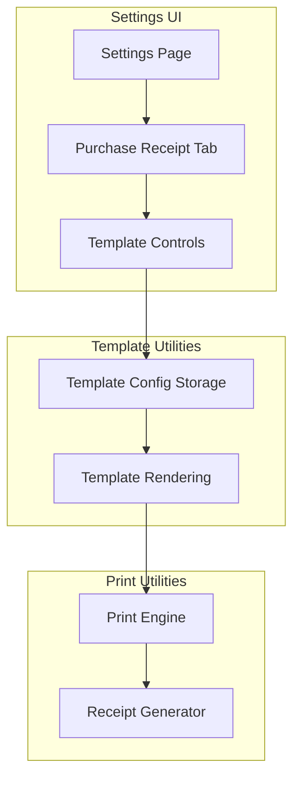
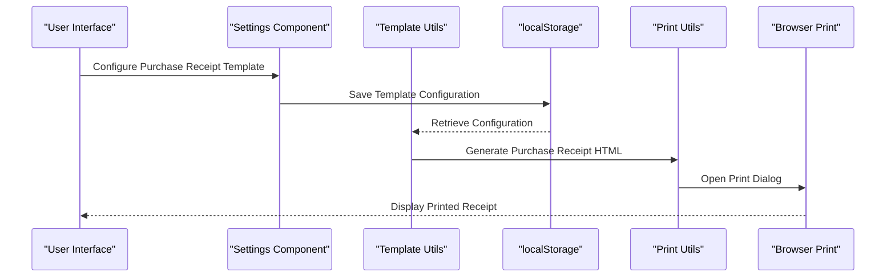
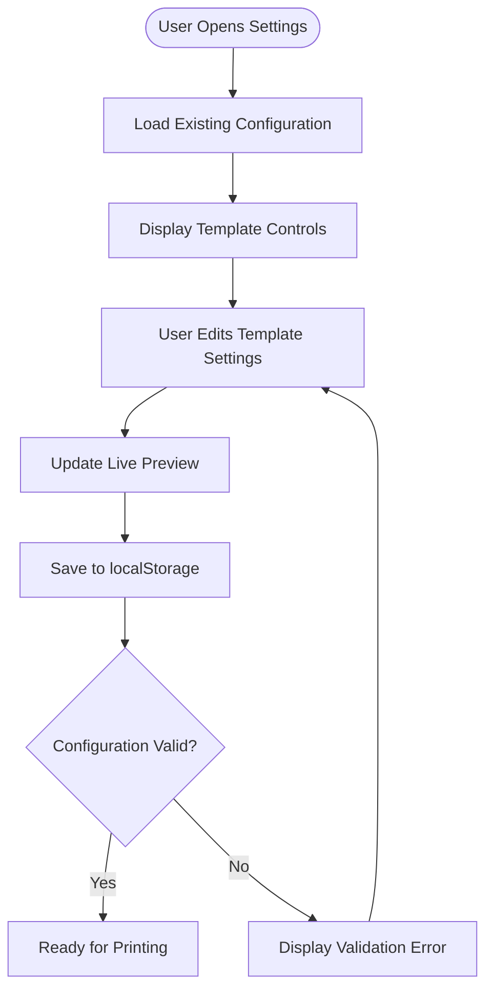
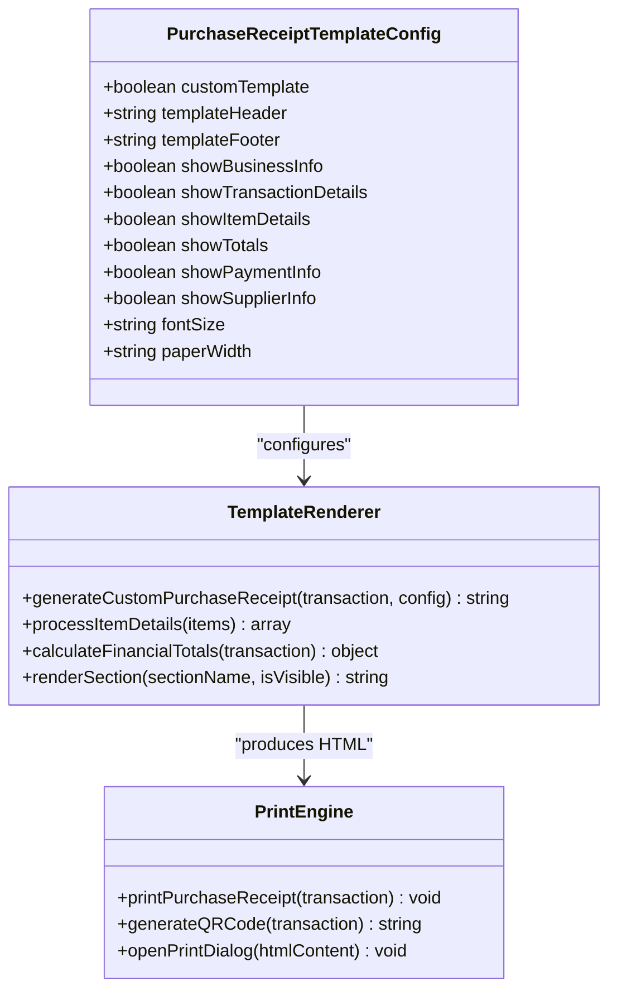
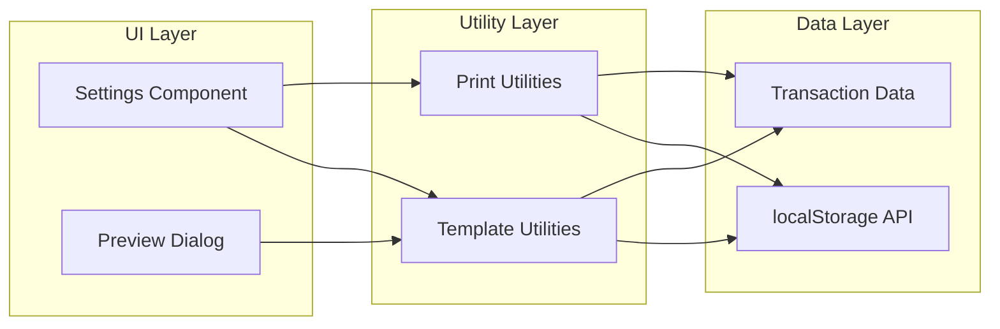

# Purchase Receipt Settings

<cite>
**Referenced Files in This Document**
- [Settings.tsx](file://src/pages/Settings.tsx)
- [templateUtils.ts](file://src/utils/templateUtils.ts)
- [printUtils.ts](file://src/utils/printUtils.ts)
- [OutletGRN.tsx](file://src/pages/OutletGRN.tsx)
- [CUSTOM_RECEIPT_TEMPLATES.md](file://src/docs/CUSTOM_RECEIPT_TEMPLATES.md)
</cite>

## Table of Contents
1. [Introduction](#introduction)
2. [Project Structure](#project-structure)
3. [Core Components](#core-components)
4. [Architecture Overview](#architecture-overview)
5. [Detailed Component Analysis](#detailed-component-analysis)
6. [Dependency Analysis](#dependency-analysis)
7. [Performance Considerations](#performance-considerations)
8. [Troubleshooting Guide](#troubleshooting-guide)
9. [Conclusion](#conclusion)

## Introduction
This document explains the Purchase Receipt Settings section for configuring supplier purchase receipt templates in the POS system. It covers how to enable and customize purchase receipt templates, configure printing preferences, and understand the differences between purchase and sales receipts. The guide includes practical examples, preview functionality, and troubleshooting advice for common template issues.

## Project Structure
The purchase receipt settings are implemented across three main areas:
- Settings page with dedicated "Purchase Receipt" tab containing template controls
- Template utilities that manage configuration storage and rendering
- Print utilities that generate and print purchase receipts using templates

**Diagram sources**
- [Settings.tsx:679-842](file://src/pages/Settings.tsx#L679-L842)
- [templateUtils.ts:15-97](file://src/utils/templateUtils.ts#L15-L97)
- [printUtils.ts:420-751](file://src/utils/printUtils.ts#L420-L751)

**Section sources**
- [Settings.tsx:679-842](file://src/pages/Settings.tsx#L679-L842)
- [templateUtils.ts:15-97](file://src/utils/templateUtils.ts#L15-L97)
- [printUtils.ts:420-751](file://src/utils/printUtils.ts#L420-L751)

## Core Components
The purchase receipt settings system consists of several key components:

### Template Configuration Interface
The system defines a structured configuration object for purchase receipts with the following properties:
- Enable/disable custom template
- Header and footer content
- Section visibility controls (business info, transaction details, item details, totals, payment info, supplier info)
- Typography settings (font size)
- Paper width configuration
- Supplier information display toggle

### Template Rendering Engine
The template engine processes purchase receipt data through a structured rendering pipeline that:
- Formats item details with quantities and pricing
- Calculates financial totals (subtotal, tax, discount, total)
- Generates HTML markup with embedded CSS styles
- Applies responsive typography and spacing
- Supports conditional section rendering based on configuration

### Print Management System
The print system handles both custom and default receipt rendering:
- Template-aware printing for purchase receipts
- QR code generation for purchase transactions
- Cross-platform compatibility (desktop and mobile)
- Browser print dialog integration

**Section sources**
- [templateUtils.ts:15-28](file://src/utils/templateUtils.ts#L15-L28)
- [templateUtils.ts:340-584](file://src/utils/templateUtils.ts#L340-L584)
- [printUtils.ts:420-751](file://src/utils/printUtils.ts#L420-L751)

## Architecture Overview
The purchase receipt settings architecture follows a layered approach with clear separation of concerns:

**Diagram sources**
- [Settings.tsx:223-310](file://src/pages/Settings.tsx#L223-L310)
- [templateUtils.ts:82-97](file://src/utils/templateUtils.ts#L82-L97)
- [printUtils.ts:420-751](file://src/utils/printUtils.ts#L420-L751)

The architecture ensures that:
- Configuration changes persist locally via localStorage
- Template rendering remains decoupled from UI components
- Printing functionality supports both custom and default templates
- Cross-browser compatibility is maintained through standardized APIs

## Detailed Component Analysis

### Settings Interface Implementation
The Settings component provides a comprehensive interface for purchase receipt configuration:

#### Template Controls
The purchase receipt tab includes specialized controls for:
- Custom template enable/disable toggle
- Header and footer text areas with multi-line support
- Font size selection (10px, 12px, 14px, 16px)
- Paper width selection (280px, 320px, 360px, 400px)
- Conditional section visibility toggles
- Preview functionality for testing layouts

#### Configuration Persistence
All purchase receipt settings are persisted in localStorage with automatic loading on component initialization. The system maintains separate configuration objects for sales and purchase receipts to prevent cross-contamination.

#### Preview System
The integrated preview system allows real-time testing of template configurations without requiring actual printing. The preview mirrors the final printed output with accurate typography and spacing.

**Diagram sources**
- [Settings.tsx:92-221](file://src/pages/Settings.tsx#L92-L221)
- [Settings.tsx:365-369](file://src/pages/Settings.tsx#L365-L369)

**Section sources**
- [Settings.tsx:679-842](file://src/pages/Settings.tsx#L679-L842)
- [Settings.tsx:92-221](file://src/pages/Settings.tsx#L92-L221)
- [Settings.tsx:365-369](file://src/pages/Settings.tsx#L365-L369)

### Template Rendering Engine
The template rendering system processes purchase receipt data through a structured pipeline:

#### Data Processing Pipeline
The rendering engine transforms raw transaction data into formatted receipt content:
- Item details formatting with quantities and pricing
- Financial calculation aggregation
- Conditional section inclusion based on configuration
- HTML/CSS generation with responsive styling

#### Template Variables and Sections
Supported template sections include:
- Business information header
- Transaction details (purchase order number, date, time)
- Supplier information display
- Itemized purchase details
- Financial summary (subtotal, tax, discount, total)
- Payment information
- Customizable header and footer content

#### Typography and Layout Control
The system provides granular control over:
- Font sizing with responsive scaling
- Paper width adaptation
- Section spacing and alignment
- Conditional content display

**Diagram sources**
- [templateUtils.ts:15-28](file://src/utils/templateUtils.ts#L15-L28)
- [templateUtils.ts:340-584](file://src/utils/templateUtils.ts#L340-L584)
- [printUtils.ts:420-751](file://src/utils/printUtils.ts#L420-L751)

**Section sources**
- [templateUtils.ts:340-584](file://src/utils/templateUtils.ts#L340-L584)
- [printUtils.ts:420-751](file://src/utils/printUtils.ts#L420-L751)

### Print Management System
The print management system handles the complete lifecycle of purchase receipt printing:

#### Cross-Platform Compatibility
The system accommodates different device capabilities:
- Desktop browsers with full print dialog support
- Mobile browsers with optimized print approaches
- Consistent styling across platforms

#### QR Code Integration
Purchase receipts can include QR codes linking to transaction details:
- Dynamic QR code generation via external service
- Error handling for network failures
- Fallback mechanisms for offline scenarios

#### Browser Integration
The printing system integrates seamlessly with browser print capabilities:
- Hidden iframe approach for desktop printing
- Native print dialog invocation
- Cleanup and resource management

**Section sources**
- [printUtils.ts:420-751](file://src/utils/printUtils.ts#L420-L751)

### Practical Configuration Examples

#### Minimal Purchase Receipt Template
A minimal configuration focuses on essential purchase information:
- Header: Business name and contact details
- Footer: Standard business messaging
- Sections: Item details and totals
- Font size: 12px for optimal readability
- Paper width: 320px for standard receipt printers

#### Comprehensive Purchase Receipt Template
A detailed configuration includes extensive supplier information:
- Header: Complete business branding
- Footer: Legal disclaimers and contact info
- Sections: All available sections enabled
- Supplier details: Full supplier information display
- Font size: 12px with appropriate spacing
- Paper width: 360px for longer supplier names

**Section sources**
- [CUSTOM_RECEIPT_TEMPLATES.md:82-105](file://src/docs/CUSTOM_RECEIPT_TEMPLATES.md#L82-L105)

## Dependency Analysis
The purchase receipt settings system exhibits well-managed dependencies:

**Diagram sources**
- [Settings.tsx:23-25](file://src/pages/Settings.tsx#L23-L25)
- [templateUtils.ts:82-97](file://src/utils/templateUtils.ts#L82-L97)
- [printUtils.ts:1-7](file://src/utils/printUtils.ts#L1-L7)

The dependency structure ensures:
- Loose coupling between UI and business logic
- Clear separation of concerns across layers
- Minimal external dependencies
- Easy maintainability and extensibility

**Section sources**
- [Settings.tsx:23-25](file://src/pages/Settings.tsx#L23-L25)
- [templateUtils.ts:82-97](file://src/utils/templateUtils.ts#L82-L97)
- [printUtils.ts:1-7](file://src/utils/printUtils.ts#L1-L7)

## Performance Considerations
The purchase receipt system is designed for optimal performance:

### Memory Management
- Configuration data is stored in localStorage to minimize memory footprint
- Template rendering uses efficient string concatenation
- Preview system updates reactively without full page reloads

### Rendering Optimization
- HTML generation uses template literals for speed
- CSS styles are embedded for immediate application
- Conditional rendering prevents unnecessary DOM manipulation

### Network Efficiency
- QR code generation uses external CDN services
- Template assets are cached locally
- Print operations minimize network requests

## Troubleshooting Guide

### Template Configuration Issues
Common problems and solutions:
- **Template not applying**: Ensure the "Enable Custom Purchase Template" toggle is active and changes are saved
- **Layout cutoff issues**: Adjust font size or paper width settings to accommodate content
- **Missing sections**: Verify that corresponding visibility toggles are enabled

### Printing Problems
Resolution steps:
- **Printer connection issues**: Confirm receipt printer is properly connected and powered
- **Paper size mismatches**: Set paper width to match physical receipt paper dimensions
- **Browser print settings**: Check browser print dialog for proper page setup

### Template Preview Problems
Diagnostic procedures:
- **Preview not updating**: Refresh the settings page after making changes
- **Incorrect formatting**: Adjust font size and paper width settings
- **Missing content**: Verify section visibility toggles are properly configured

### Cross-Browser Compatibility
Platform-specific considerations:
- **Mobile printing**: Some mobile browsers have limited print dialog support
- **CSS rendering**: Different browsers may render CSS slightly differently
- **QR code display**: External service dependencies may vary by platform

**Section sources**
- [CUSTOM_RECEIPT_TEMPLATES.md:118-133](file://src/docs/CUSTOM_RECEIPT_TEMPLATES.md#L118-L133)

## Conclusion
The Purchase Receipt Settings system provides a comprehensive solution for configuring supplier purchase receipt templates. The implementation offers intuitive controls, robust template customization, reliable printing functionality, and extensive troubleshooting support. The system's architecture ensures maintainability while providing the flexibility needed for diverse business requirements.

Key benefits include:
- Intuitive configuration interface with live preview
- Comprehensive template customization options
- Reliable cross-platform printing support
- Extensive troubleshooting and validation
- Clear separation of concerns for maintainability

The system successfully bridges the gap between configurable template systems and practical printing requirements, making it suitable for various business scenarios involving supplier purchase transactions.