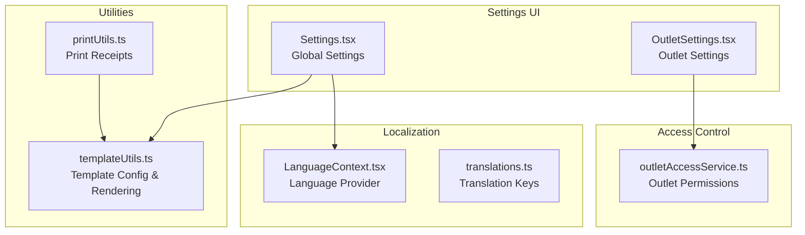
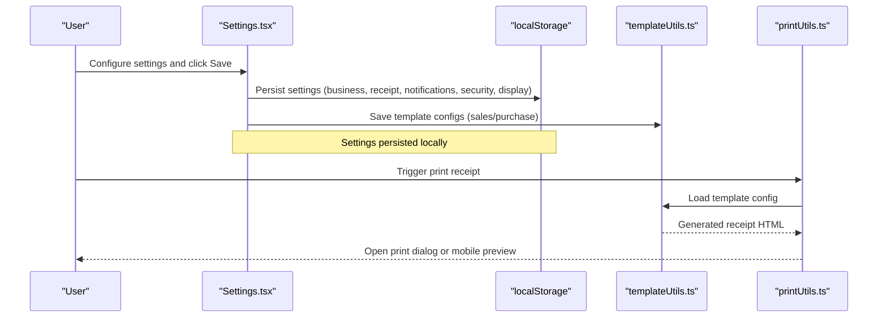
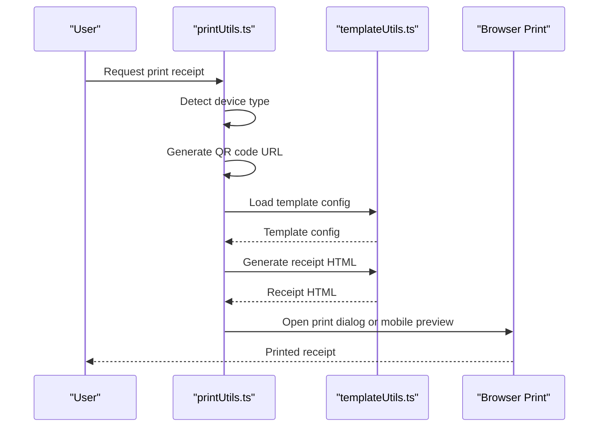
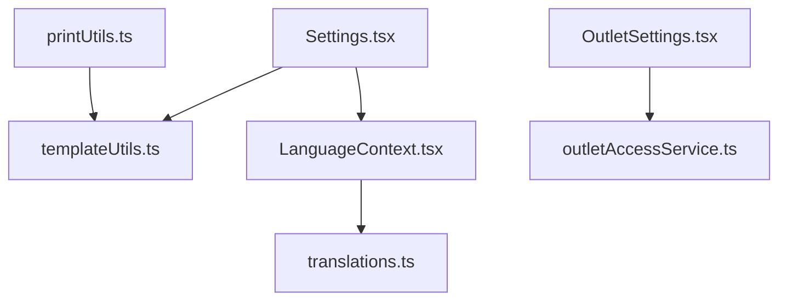

# Settings Configuration

<cite>
**Referenced Files in This Document**
- [Settings.tsx](file://src/pages/Settings.tsx)
- [OutletSettings.tsx](file://src/pages/OutletSettings.tsx)
- [templateUtils.ts](file://src/utils/templateUtils.ts)
- [printUtils.ts](file://src/utils/printUtils.ts)
- [LanguageContext.tsx](file://src/contexts/LanguageContext.tsx)
- [translations.ts](file://src/lib/translations.ts)
- [outletAccessService.ts](file://src/services/outletAccessService.ts)
- [CUSTOM_RECEIPT_TEMPLATES.md](file://src/docs/CUSTOM_RECEIPT_TEMPLATES.md)
</cite>

## Table of Contents
1. [Introduction](#introduction)
2. [Project Structure](#project-structure)
3. [Core Components](#core-components)
4. [Architecture Overview](#architecture-overview)
5. [Detailed Component Analysis](#detailed-component-analysis)
6. [Dependency Analysis](#dependency-analysis)
7. [Performance Considerations](#performance-considerations)
8. [Troubleshooting Guide](#troubleshooting-guide)
9. [Conclusion](#conclusion)

## Introduction
This document explains the Royal POS Modern settings configuration system. It covers global system settings (business configuration, receipt printing, custom templates, notifications, security, and display), outlet-specific settings, and the persistence mechanism using localStorage. It also provides practical configuration examples, template customization workflows, best practices for system administration, and troubleshooting guidance for common configuration issues.

## Project Structure
The settings system is implemented across several focused modules:
- Global settings UI and persistence
- Outlet-specific settings UI
- Template utilities for rendering receipts
- Print utilities for generating and printing receipts
- Localization and language context
- Access control service for outlet permissions

**Diagram sources**
- [Settings.tsx:33-1187](file://src/pages/Settings.tsx#L33-L1187)
- [OutletSettings.tsx:58-292](file://src/pages/OutletSettings.tsx#L58-L292)
- [templateUtils.ts:1-584](file://src/utils/templateUtils.ts#L1-L584)
- [printUtils.ts:1-1200](file://src/utils/printUtils.ts#L1-L1200)
- [LanguageContext.tsx:1-44](file://src/contexts/LanguageContext.tsx#L1-L44)
- [translations.ts:1-332](file://src/lib/translations.ts#L1-L332)
- [outletAccessService.ts:1-98](file://src/services/outletAccessService.ts#L1-L98)

**Section sources**
- [Settings.tsx:33-1187](file://src/pages/Settings.tsx#L33-L1187)
- [OutletSettings.tsx:58-292](file://src/pages/OutletSettings.tsx#L58-L292)
- [templateUtils.ts:1-584](file://src/utils/templateUtils.ts#L1-L584)
- [printUtils.ts:1-1200](file://src/utils/printUtils.ts#L1-L1200)
- [LanguageContext.tsx:1-44](file://src/contexts/LanguageContext.tsx#L1-L44)
- [translations.ts:1-332](file://src/lib/translations.ts#L1-L332)
- [outletAccessService.ts:1-98](file://src/services/outletAccessService.ts#L1-L98)

## Core Components
- Global Settings UI: Provides tabs for general, receipt, purchase receipt, notifications, security, and display settings. Persists all settings to localStorage and supports previewing custom templates.
- Outlet Settings UI: Manages location-based configuration including operating hours, tax rate, receipt footer, and feature toggles per outlet.
- Template Utilities: Define default template configurations, persist and retrieve template settings, and generate HTML receipts for both sales and purchase transactions.
- Print Utilities: Generate receipts dynamically, support QR code embedding, and handle desktop/mobile printing workflows.
- Language Context and Translations: Provide internationalization for settings labels and messages.
- Outlet Access Service: Manage user-to-outlet assignments and access checks.

**Section sources**
- [Settings.tsx:33-1187](file://src/pages/Settings.tsx#L33-L1187)
- [OutletSettings.tsx:58-292](file://src/pages/OutletSettings.tsx#L58-L292)
- [templateUtils.ts:1-584](file://src/utils/templateUtils.ts#L1-L584)
- [printUtils.ts:1-1200](file://src/utils/printUtils.ts#L1-L1200)
- [LanguageContext.tsx:1-44](file://src/contexts/LanguageContext.tsx#L1-L44)
- [translations.ts:1-332](file://src/lib/translations.ts#L1-L332)
- [outletAccessService.ts:1-98](file://src/services/outletAccessService.ts#L1-L98)

## Architecture Overview
The settings system follows a layered approach:
- UI Layer: React components render forms and manage local state.
- Persistence Layer: localStorage stores user preferences and template configurations.
- Utility Layer: templateUtils and printUtils encapsulate rendering and printing logic.
- Access Control Layer: outletAccessService validates user permissions for outlets.
- Localization Layer: LanguageContext and translations provide i18n.

**Diagram sources**
- [Settings.tsx:223-310](file://src/pages/Settings.tsx#L223-L310)
- [templateUtils.ts:82-97](file://src/utils/templateUtils.ts#L82-L97)
- [printUtils.ts:48-418](file://src/utils/printUtils.ts#L48-L418)

## Detailed Component Analysis

### Global Settings (System-wide)
The global settings UI organizes configuration into six categories:
- Business configuration: business name, address, phone, currency, timezone
- Receipt printing: enable/disable printing, header message, logo visibility
- Custom receipt templates: enable, header/footer, section visibility, font size, paper width
- Notifications: email notifications, low stock alerts, daily reports
- Security: require password for returns, session timeout, two-factor authentication
- Display: dark mode, language, display font size

Key behaviors:
- On mount, loads all settings from localStorage into component state.
- On save, writes all settings to localStorage and persists template configurations via templateUtils.
- Provides a preview dialog for custom templates.

Practical configuration examples:
- Set business currency to USD and timezone to America/New_York for US operations.
- Enable custom receipt template, set header/footer, and choose font size 12px with paper width 320px.
- Enable email notifications and daily reports for automated summaries.
- Set session timeout to 15 minutes and enable two-factor authentication for enhanced security.
- Enable dark mode and set language to Swahili for regional preference.

Best practices:
- Use the preview feature to validate template layout before enabling custom templates.
- Keep receipt headers concise and include essential contact information.
- Align font size and paper width with your receipt printer capabilities.
- Regularly review security settings and session timeouts for compliance.

**Section sources**
- [Settings.tsx:40-975](file://src/pages/Settings.tsx#L40-L975)
- [templateUtils.ts:82-97](file://src/utils/templateUtils.ts#L82-L97)
- [CUSTOM_RECEIPT_TEMPLATES.md:1-133](file://src/docs/CUSTOM_RECEIPT_TEMPLATES.md#L1-L133)

### Custom Receipt Templates
The template system supports:
- Enabling/disabling custom templates
- Defining header and footer content
- Controlling visibility of business info, transaction details, item details, totals, and payment info
- Configuring font size and paper width
- Generating HTML receipts for sales and purchase transactions

Workflow:
- Configure template options in the Settings UI.
- Click Save to persist template settings to localStorage.
- Use the preview dialog to visualize the receipt layout.
- Printing uses either default or custom template rendering depending on configuration.

Template variables and sections:
- Business information: business name, address, phone
- Transaction information: receipt/order number, date, time
- Item details: item name, quantity, price, total
- Financial details: subtotal, tax, discount, total, payment method, amount received, change

**Section sources**
- [Settings.tsx:54-843](file://src/pages/Settings.tsx#L54-L843)
- [templateUtils.ts:99-584](file://src/utils/templateUtils.ts#L99-L584)
- [CUSTOM_RECEIPT_TEMPLATES.md:13-133](file://src/docs/CUSTOM_RECEIPT_TEMPLATES.md#L13-L133)

### Printing Workflow
The printing system:
- Detects mobile vs desktop environments
- Generates QR code URLs via a CDN-based approach
- Creates hidden iframes for desktop printing or mobile modals
- Uses templateUtils to render receipts with custom templates when enabled
- Handles error scenarios gracefully and cleans up resources

**Diagram sources**
- [printUtils.ts:48-418](file://src/utils/printUtils.ts#L48-L418)
- [templateUtils.ts:59-97](file://src/utils/templateUtils.ts#L59-L97)

**Section sources**
- [printUtils.ts:48-751](file://src/utils/printUtils.ts#L48-L751)
- [templateUtils.ts:59-97](file://src/utils/templateUtils.ts#L59-L97)

### Outlet Settings (Location-based)
Outlet settings allow per-location configuration:
- General information: name, address, phone, email, currency
- Operating hours: opening and closing times
- Tax and receipt settings: tax rate and receipt footer text
- Feature toggles: notifications, loyalty program, auth for discounts, auto-print receipt

Access control:
- The outletAccessService manages user-to-outlet assignments and checks access permissions.

**Section sources**
- [OutletSettings.tsx:25-292](file://src/pages/OutletSettings.tsx#L25-L292)
- [outletAccessService.ts:22-98](file://src/services/outletAccessService.ts#L22-L98)

### Localization and Display Settings
- LanguageContext persists selected language in localStorage and exposes translation keys.
- Display settings include dark mode and display font size.

**Section sources**
- [LanguageContext.tsx:13-44](file://src/contexts/LanguageContext.tsx#L13-L44)
- [translations.ts:3-332](file://src/lib/translations.ts#L3-L332)
- [Settings.tsx:933-975](file://src/pages/Settings.tsx#L933-L975)

## Dependency Analysis
The settings system exhibits clear separation of concerns:
- Settings.tsx depends on templateUtils for saving template configurations and on LanguageContext for localization.
- printUtils depends on templateUtils for template configuration retrieval.
- OutletSettings.tsx relies on outletAccessService for permission checks.
- LanguageContext integrates with translations.ts for i18n.

**Diagram sources**
- [Settings.tsx:33-1187](file://src/pages/Settings.tsx#L33-L1187)
- [templateUtils.ts:1-584](file://src/utils/templateUtils.ts#L1-L584)
- [LanguageContext.tsx:1-44](file://src/contexts/LanguageContext.tsx#L1-L44)
- [translations.ts:1-332](file://src/lib/translations.ts#L1-L332)
- [printUtils.ts:1-1200](file://src/utils/printUtils.ts#L1-L1200)
- [OutletSettings.tsx:58-292](file://src/pages/OutletSettings.tsx#L58-L292)
- [outletAccessService.ts:1-98](file://src/services/outletAccessService.ts#L1-L98)

**Section sources**
- [Settings.tsx:33-1187](file://src/pages/Settings.tsx#L33-L1187)
- [templateUtils.ts:1-584](file://src/utils/templateUtils.ts#L1-L584)
- [LanguageContext.tsx:1-44](file://src/contexts/LanguageContext.tsx#L1-L44)
- [translations.ts:1-332](file://src/lib/translations.ts#L1-L332)
- [printUtils.ts:1-1200](file://src/utils/printUtils.ts#L1-L1200)
- [OutletSettings.tsx:58-292](file://src/pages/OutletSettings.tsx#L58-L292)
- [outletAccessService.ts:1-98](file://src/services/outletAccessService.ts#L1-L98)

## Performance Considerations
- Template rendering: Keep header/footer content concise to minimize DOM size and improve print performance.
- Font size and paper width: Choose sizes appropriate for your printer to reduce truncation and reflows.
- QR code generation: Using a CDN avoids bundling heavy libraries and reduces build-time overhead.
- Local storage usage: Settings are stored locally; avoid storing large binary data in localStorage to prevent performance degradation.

## Troubleshooting Guide
Common configuration issues and resolutions:
- Settings not applying after save:
  - Ensure you clicked Save Changes and refresh the page if necessary.
  - Confirm that localStorage keys exist for the settings you modified.
- Custom template not visible:
  - Verify Enable Custom Template is toggled on.
  - Use the preview dialog to validate layout.
- Printing issues:
  - Confirm your receipt printer is connected and configured.
  - Match paper width with your template settings.
  - Check browser print settings and permissions.
- Template layout problems:
  - Adjust font size and paper width.
  - Simplify header/footer content to prevent text cutoff.
- Language not changing:
  - Ensure language is saved in localStorage and the LanguageContext provider is initialized.
- Outlet access denied:
  - Verify user outlet assignment and active status via outletAccessService.

**Section sources**
- [CUSTOM_RECEIPT_TEMPLATES.md:118-133](file://src/docs/CUSTOM_RECEIPT_TEMPLATES.md#L118-L133)
- [Settings.tsx:223-310](file://src/pages/Settings.tsx#L223-L310)
- [LanguageContext.tsx:15-24](file://src/contexts/LanguageContext.tsx#L15-L24)
- [outletAccessService.ts:22-98](file://src/services/outletAccessService.ts#L22-L98)

## Conclusion
Royal POS Modern’s settings configuration system provides a comprehensive, user-friendly way to tailor the POS experience globally and per outlet. With robust persistence via localStorage, flexible receipt templating, and strong localization support, administrators can efficiently configure business operations, customize receipts, and enforce security and display preferences. Following the best practices and troubleshooting steps outlined here will help ensure smooth operation and reliable printing workflows.