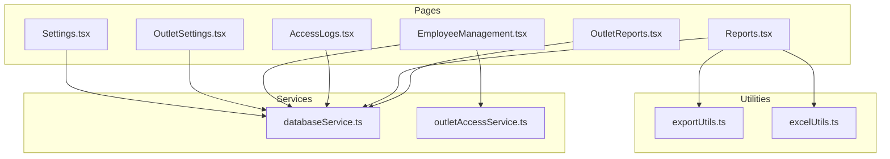
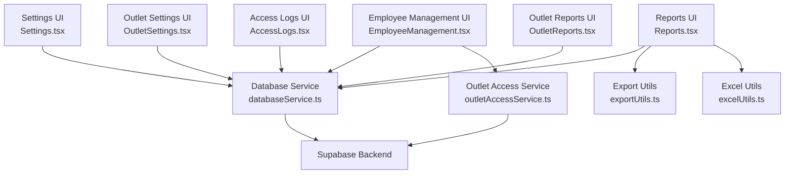
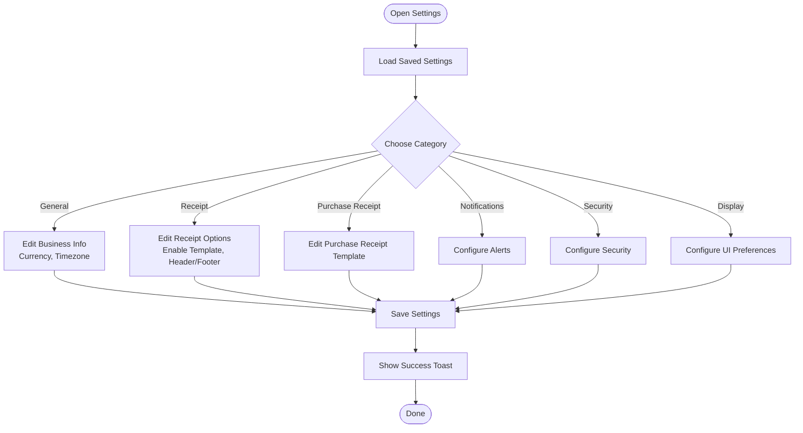
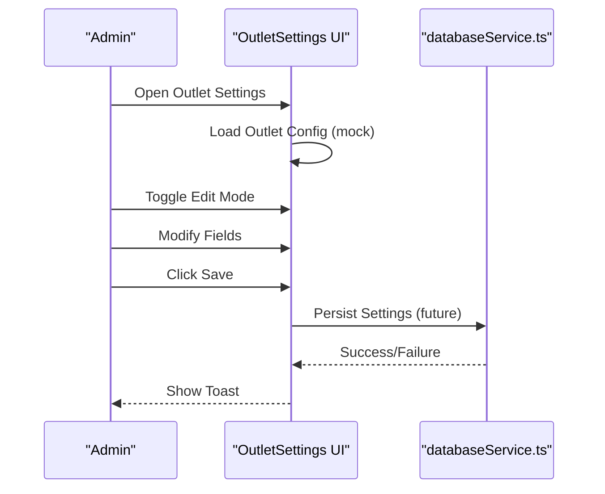
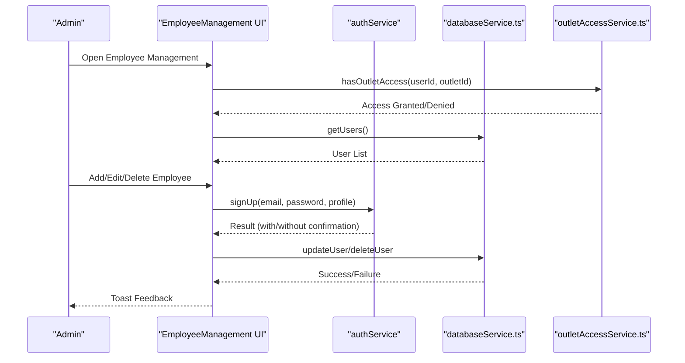
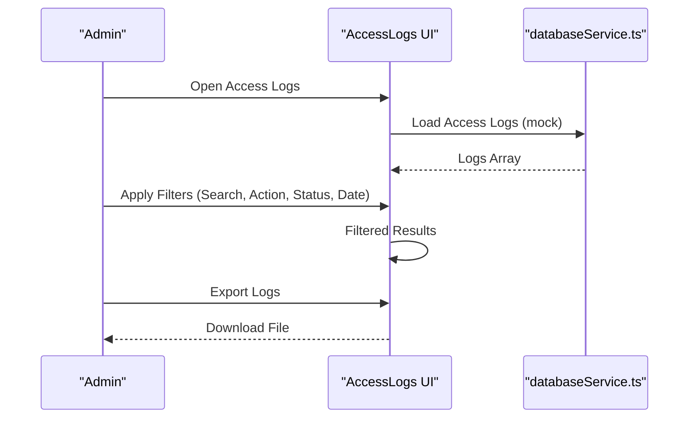
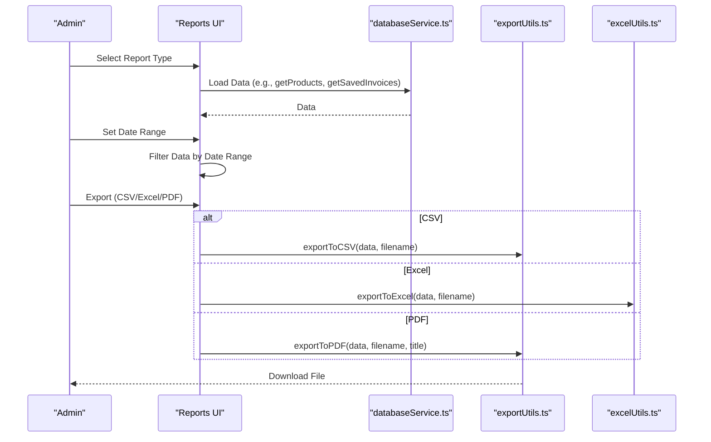
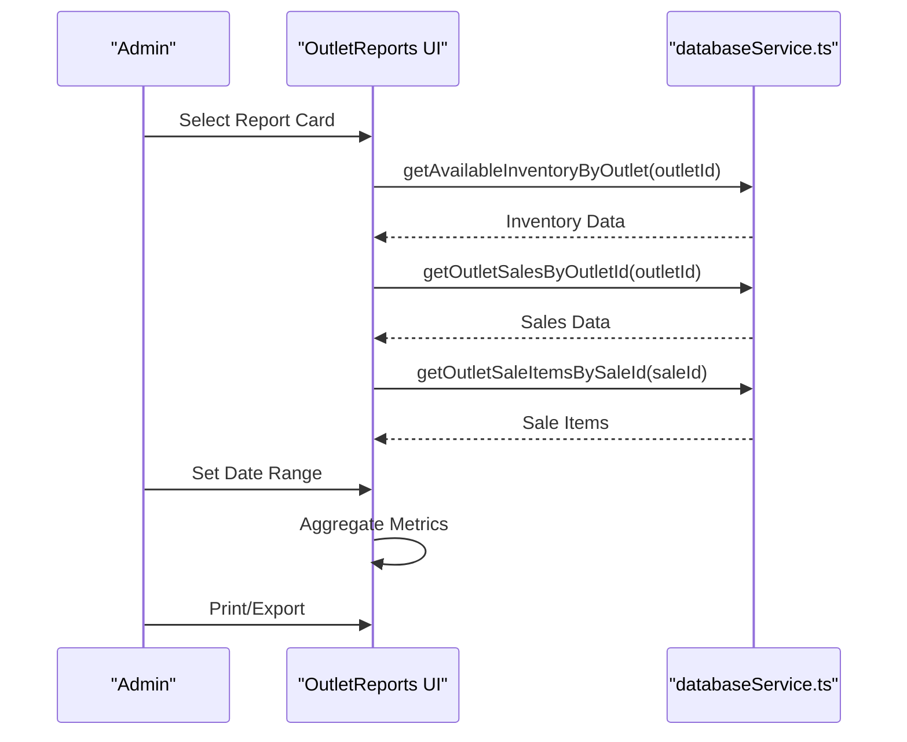
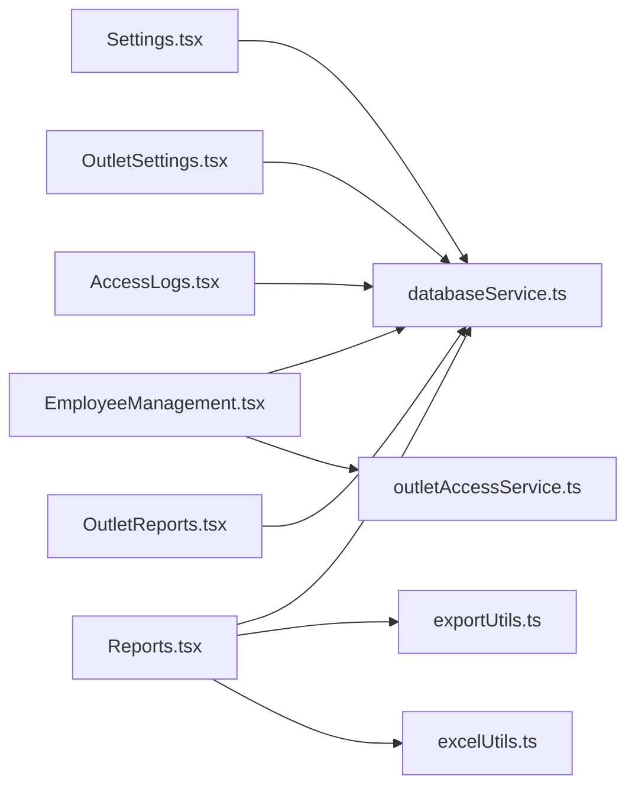

# System Management

<cite>
**Referenced Files in This Document**
- [Settings.tsx](file://src/pages/Settings.tsx)
- [OutletSettings.tsx](file://src/pages/OutletSettings.tsx)
- [EmployeeManagement.tsx](file://src/pages/EmployeeManagement.tsx)
- [AccessLogs.tsx](file://src/pages/AccessLogs.tsx)
- [Reports.tsx](file://src/pages/Reports.tsx)
- [OutletReports.tsx](file://src/pages/OutletReports.tsx)
- [outletAccessService.ts](file://src/services/outletAccessService.ts)
- [databaseService.ts](file://src/services/databaseService.ts)
- [exportUtils.ts](file://src/utils/exportUtils.ts)
- [excelUtils.ts](file://src/utils/excelUtils.ts)
</cite>

## Table of Contents
1. [Introduction](#introduction)
2. [Project Structure](#project-structure)
3. [Core Components](#core-components)
4. [Architecture Overview](#architecture-overview)
5. [Detailed Component Analysis](#detailed-component-analysis)
6. [Dependency Analysis](#dependency-analysis)
7. [Performance Considerations](#performance-considerations)
8. [Troubleshooting Guide](#troubleshooting-guide)
9. [Conclusion](#conclusion)
10. [Appendices](#appendices)

## Introduction
This document provides comprehensive system administration guidance for Royal POS Modern. It covers the complete system administration workflow from settings configuration to user management, outlet-specific settings, reporting, access logging, and operational maintenance. It also includes practical examples and troubleshooting advice to help administrators manage the system effectively.

## Project Structure
Royal POS Modern is a React-based frontend application integrated with Supabase for backend services. Administrative features are implemented as page components under the pages directory, utility modules for exports and printing, and service modules for database and access control.

**Diagram sources**
- [Settings.tsx:1-1187](file://src/pages/Settings.tsx#L1-L1187)
- [OutletSettings.tsx:1-292](file://src/pages/OutletSettings.tsx#L1-L292)
- [EmployeeManagement.tsx:1-601](file://src/pages/EmployeeManagement.tsx#L1-L601)
- [AccessLogs.tsx:1-334](file://src/pages/AccessLogs.tsx#L1-L334)
- [Reports.tsx:1-1384](file://src/pages/Reports.tsx#L1-L1384)
- [OutletReports.tsx:1-1081](file://src/pages/OutletReports.tsx#L1-L1081)
- [databaseService.ts:1-5409](file://src/services/databaseService.ts#L1-L5409)
- [outletAccessService.ts:1-98](file://src/services/outletAccessService.ts#L1-L98)
- [exportUtils.ts:1-785](file://src/utils/exportUtils.ts#L1-L785)
- [excelUtils.ts:1-36](file://src/utils/excelUtils.ts#L1-L36)

**Section sources**
- [Settings.tsx:1-1187](file://src/pages/Settings.tsx#L1-L1187)
- [OutletSettings.tsx:1-292](file://src/pages/OutletSettings.tsx#L1-L292)
- [EmployeeManagement.tsx:1-601](file://src/pages/EmployeeManagement.tsx#L1-L601)
- [AccessLogs.tsx:1-334](file://src/pages/AccessLogs.tsx#L1-L334)
- [Reports.tsx:1-1384](file://src/pages/Reports.tsx#L1-L1384)
- [OutletReports.tsx:1-1081](file://src/pages/OutletReports.tsx#L1-L1081)
- [databaseService.ts:1-5409](file://src/services/databaseService.ts#L1-L5409)
- [outletAccessService.ts:1-98](file://src/services/outletAccessService.ts#L1-L98)
- [exportUtils.ts:1-785](file://src/utils/exportUtils.ts#L1-L785)
- [excelUtils.ts:1-36](file://src/utils/excelUtils.ts#L1-L36)

## Core Components
- Global Settings: Centralized configuration for business identity, currency, timezone, receipt templates, notifications, security, and UI preferences.
- Outlet Settings: Location-specific configuration including operating hours, tax rate, receipt footer, and feature toggles.
- Employee Management: Full lifecycle of user accounts, roles, permissions, and access control checks.
- Access Logs: Audit trail of user actions, modules accessed, timestamps, IP addresses, and statuses.
- Reporting: Built-in reports with export and print capabilities, including inventory, sales, customers, suppliers, expenses, and outlet-specific dashboards.
- Utilities: Export utilities for CSV, Excel, and PDF; Excel export helper; printing utilities.

**Section sources**
- [Settings.tsx:1-1187](file://src/pages/Settings.tsx#L1-L1187)
- [OutletSettings.tsx:1-292](file://src/pages/OutletSettings.tsx#L1-L292)
- [EmployeeManagement.tsx:1-601](file://src/pages/EmployeeManagement.tsx#L1-L601)
- [AccessLogs.tsx:1-334](file://src/pages/AccessLogs.tsx#L1-L334)
- [Reports.tsx:1-1384](file://src/pages/Reports.tsx#L1-L1384)
- [OutletReports.tsx:1-1081](file://src/pages/OutletReports.tsx#L1-L1081)
- [exportUtils.ts:1-785](file://src/utils/exportUtils.ts#L1-L785)
- [excelUtils.ts:1-36](file://src/utils/excelUtils.ts#L1-L36)

## Architecture Overview
The system uses a layered architecture:
- Presentation Layer: Page components implement UI and orchestrate user actions.
- Services Layer: databaseService.ts abstracts Supabase queries and mutations; outletAccessService.ts handles outlet-user relationships.
- Utilities Layer: exportUtils.ts and excelUtils.ts provide standardized export and printing capabilities.

**Diagram sources**
- [Settings.tsx:1-1187](file://src/pages/Settings.tsx#L1-L1187)
- [OutletSettings.tsx:1-292](file://src/pages/OutletSettings.tsx#L1-L292)
- [EmployeeManagement.tsx:1-601](file://src/pages/EmployeeManagement.tsx#L1-L601)
- [AccessLogs.tsx:1-334](file://src/pages/AccessLogs.tsx#L1-L334)
- [Reports.tsx:1-1384](file://src/pages/Reports.tsx#L1-L1384)
- [OutletReports.tsx:1-1081](file://src/pages/OutletReports.tsx#L1-L1081)
- [databaseService.ts:1-5409](file://src/services/databaseService.ts#L1-L5409)
- [outletAccessService.ts:1-98](file://src/services/outletAccessService.ts#L1-L98)
- [exportUtils.ts:1-785](file://src/utils/exportUtils.ts#L1-L785)
- [excelUtils.ts:1-36](file://src/utils/excelUtils.ts#L1-L36)

## Detailed Component Analysis

### Global Settings System
The global settings page centralizes configuration for:
- Business identity: name, address, phone, currency, timezone.
- Receipt templates: enable/disable custom templates, header/footer, visibility toggles, font size, paper width.
- Notifications: email alerts, low stock alerts, daily reports.
- Security: require password, session timeout, two-factor authentication.
- Display: dark mode, language, display font size.

Administrators can preview templates, reset to defaults, and persist settings to local storage. The page organizes settings into logical categories and provides immediate feedback via toasts.

**Diagram sources**
- [Settings.tsx:1-1187](file://src/pages/Settings.tsx#L1-L1187)

**Section sources**
- [Settings.tsx:1-1187](file://src/pages/Settings.tsx#L1-L1187)

### Outlet-Specific Settings
Outlet settings enable location-based configuration:
- General: name, email, address, phone, currency.
- Operating hours: opening and closing times.
- Tax & receipt: tax rate, receipt footer text.
- Feature toggles: notifications, loyalty program, auth for discounts, auto-print receipts.

These settings are presented in a responsive grid layout with inline editing controls and a save/edit toggle. While the current implementation uses mock data, the structure supports future integration with Supabase.

**Diagram sources**
- [OutletSettings.tsx:1-292](file://src/pages/OutletSettings.tsx#L1-L292)
- [databaseService.ts:1-5409](file://src/services/databaseService.ts#L1-L5409)

**Section sources**
- [OutletSettings.tsx:1-292](file://src/pages/OutletSettings.tsx#L1-L292)

### Employee Management
Employee management supports:
- Role-based access control: admin, manager, cashier, staff.
- Permissions matrix: granular permissions per module.
- Lifecycle: create, update, delete users with validation and duplicate detection.
- Access checks: permission validation on component mount.
- Self-service protection: prevent self-deletion.

**Diagram sources**
- [EmployeeManagement.tsx:1-601](file://src/pages/EmployeeManagement.tsx#L1-L601)
- [outletAccessService.ts:1-98](file://src/services/outletAccessService.ts#L1-L98)
- [databaseService.ts:1-5409](file://src/services/databaseService.ts#L1-L5409)

**Section sources**
- [EmployeeManagement.tsx:1-601](file://src/pages/EmployeeManagement.tsx#L1-L601)
- [outletAccessService.ts:1-98](file://src/services/outletAccessService.ts#L1-L98)
- [databaseService.ts:1-5409](file://src/services/databaseService.ts#L1-L5409)

### Access Log System
Access logs capture:
- User actions: login, logout, create, update, delete, view, export, error.
- Module categorization: Authentication, Products, Customers, Sales, Reports, Settings.
- Timestamps, IP addresses, user agents, and status indicators.
- Filtering: by action, status, and date range.
- Export capability: export logs to CSV/Excel/PDF.

**Diagram sources**
- [AccessLogs.tsx:1-334](file://src/pages/AccessLogs.tsx#L1-L334)
- [databaseService.ts:1-5409](file://src/services/databaseService.ts#L1-L5409)

**Section sources**
- [AccessLogs.tsx:1-334](file://src/pages/AccessLogs.tsx#L1-L334)

### Reporting System
The reporting system provides:
- Report types: inventory, sales, customers, suppliers, expenses, saved invoices, saved customer settlements, saved deliveries.
- Date range filtering: today, yesterday, this week, this month, last month, this year, all-time.
- Export formats: CSV, Excel (.xlsx), PDF.
- Print support: print financial reports and receipts.
- Outlet reports: outlet-specific dashboards for inventory, sales, payments, deliveries, receipts, and GRNs.

**Diagram sources**
- [Reports.tsx:1-1384](file://src/pages/Reports.tsx#L1-L1384)
- [databaseService.ts:1-5409](file://src/services/databaseService.ts#L1-L5409)
- [exportUtils.ts:1-785](file://src/utils/exportUtils.ts#L1-L785)
- [excelUtils.ts:1-36](file://src/utils/excelUtils.ts#L1-L36)

**Section sources**
- [Reports.tsx:1-1384](file://src/pages/Reports.tsx#L1-L1384)
- [exportUtils.ts:1-785](file://src/utils/exportUtils.ts#L1-L785)
- [excelUtils.ts:1-36](file://src/utils/excelUtils.ts#L1-L36)

### Outlet Reports
Outlet reports focus on:
- Quick-access cards for inventory, sales, payments, deliveries, receipts, and GRNs.
- Inventory overview: counts, values, stock status distribution, low stock alerts.
- Sales analytics: revenue, transactions, product performance, charts.
- Date range selection and refresh controls.

**Diagram sources**
- [OutletReports.tsx:1-1081](file://src/pages/OutletReports.tsx#L1-L1081)
- [databaseService.ts:1-5409](file://src/services/databaseService.ts#L1-L5409)

**Section sources**
- [OutletReports.tsx:1-1081](file://src/pages/OutletReports.tsx#L1-L1081)

## Dependency Analysis
Key dependencies and relationships:
- Settings.tsx depends on local storage for persistence and template utilities for printer configuration.
- EmployeeManagement.tsx integrates with outletAccessService.ts for access checks and databaseService.ts for user CRUD.
- Reports.tsx and OutletReports.tsx depend on databaseService.ts for data retrieval and exportUtils.ts/excelUtils.ts for exports.
- AccessLogs.tsx currently uses mock data but follows the same service pattern.

**Diagram sources**
- [Settings.tsx:1-1187](file://src/pages/Settings.tsx#L1-L1187)
- [OutletSettings.tsx:1-292](file://src/pages/OutletSettings.tsx#L1-L292)
- [EmployeeManagement.tsx:1-601](file://src/pages/EmployeeManagement.tsx#L1-L601)
- [AccessLogs.tsx:1-334](file://src/pages/AccessLogs.tsx#L1-L334)
- [Reports.tsx:1-1384](file://src/pages/Reports.tsx#L1-L1384)
- [OutletReports.tsx:1-1081](file://src/pages/OutletReports.tsx#L1-L1081)
- [databaseService.ts:1-5409](file://src/services/databaseService.ts#L1-L5409)
- [outletAccessService.ts:1-98](file://src/services/outletAccessService.ts#L1-L98)
- [exportUtils.ts:1-785](file://src/utils/exportUtils.ts#L1-L785)
- [excelUtils.ts:1-36](file://src/utils/excelUtils.ts#L1-L36)

**Section sources**
- [databaseService.ts:1-5409](file://src/services/databaseService.ts#L1-L5409)
- [outletAccessService.ts:1-98](file://src/services/outletAccessService.ts#L1-L98)
- [exportUtils.ts:1-785](file://src/utils/exportUtils.ts#L1-L785)
- [excelUtils.ts:1-36](file://src/utils/excelUtils.ts#L1-L36)

## Performance Considerations
- Pagination and virtualization: For large datasets (e.g., reports, logs), implement pagination or virtualized tables to reduce DOM size.
- Debounced filters: Apply debounced search inputs to avoid excessive re-renders during typing.
- Lazy loading: Load report data on demand (when a report card is clicked) rather than pre-loading all data.
- Efficient exports: For large exports, stream data or chunk writes to avoid memory pressure.
- Caching: Cache frequently accessed lookup data (categories, tax rates) in memory to reduce repeated network calls.
- Image optimization: Compress images and lazy-load thumbnails to improve initial load times.

## Troubleshooting Guide
Common issues and resolutions:
- Settings not persisting: Verify local storage availability and browser privacy settings. Confirm save/reset handlers update localStorage keys.
- Employee creation failures: Check for duplicate emails, missing required fields, and backend error messages returned by sign-up and user update functions.
- Access denied errors: Ensure the user has the required module access and that outlet assignments are correct.
- Report export errors: Validate data arrays are non-empty before exporting; confirm export utilities receive proper headers and rows.
- Printing issues: Ensure PrintUtils receives properly formatted report data; verify browser print dialog permissions.

**Section sources**
- [Settings.tsx:1-1187](file://src/pages/Settings.tsx#L1-L1187)
- [EmployeeManagement.tsx:1-601](file://src/pages/EmployeeManagement.tsx#L1-L601)
- [Reports.tsx:1-1384](file://src/pages/Reports.tsx#L1-L1384)
- [OutletReports.tsx:1-1081](file://src/pages/OutletReports.tsx#L1-L1081)

## Conclusion
Royal POS Modern’s system management suite provides a robust foundation for configuring, monitoring, and maintaining the POS environment. Administrators can tailor global and outlet-specific settings, manage users and access, monitor activity through logs, and generate insightful reports with flexible export options. Following the best practices and troubleshooting steps outlined here will help ensure smooth operations and efficient administration.

## Appendices
- Practical Examples
  - Configure business identity and timezone in Global Settings, then preview receipt templates.
  - Assign an outlet manager via outletAccessService and verify access using hasOutletAccess.
  - Generate an inventory report for a specific outlet, filter by date range, and export to Excel.
  - Review access logs for failed login attempts and take corrective action.
  - Manage employees: add a new cashier, assign role and permissions, and disable inactive accounts.

- Backup and Recovery
  - Export critical reports (sales, inventory, customer settlements) regularly to CSV/Excel/PDF.
  - Maintain backups of outlet configurations and user lists.
  - Use browser developer tools to inspect localStorage entries for settings backups.

- Maintenance Procedures
  - Periodically review low stock alerts and reorder plans.
  - Rotate session timeouts and enforce password policies.
  - Monitor access logs for suspicious activity and adjust permissions accordingly.