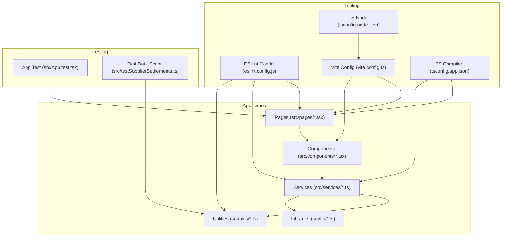
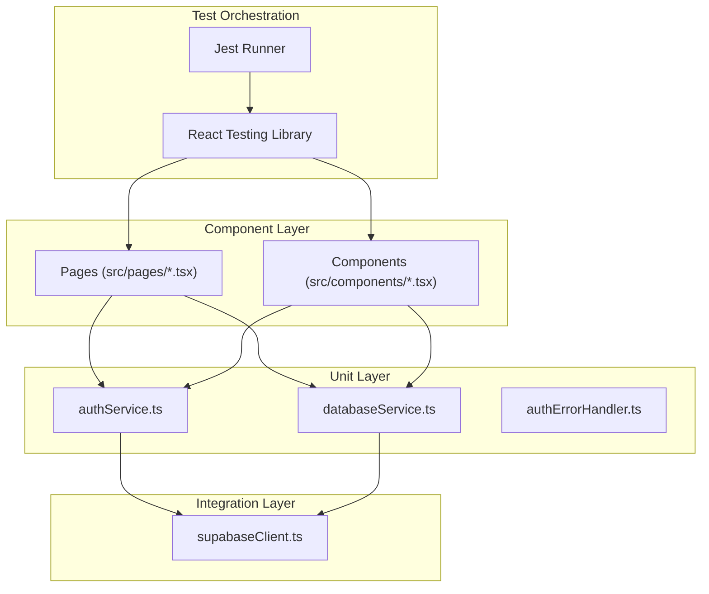
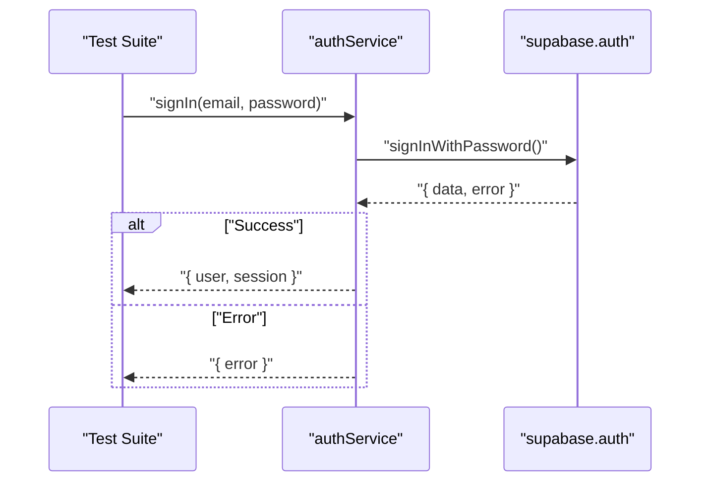
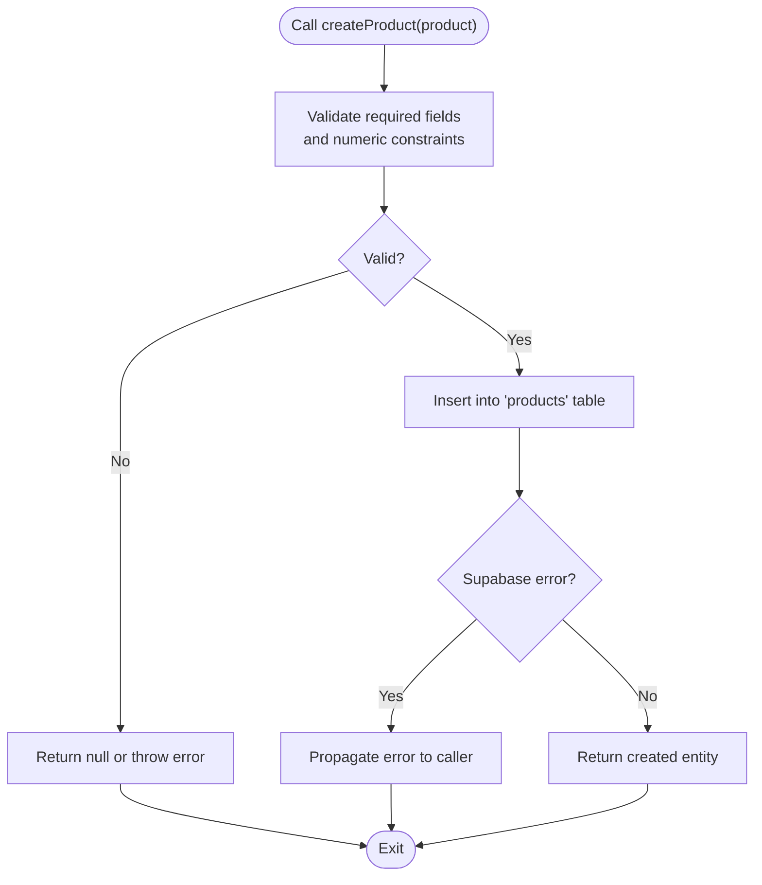
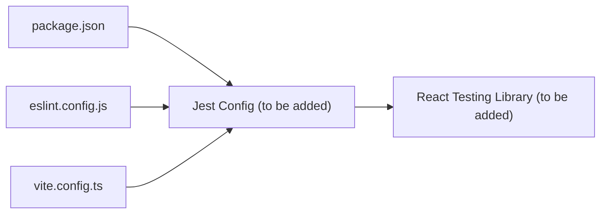

# Testing and Quality Assurance

<cite>
**Referenced Files in This Document**
- [package.json](file://package.json)
- [eslint.config.js](file://eslint.config.js)
- [vite.config.ts](file://vite.config.ts)
- [tsconfig.app.json](file://tsconfig.app.json)
- [tsconfig.node.json](file://tsconfig.node.json)
- [src/App.test.tsx](file://src/App.test.tsx)
- [src/testSupplierSettlements.ts](file://src/testSupplierSettlements.ts)
- [src/services/authService.ts](file://src/services/authService.ts)
- [src/services/databaseService.ts](file://src/services/databaseService.ts)
- [src/utils/authErrorHandler.ts](file://src/utils/authErrorHandler.ts)
- [src/lib/supabaseClient.ts](file://src/lib/supabaseClient.ts)
</cite>

## Table of Contents
1. [Introduction](#introduction)
2. [Project Structure](#project-structure)
3. [Core Components](#core-components)
4. [Architecture Overview](#architecture-overview)
5. [Detailed Component Analysis](#detailed-component-analysis)
6. [Dependency Analysis](#dependency-analysis)
7. [Performance Considerations](#performance-considerations)
8. [Troubleshooting Guide](#troubleshooting-guide)
9. [Conclusion](#conclusion)
10. [Appendices](#appendices)

## Introduction
This document defines the complete testing and quality assurance strategy for Royal POS Modern. It covers unit testing, integration testing, and end-to-end testing approaches; the testing framework setup with Jest and React Testing Library; code quality standards via ESLint and TypeScript linting; testing patterns across components, services, and integrations; QA processes including code review, automated pipelines, and performance testing; coverage requirements, mocking strategies, and test data management; debugging techniques, error-handling tests, and performance optimization testing; and practical examples for writing effective tests while maintaining high code quality.

## Project Structure
The project is a Vite + React + TypeScript application using Supabase for authentication and data persistence. Testing is currently minimal, with a placeholder test file and a small utility script for test data population. The repository includes:
- Frontend application under src/
- Services and utilities for authentication and database operations
- ESLint configuration for TypeScript linting
- Vite configuration for bundling and aliases
- TypeScript compiler options for strictness and module resolution

**Diagram sources**
- [vite.config.ts:1-33](file://vite.config.ts#L1-L33)
- [eslint.config.js:1-30](file://eslint.config.js#L1-L30)
- [tsconfig.app.json:1-32](file://tsconfig.app.json#L1-L32)
- [tsconfig.node.json:1-22](file://tsconfig.node.json#L1-L22)
- [src/App.test.tsx:1-14](file://src/App.test.tsx#L1-L14)
- [src/testSupplierSettlements.ts:1-45](file://src/testSupplierSettlements.ts#L1-L45)

**Section sources**
- [package.json:1-95](file://package.json#L1-L95)
- [vite.config.ts:1-33](file://vite.config.ts#L1-L33)
- [eslint.config.js:1-30](file://eslint.config.js#L1-L30)
- [tsconfig.app.json:1-32](file://tsconfig.app.json#L1-L32)
- [tsconfig.node.json:1-22](file://tsconfig.node.json#L1-L22)
- [src/App.test.tsx:1-14](file://src/App.test.tsx#L1-L14)
- [src/testSupplierSettlements.ts:1-45](file://src/testSupplierSettlements.ts#L1-L45)

## Core Components
- Authentication service: Provides sign-up, sign-in, sign-out, password reset/update, and user metadata retrieval.
- Database service: Defines TypeScript interfaces for domain entities and exposes CRUD operations against Supabase tables.
- Auth error handler: Centralized error handling for authentication failures and session refresh logic.
- Supabase client: Creates and configures the Supabase client with environment variables and auto-refresh settings.
- Test utilities: Placeholder test and a small script to populate localStorage with sample supplier settlements for UI testing.

Key testing targets:
- Unit tests for service functions (authService, databaseService) focusing on error handling, validation, and return values.
- Component tests for UI pages and dialogs that rely on services and context providers.
- Integration tests validating service-to-Supabase interactions and error propagation.
- E2E tests for critical user journeys (login, product CRUD, settlement flows).

**Section sources**
- [src/services/authService.ts:1-127](file://src/services/authService.ts#L1-L127)
- [src/services/databaseService.ts:1-800](file://src/services/databaseService.ts#L1-L800)
- [src/utils/authErrorHandler.ts:1-92](file://src/utils/authErrorHandler.ts#L1-L92)
- [src/lib/supabaseClient.ts:1-33](file://src/lib/supabaseClient.ts#L1-L33)
- [src/App.test.tsx:1-14](file://src/App.test.tsx#L1-L14)
- [src/testSupplierSettlements.ts:1-45](file://src/testSupplierSettlements.ts#L1-L45)

## Architecture Overview
The testing architecture centers around:
- Unit tests for pure functions and service logic
- Component tests for UI rendering and behavior
- Integration tests for service-to-database interactions
- E2E tests for end-to-end user flows

**Diagram sources**
- [src/services/authService.ts:1-127](file://src/services/authService.ts#L1-L127)
- [src/services/databaseService.ts:1-800](file://src/services/databaseService.ts#L1-L800)
- [src/utils/authErrorHandler.ts:1-92](file://src/utils/authErrorHandler.ts#L1-L92)
- [src/lib/supabaseClient.ts:1-33](file://src/lib/supabaseClient.ts#L1-L33)

## Detailed Component Analysis

### Authentication Service Testing
Patterns:
- Mock Supabase auth methods to simulate success and error scenarios.
- Assert returned shape: { user, session } on success; { error } on failure.
- Verify error handling paths and logging.

**Diagram sources**
- [src/services/authService.ts:25-39](file://src/services/authService.ts#L25-L39)
- [src/lib/supabaseClient.ts:1-33](file://src/lib/supabaseClient.ts#L1-L33)

**Section sources**
- [src/services/authService.ts:1-127](file://src/services/authService.ts#L1-L127)
- [src/utils/authErrorHandler.ts:1-92](file://src/utils/authErrorHandler.ts#L1-L92)
- [src/lib/supabaseClient.ts:1-33](file://src/lib/supabaseClient.ts#L1-L33)

### Database Service Testing
Patterns:
- Mock Supabase queries to simulate table reads/writes.
- Validate input sanitization and error propagation.
- Test CRUD boundaries: missing IDs, negative prices, empty barcodes/SKUs.

**Diagram sources**
- [src/services/databaseService.ts:580-640](file://src/services/databaseService.ts#L580-L640)

**Section sources**
- [src/services/databaseService.ts:496-800](file://src/services/databaseService.ts#L496-L800)

### Component Testing Patterns
Recommended patterns:
- Render components with React Testing Library and user-event interactions.
- Wrap with providers (AuthContext, LanguageContext) as needed.
- Mock services and Supabase client to isolate component behavior.
- Assert DOM updates, accessibility attributes, and error messages.

Example focus areas:
- LoginForm: submit with valid/invalid credentials, show error messaging.
- ProductManagementCard: CRUD actions, loading states, error states.
- ProtectedRoute: redirect behavior when unauthenticated.

**Section sources**
- [src/App.test.tsx:1-14](file://src/App.test.tsx#L1-14)

### Integration Testing Patterns
Approach:
- Use isolated test databases or Supabase test schemas.
- Test service-to-database flows: create/read/update/delete with realistic data.
- Validate error propagation and transaction-like behavior.

Areas to target:
- Product creation with barcode/SKU uniqueness constraints.
- User CRUD operations and role-based access checks.
- Settlement creation and balance calculations.

**Section sources**
- [src/services/databaseService.ts:415-494](file://src/services/databaseService.ts#L415-L494)
- [src/services/authService.ts:5-82](file://src/services/authService.ts#L5-L82)

### End-to-End Testing Patterns
Focus:
- Critical user journeys: Login → Dashboard → Product Search → Sale → Settlement.
- Cross-page navigation and state persistence.
- Error scenarios: network failures, invalid inputs, session expiration.

Tools recommendation:
- Playwright or Cypress for browser automation.
- Environment-specific test environments with seeded data.

[No sources needed since this section provides general guidance]

## Dependency Analysis
Current state:
- No explicit test runner or framework configured in package.json scripts.
- ESLint and TypeScript are configured; no dedicated test lint rules.
- Vite aliases configured for "@/" path resolution.

Recommendations:
- Add Jest and React Testing Library to devDependencies.
- Configure Jest with TypeScript support and RTL matchers.
- Integrate ESLint with Jest plugin for test linting.

**Diagram sources**
- [package.json:1-95](file://package.json#L1-L95)
- [eslint.config.js:1-30](file://eslint.config.js#L1-L30)
- [vite.config.ts:1-33](file://vite.config.ts#L1-L33)

**Section sources**
- [package.json:1-95](file://package.json#L1-L95)
- [eslint.config.js:1-30](file://eslint.config.js#L1-L30)
- [vite.config.ts:1-33](file://vite.config.ts#L1-L33)

## Performance Considerations
- Prefer lightweight mocks over real network calls in unit tests.
- Use deterministic data generation for large datasets in integration tests.
- Limit concurrent tests that hit shared resources (e.g., Supabase).
- Profile bundle sizes and avoid heavy test fixtures in component tests.

[No sources needed since this section provides general guidance]

## Troubleshooting Guide
Common issues and resolutions:
- Supabase env variables not set: The client logs warnings when environment variables are missing. Ensure VITE_SUPABASE_URL and VITE_SUPABASE_ANON_KEY are configured.
- Session refresh failures: Use AuthErrorHandler to detect invalid sessions and clear stale tokens.
- Test flakiness: Isolate external dependencies with mocks; seed deterministic data; avoid relying on global state.

Practical steps:
- Add environment variable validation in CI/CD to fail fast on misconfiguration.
- Centralize error handling in authErrorHandler and reuse across services.
- Use test data scripts sparingly; prefer in-test factories or fixtures.

**Section sources**
- [src/lib/supabaseClient.ts:10-17](file://src/lib/supabaseClient.ts#L10-L17)
- [src/utils/authErrorHandler.ts:40-92](file://src/utils/authErrorHandler.ts#L40-L92)
- [src/testSupplierSettlements.ts:1-45](file://src/testSupplierSettlements.ts#L1-L45)

## Conclusion
Royal POS Modern currently has a minimal testing footprint. The recommended path is to establish a robust testing foundation with Jest and React Testing Library, adopt comprehensive testing patterns for services and components, enforce code quality via ESLint and TypeScript linting, and implement integration and E2E tests for critical flows. This will improve reliability, maintainability, and developer confidence as the application evolves.

[No sources needed since this section summarizes without analyzing specific files]

## Appendices

### A. Testing Strategy Matrix
- Unit tests: Service functions, utilities, pure functions
- Component tests: UI components, dialogs, forms
- Integration tests: Service-to-database interactions, auth flows
- E2E tests: End-to-end user journeys, cross-page flows

[No sources needed since this section provides general guidance]

### B. Code Quality Standards
- ESLint configuration extends recommended rules and adds React Hooks and React Refresh plugins.
- TypeScript strictness is relaxed in app config; consider tightening for improved safety.
- Enforce unused variable rules consistently across the codebase.

**Section sources**
- [eslint.config.js:1-30](file://eslint.config.js#L1-L30)
- [tsconfig.app.json:17-22](file://tsconfig.app.json#L17-L22)

### C. Test Coverage Requirements
- Target 80%+ for services and utilities.
- Target 70%+ for components.
- Prioritize critical paths: authentication, product CRUD, settlement flows.

[No sources needed since this section provides general guidance]

### D. Mocking Strategies
- Use library-level mocks for Supabase client methods.
- Mock context providers for components requiring AuthContext/LanguageContext.
- Use deterministic factories for test data; avoid real network calls.

[No sources needed since this section provides general guidance]

### E. Test Data Management
- Use small, deterministic fixtures for unit tests.
- Use test data scripts for UI testing scenarios (e.g., sample settlements).
- For integration tests, seed test schemas and clean up after runs.

**Section sources**
- [src/testSupplierSettlements.ts:1-45](file://src/testSupplierSettlements.ts#L1-L45)

### F. Practical Examples
- Example: Write a unit test for signIn that asserts success and error branches.
- Example: Write a component test for LoginForm that simulates user input and validates error messages.
- Example: Write an integration test for createProduct that validates constraints and error propagation.

[No sources needed since this section provides general guidance]