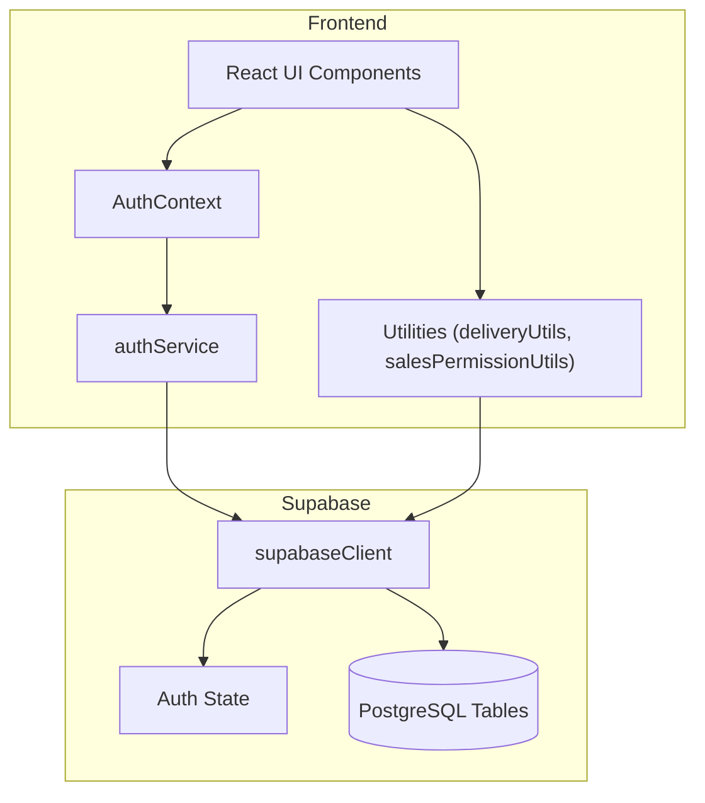
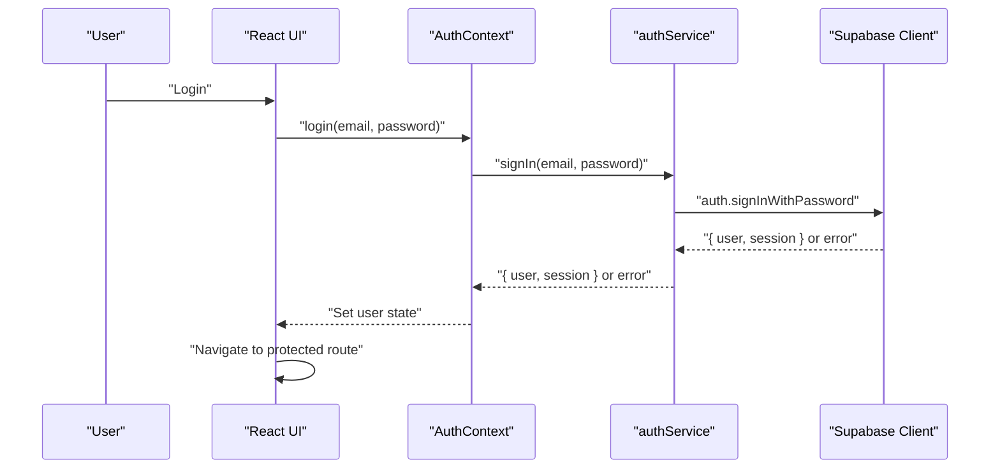
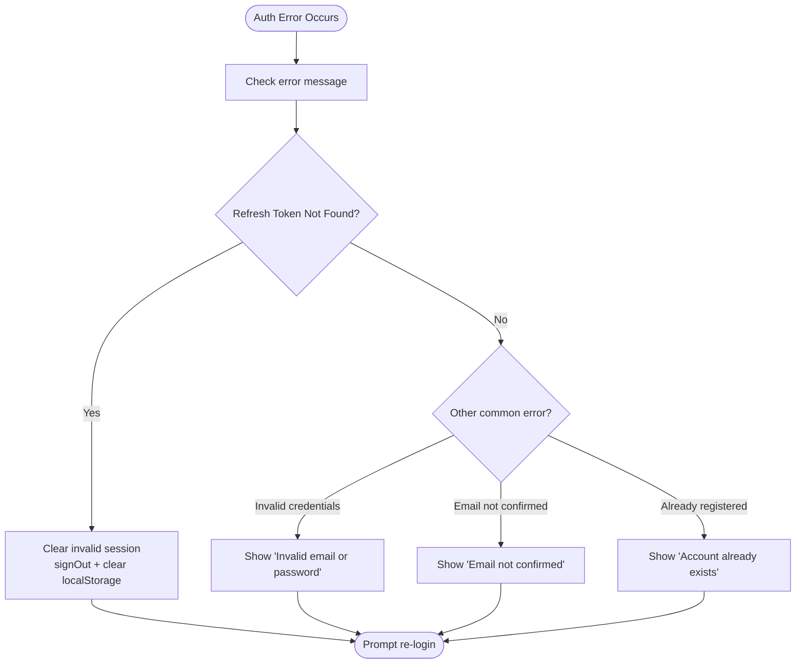
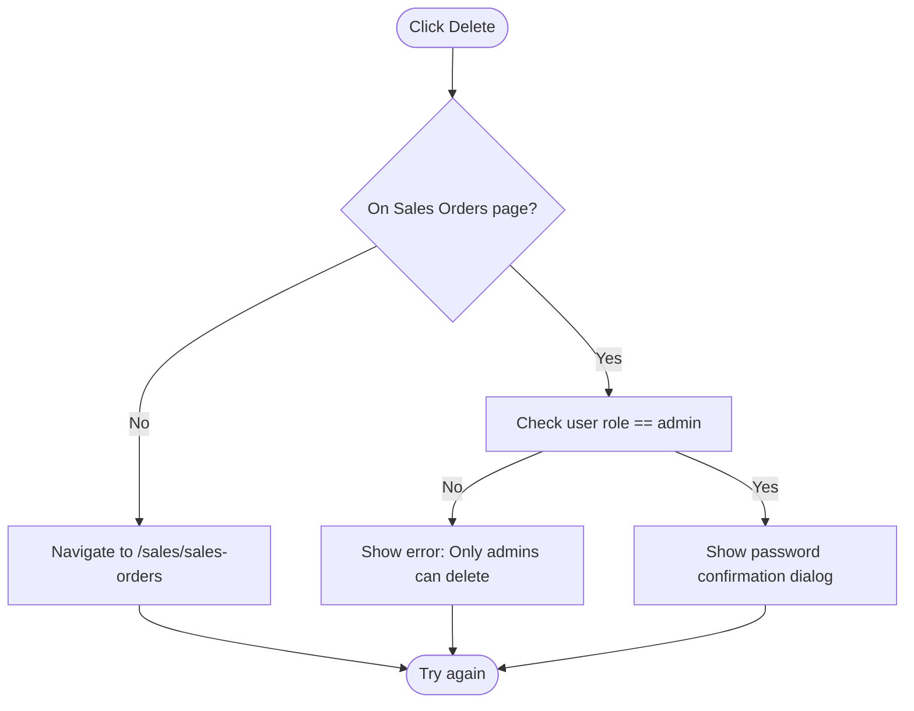
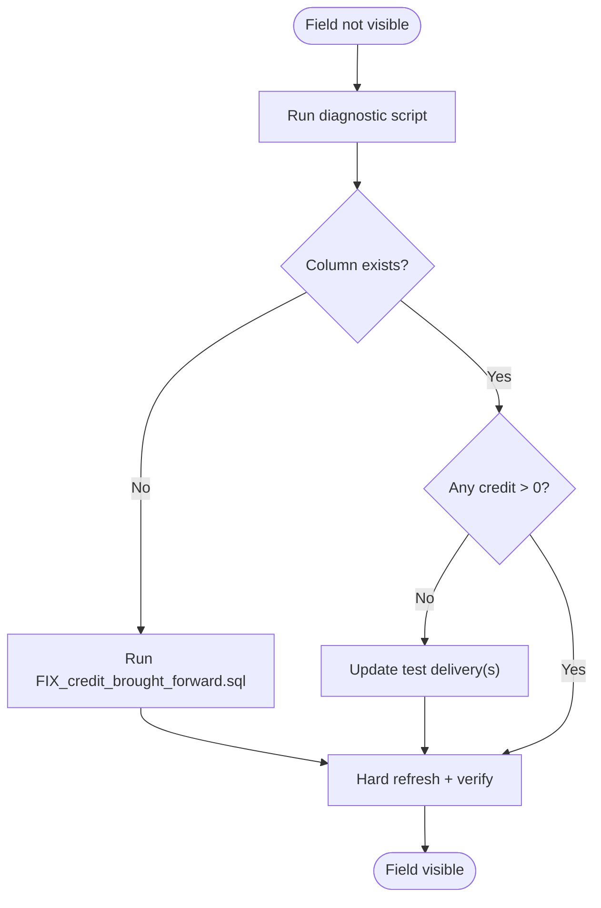
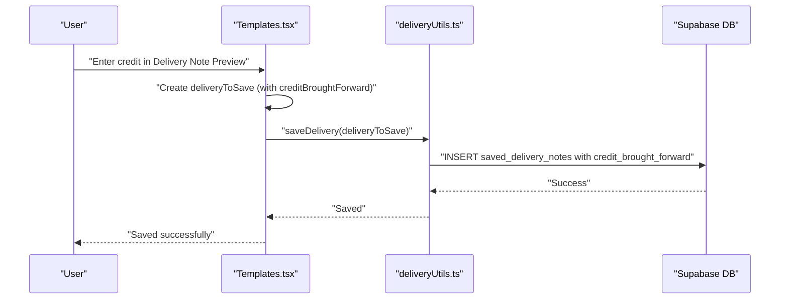
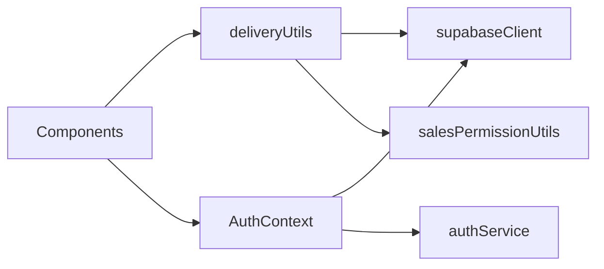

# Troubleshooting and FAQ

<cite>
**Referenced Files in This Document**
- [README.md](file://README.md)
- [DEBUG_DELETE_ISSUE.md](file://DEBUG_DELETE_ISSUE.md)
- [TROUBLESHOOTING_CREDIT_BROUGHT_FORWARD.md](file://TROUBLESHOOTING_CREDIT_BROUGHT_FORWARD.md)
- [CREDIT_BROUGHT_FORWARD_FIX.md](file://CREDIT_BROUGHT_FORWARD_FIX.md)
- [CREDIT_BROUGHT_FORWARD_SAVE_FIX.md](file://CREDIT_BROUGHT_FORWARD_SAVE_FIX.md)
- [DEPLOYMENT_NETLIFY.md](file://DEPLOYMENT_NETLIFY.md)
- [src/contexts/AuthContext.tsx](file://src/contexts/AuthContext.tsx)
- [src/services/authService.ts](file://src/services/authService.ts)
- [src/lib/supabaseClient.ts](file://src/lib/supabaseClient.ts)
- [src/utils/authErrorHandler.ts](file://src/utils/authErrorHandler.ts)
- [src/utils/salesPermissionUtils.ts](file://src/utils/salesPermissionUtils.ts)
- [src/utils/deliveryUtils.ts](file://src/utils/deliveryUtils.ts)
- [src/components/SavedSalesOrdersSection.tsx](file://src/components/SavedSalesOrdersSection.tsx)
- [scripts/check_credit_brought_forward.js](file://scripts/check_credit_brought_forward.js)
- [scripts/run-migration.js](file://scripts/run-migration.js)
- [migrations/FIX_credit_brought_forward.sql](file://migrations/FIX_credit_brought_forward.sql)
</cite>

## Table of Contents
1. [Introduction](#introduction)
2. [Project Structure](#project-structure)
3. [Core Components](#core-components)
4. [Architecture Overview](#architecture-overview)
5. [Detailed Component Analysis](#detailed-component-analysis)
6. [Dependency Analysis](#dependency-analysis)
7. [Performance Considerations](#performance-considerations)
8. [Troubleshooting Guide](#troubleshooting-guide)
9. [Conclusion](#conclusion)
10. [Appendices](#appendices)

## Introduction
This document provides comprehensive troubleshooting and FAQ guidance for Royal POS Modern. It focuses on resolving common issues such as credit brought forward not displaying, debug deletion not appearing, and authentication/database connectivity concerns. It also covers systematic diagnostics for performance bottlenecks, error message interpretations, preventive measures, best practices, emergency procedures, and step-by-step resolution techniques.

## Project Structure
The application is a React + TypeScript frontend integrated with Supabase for authentication and data persistence. Key areas relevant to troubleshooting include:
- Authentication and session management
- Supabase client configuration and environment variables
- Sales order deletion logic differences between pages
- Credit brought forward feature across templates, saved deliveries, and UI
- Deployment and environment variable configuration

**Diagram sources**
- [src/contexts/AuthContext.tsx:1-118](file://src/contexts/AuthContext.tsx#L1-L118)
- [src/services/authService.ts:1-127](file://src/services/authService.ts#L1-L127)
- [src/lib/supabaseClient.ts:1-33](file://src/lib/supabaseClient.ts#L1-L33)
- [src/utils/deliveryUtils.ts:1-609](file://src/utils/deliveryUtils.ts#L1-L609)
- [src/utils/salesPermissionUtils.ts:1-171](file://src/utils/salesPermissionUtils.ts#L1-L171)

**Section sources**
- [README.md:1-207](file://README.md#L1-L207)

## Core Components
- Authentication and session lifecycle with Supabase, including error handling for refresh tokens and invalid sessions.
- Supabase client initialization with environment variable validation.
- Sales order deletion behavior differs by page; correct page navigation is required for proper delete confirmation dialogs.
- Credit brought forward feature spans database migrations, UI display/edit, and save logic in templates.

**Section sources**
- [src/contexts/AuthContext.tsx:1-118](file://src/contexts/AuthContext.tsx#L1-L118)
- [src/services/authService.ts:1-127](file://src/services/authService.ts#L1-L127)
- [src/lib/supabaseClient.ts:1-33](file://src/lib/supabaseClient.ts#L1-L33)
- [src/utils/authErrorHandler.ts:1-92](file://src/utils/authErrorHandler.ts#L1-L92)
- [src/components/SavedSalesOrdersSection.tsx:1-200](file://src/components/SavedSalesOrdersSection.tsx#L1-L200)
- [src/utils/deliveryUtils.ts:1-609](file://src/utils/deliveryUtils.ts#L1-L609)
- [TROUBLESHOOTING_CREDIT_BROUGHT_FORWARD.md:1-172](file://TROUBLESHOOTING_CREDIT_BROUGHT_FORWARD.md#L1-L172)

## Architecture Overview
The system relies on Supabase for:
- Authentication (sign-in/sign-out, session persistence, password reset)
- Authorization via user metadata and role-based access
- Data persistence and retrieval for sales, deliveries, and related entities

**Diagram sources**
- [src/contexts/AuthContext.tsx:56-76](file://src/contexts/AuthContext.tsx#L56-L76)
- [src/services/authService.ts:25-39](file://src/services/authService.ts#L25-L39)
- [src/lib/supabaseClient.ts:20-31](file://src/lib/supabaseClient.ts#L20-L31)

## Detailed Component Analysis

### Authentication and Session Management
Common issues:
- Invalid login credentials
- Email not confirmed
- Refresh token/session invalid/expired
- Environment variables not set for Supabase

Resolution steps:
- Confirm environment variables are present and correct.
- Clear invalid sessions when refresh token errors occur.
- Use the provided error handler to present user-friendly messages.

**Diagram sources**
- [src/utils/authErrorHandler.ts:14-38](file://src/utils/authErrorHandler.ts#L14-L38)
- [src/contexts/AuthContext.tsx:26-34](file://src/contexts/AuthContext.tsx#L26-L34)

**Section sources**
- [src/contexts/AuthContext.tsx:1-118](file://src/contexts/AuthContext.tsx#L1-L118)
- [src/services/authService.ts:1-127](file://src/services/authService.ts#L1-L127)
- [src/utils/authErrorHandler.ts:1-92](file://src/utils/authErrorHandler.ts#L1-L92)
- [src/lib/supabaseClient.ts:1-33](file://src/lib/supabaseClient.ts#L1-L33)

### Sales Order Deletion: Debug Dialog Not Appearing
Problem:
- Clicking delete shows “No Saved Sales Orders” instead of a password confirmation dialog.

Root cause:
- Confusion between Sales Orders management and Saved Sales Orders pages; incorrect page context.

Resolution:
- Navigate to the correct page: Sales Orders management (/sales/sales-orders).
- Verify user role is admin; non-admins are blocked from delete.
- Clear browser cache if stale code is cached.
- Use console logs to confirm delete handler is invoked.

**Diagram sources**
- [DEBUG_DELETE_ISSUE.md:13-127](file://DEBUG_DELETE_ISSUE.md#L13-L127)
- [src/components/SavedSalesOrdersSection.tsx:98-121](file://src/components/SavedSalesOrdersSection.tsx#L98-L121)

**Section sources**
- [DEBUG_DELETE_ISSUE.md:1-213](file://DEBUG_DELETE_ISSUE.md#L1-L213)
- [src/components/SavedSalesOrdersSection.tsx:1-200](file://src/components/SavedSalesOrdersSection.tsx#L1-L200)

### Credit Brought Forward: Field Not Displaying
Problem:
- “Credit Brought Forward from previous:” not visible in Saved Deliveries despite database column existence.

Root causes and fixes:
- Database column missing: run migration to add credit_brought_forward.
- Column exists but values are zero: update records to non-zero values for visibility.
- UI previously conditionally rendered only when > 0: now always displayed.

Verification steps:
- Run diagnostic script to check column presence and sample values.
- Manually update test deliveries if needed.
- Hard refresh browser and verify display in Delivery Details.

**Diagram sources**
- [TROUBLESHOOTING_CREDIT_BROUGHT_FORWARD.md:54-86](file://TROUBLESHOOTING_CREDIT_BROUGHT_FORWARD.md#L54-L86)
- [scripts/check_credit_brought_forward.js:22-99](file://scripts/check_credit_brought_forward.js#L22-L99)

**Section sources**
- [TROUBLESHOOTING_CREDIT_BROUGHT_FORWARD.md:1-172](file://TROUBLESHOOTING_CREDIT_BROUGHT_FORWARD.md#L1-L172)
- [CREDIT_BROUGHT_FORWARD_FIX.md:1-129](file://CREDIT_BROUGHT_FORWARD_FIX.md#L1-L129)
- [CREDIT_BROUGHT_FORWARD_SAVE_FIX.md:1-153](file://CREDIT_BROUGHT_FORWARD_SAVE_FIX.md#L1-L153)
- [migrations/FIX_credit_brought_forward.sql](file://migrations/FIX_credit_brought_forward.sql)
- [scripts/check_credit_brought_forward.js:1-99](file://scripts/check_credit_brought_forward.js#L1-L99)

### Delivery Save Logic: Credit Not Persisted
Problem:
- Entering credit in Delivery Note Preview did not save to database; always showed 0.00 in Saved Deliveries.

Root cause:
- Missing creditBroughtForward in deliveryToSave objects in Templates.tsx save functions.

Fix applied:
- Added creditBroughtForward to both save locations with default fallback to 0.

**Diagram sources**
- [CREDIT_BROUGHT_FORWARD_SAVE_FIX.md:15-54](file://CREDIT_BROUGHT_FORWARD_SAVE_FIX.md#L15-L54)
- [src/utils/deliveryUtils.ts:31-140](file://src/utils/deliveryUtils.ts#L31-L140)

**Section sources**
- [CREDIT_BROUGHT_FORWARD_SAVE_FIX.md:1-153](file://CREDIT_BROUGHT_FORWARD_SAVE_FIX.md#L1-L153)
- [src/utils/deliveryUtils.ts:1-609](file://src/utils/deliveryUtils.ts#L1-L609)

### Deployment and Environment Variables
Common deployment issues:
- Build failures due to missing dependencies or mismatched build commands.
- Environment variables not prefixed with VITE_ or not set in Netlify.
- Database connection issues due to incorrect Supabase credentials or RLS misconfiguration.

Resolution:
- Ensure build command and publish directory align with configuration files.
- Set VITE_SUPABASE_URL and VITE_SUPABASE_ANON_KEY in Netlify.
- Verify Supabase project accessibility and RLS policies.

**Section sources**
- [DEPLOYMENT_NETLIFY.md:1-102](file://DEPLOYMENT_NETLIFY.md#L1-L102)

## Dependency Analysis
Key dependencies and relationships:
- AuthContext depends on Supabase client and authService for session management.
- Utilities (deliveryUtils, salesPermissionUtils) depend on Supabase for database operations and user roles.
- Frontend components rely on these utilities for data access and permission checks.

**Diagram sources**
- [src/contexts/AuthContext.tsx:1-118](file://src/contexts/AuthContext.tsx#L1-L118)
- [src/services/authService.ts:1-127](file://src/services/authService.ts#L1-L127)
- [src/utils/deliveryUtils.ts:1-609](file://src/utils/deliveryUtils.ts#L1-L609)
- [src/utils/salesPermissionUtils.ts:1-171](file://src/utils/salesPermissionUtils.ts#L1-L171)
- [src/lib/supabaseClient.ts:1-33](file://src/lib/supabaseClient.ts#L1-L33)

**Section sources**
- [src/contexts/AuthContext.tsx:1-118](file://src/contexts/AuthContext.tsx#L1-L118)
- [src/services/authService.ts:1-127](file://src/services/authService.ts#L1-L127)
- [src/utils/deliveryUtils.ts:1-609](file://src/utils/deliveryUtils.ts#L1-L609)
- [src/utils/salesPermissionUtils.ts:1-171](file://src/utils/salesPermissionUtils.ts#L1-L171)
- [src/lib/supabaseClient.ts:1-33](file://src/lib/supabaseClient.ts#L1-L33)

## Performance Considerations
- Minimize unnecessary re-renders by using stable callbacks and memoization in components.
- Batch database writes where possible (e.g., delivery updates) to reduce network overhead.
- Use local storage as a fallback for offline scenarios while ensuring eventual consistency with the database.
- Monitor Supabase query performance and add appropriate indexes for frequently filtered columns.

## Troubleshooting Guide

### Authentication Problems
Symptoms:
- Login fails with generic or specific messages.
- Session expires unexpectedly.

Steps:
- Verify environment variables (VITE_SUPABASE_URL, VITE_SUPABASE_ANON_KEY).
- Check browser console for error messages.
- Use the AuthErrorHandler to present clear messages and clear invalid sessions when refresh token errors occur.
- Confirm email confirmation status if applicable.

**Section sources**
- [src/lib/supabaseClient.ts:10-17](file://src/lib/supabaseClient.ts#L10-L17)
- [src/utils/authErrorHandler.ts:14-38](file://src/utils/authErrorHandler.ts#L14-L38)
- [src/contexts/AuthContext.tsx:26-34](file://src/contexts/AuthContext.tsx#L26-L34)

### Database Connectivity Issues
Symptoms:
- Queries fail with column not found errors.
- Data not syncing between local storage and database.

Steps:
- Confirm Supabase credentials and project accessibility.
- Run relevant migrations to add missing columns.
- Use diagnostic scripts to validate column presence and sample data.
- Ensure user roles permit access to required tables.

**Section sources**
- [scripts/check_credit_brought_forward.js:15-18](file://scripts/check_credit_brought_forward.js#L15-L18)
- [migrations/FIX_credit_brought_forward.sql](file://migrations/FIX_credit_brought_forward.sql)
- [src/utils/deliveryUtils.ts:142-215](file://src/utils/deliveryUtils.ts#L142-L215)

### Sales Order Deletion Issues
Symptoms:
- Delete action navigates away or shows “No Saved Sales Orders”.

Steps:
- Navigate to the correct page: Sales Orders management (/sales/sales-orders).
- Confirm user role is admin.
- Clear browser cache and reload.
- Inspect console logs to confirm delete handler invocation.

**Section sources**
- [DEBUG_DELETE_ISSUE.md:29-127](file://DEBUG_DELETE_ISSUE.md#L29-L127)
- [src/components/SavedSalesOrdersSection.tsx:98-121](file://src/components/SavedSalesOrdersSection.tsx#L98-L121)

### Credit Brought Forward Not Displaying
Symptoms:
- Field missing or always shows 0.00.

Steps:
- Run diagnostic script to check column existence and values.
- If missing, run the migration SQL.
- Update test deliveries to non-zero values if needed.
- Hard refresh and verify in Saved Deliveries and Delivery Details.

**Section sources**
- [TROUBLESHOOTING_CREDIT_BROUGHT_FORWARD.md:54-172](file://TROUBLESHOOTING_CREDIT_BROUGHT_FORWARD.md#L54-L172)
- [scripts/check_credit_brought_forward.js:22-99](file://scripts/check_credit_brought_forward.js#L22-L99)

### Credit Not Saved from Templates
Symptoms:
- Entering credit in Delivery Note Preview does not persist.

Steps:
- Confirm both save locations in Templates.tsx include creditBroughtForward.
- Ensure default fallback to 0 is applied.
- Verify Saved Deliveries and print preview reflect the value.

**Section sources**
- [CREDIT_BROUGHT_FORWARD_SAVE_FIX.md:15-54](file://CREDIT_BROUGHT_FORWARD_SAVE_FIX.md#L15-L54)
- [src/utils/deliveryUtils.ts:31-140](file://src/utils/deliveryUtils.ts#L31-L140)

### Deployment and Environment Variables
Symptoms:
- Build fails or environment variables not recognized.
- Database connection errors after deployment.

Steps:
- Ensure build command and publish directory match configuration.
- Set VITE_SUPABASE_URL and VITE_SUPABASE_ANON_KEY in Netlify.
- Validate Supabase credentials and RLS policies.

**Section sources**
- [DEPLOYMENT_NETLIFY.md:56-93](file://DEPLOYMENT_NETLIFY.md#L56-L93)

### Emergency Procedures and Data Recovery
- Clear invalid sessions and force re-authentication when refresh token errors occur.
- Use Supabase SQL Editor to run migrations and recover missing schema elements.
- Validate data integrity by querying saved deliveries and cross-checking totals and amounts.
- Rebuild and redeploy if environment variables are corrected.

**Section sources**
- [src/utils/authErrorHandler.ts:43-91](file://src/utils/authErrorHandler.ts#L43-L91)
- [scripts/run-migration.js:12-54](file://scripts/run-migration.js#L12-L54)

## Conclusion
This guide consolidates actionable troubleshooting steps for Royal POS Modern, focusing on authentication, database connectivity, sales order deletion, and the credit brought forward feature. By following the diagnostic procedures, applying the fixes outlined here, and adhering to best practices, most issues can be resolved efficiently and systematically.

## Appendices

### Frequently Asked Questions
- Q: Why does the delete dialog not appear?
  - A: Ensure you are on the Sales Orders management page and logged in as an admin.
- Q: The credit field is not visible in Saved Deliveries.
  - A: Run the migration to add the column and update test records if needed.
- Q: Credit entered in Templates is not saved.
  - A: Confirm both save locations include creditBroughtForward and redeploy.
- Q: Authentication keeps failing.
  - A: Verify environment variables and check the console for specific error messages.

**Section sources**
- [DEBUG_DELETE_ISSUE.md:128-172](file://DEBUG_DELETE_ISSUE.md#L128-L172)
- [TROUBLESHOOTING_CREDIT_BROUGHT_FORWARD.md:146-172](file://TROUBLESHOOTING_CREDIT_BROUGHT_FORWARD.md#L146-L172)
- [CREDIT_BROUGHT_FORWARD_SAVE_FIX.md:103-153](file://CREDIT_BROUGHT_FORWARD_SAVE_FIX.md#L103-L153)
- [src/utils/authErrorHandler.ts:14-38](file://src/utils/authErrorHandler.ts#L14-L38)