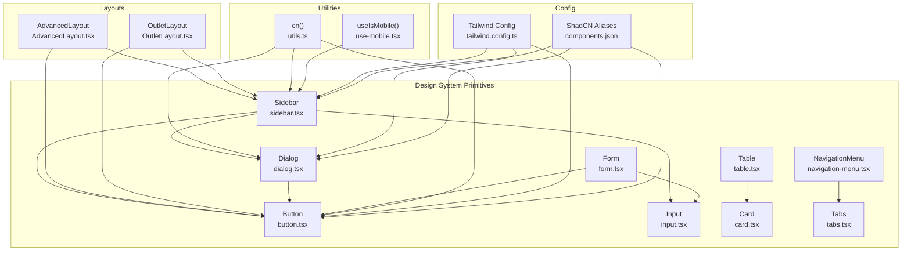
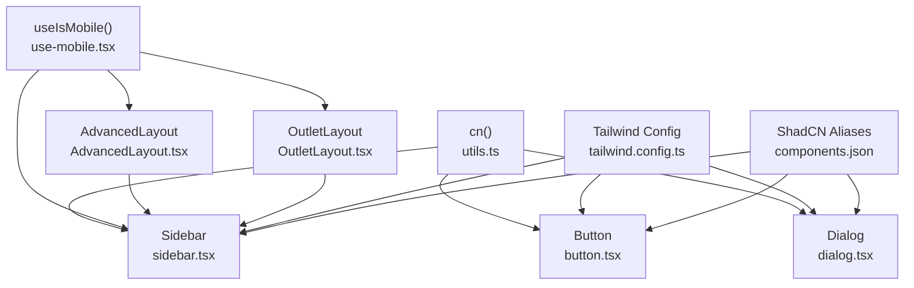
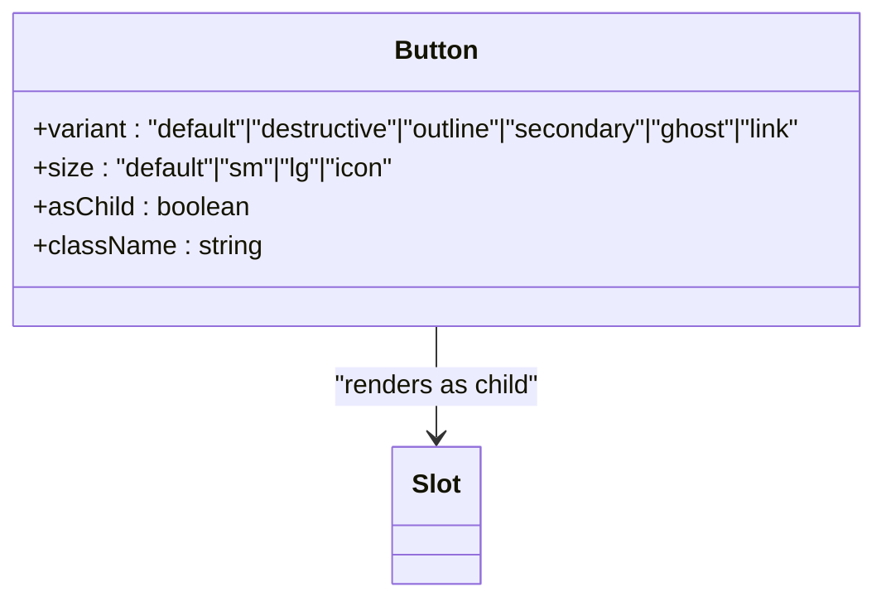
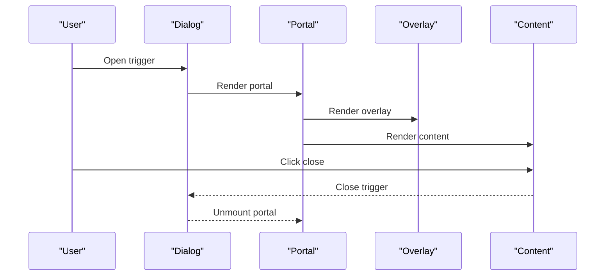
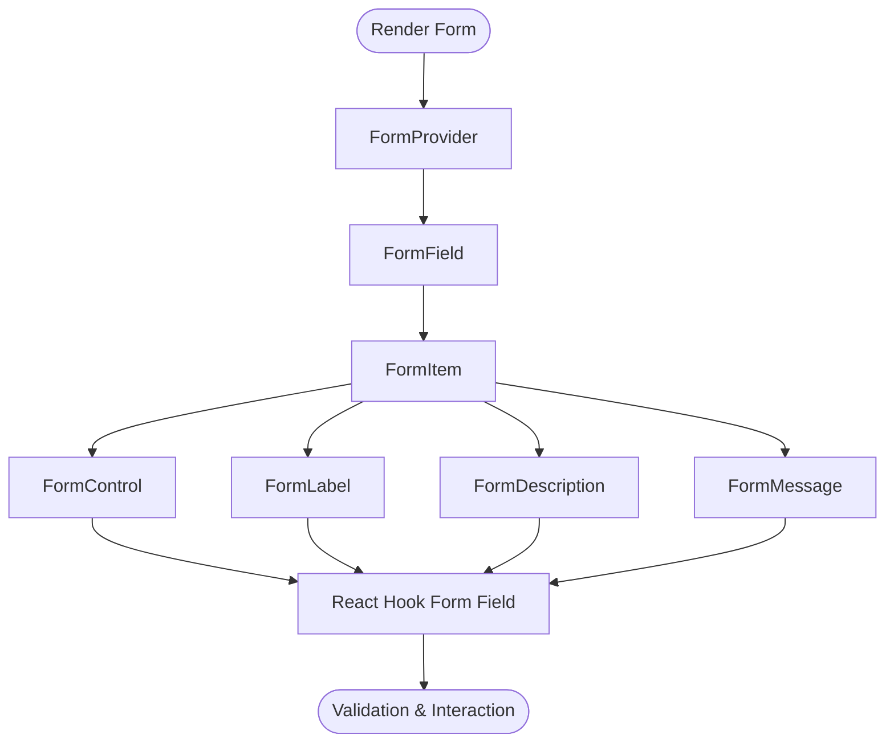
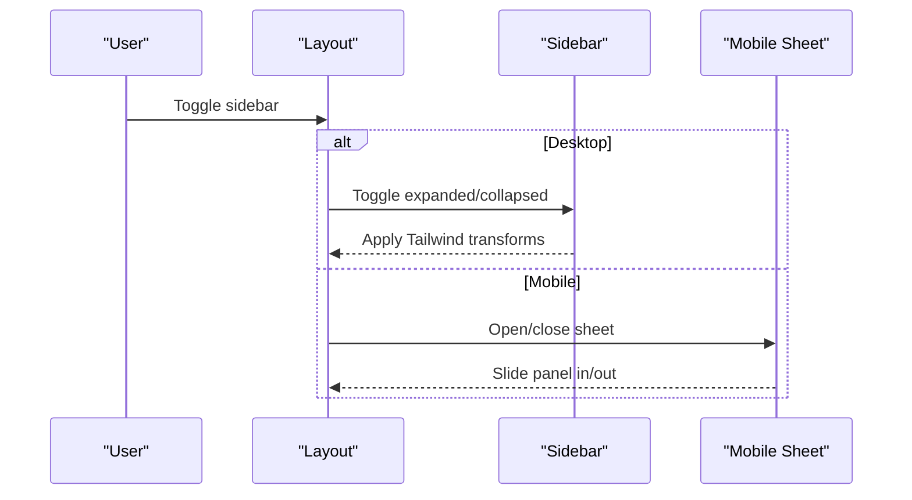
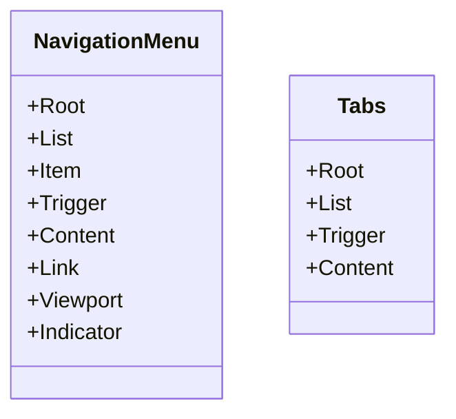
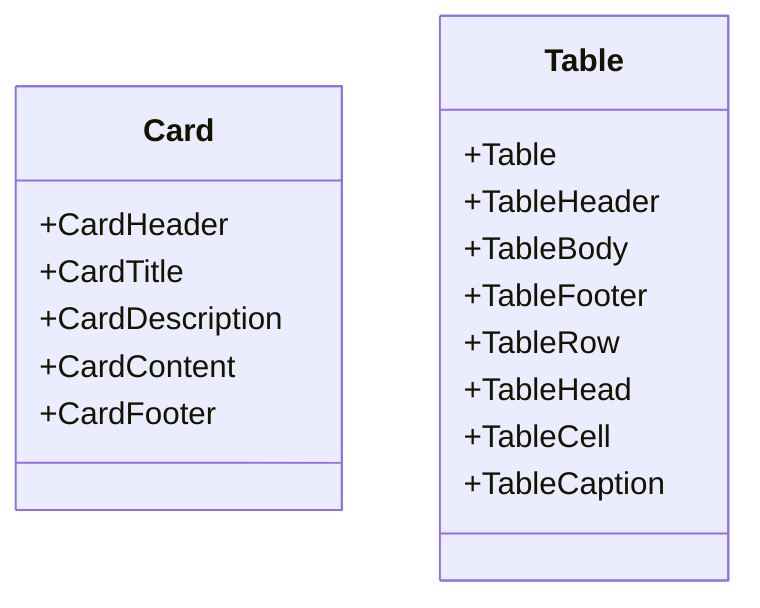
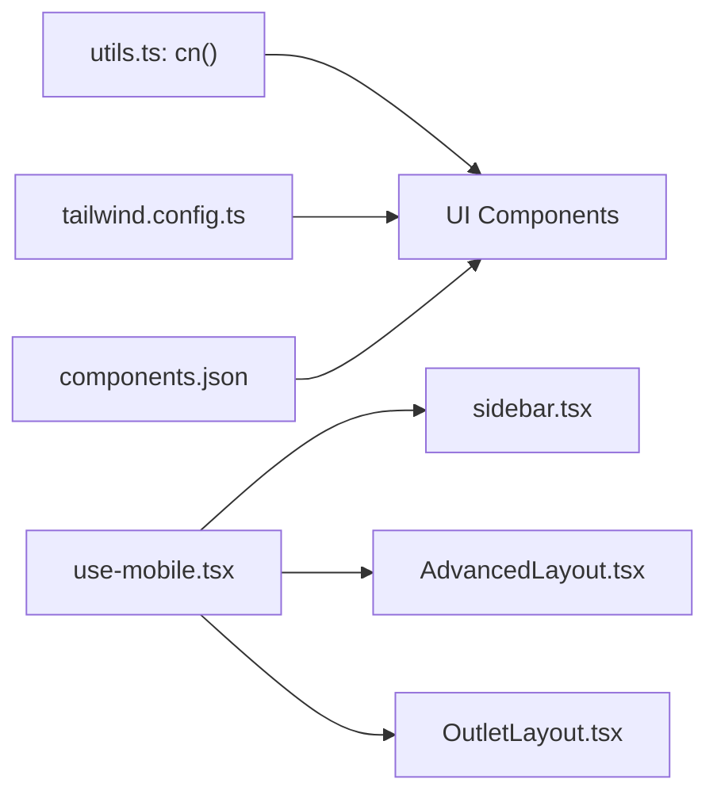

# UI Components and Design System

<cite>
**Referenced Files in This Document**
- [button.tsx](file://src/components/ui/button.tsx)
- [input.tsx](file://src/components/ui/input.tsx)
- [card.tsx](file://src/components/ui/card.tsx)
- [table.tsx](file://src/components/ui/table.tsx)
- [navigation-menu.tsx](file://src/components/ui/navigation-menu.tsx)
- [tabs.tsx](file://src/components/ui/tabs.tsx)
- [dialog.tsx](file://src/components/ui/dialog.tsx)
- [sidebar.tsx](file://src/components/ui/sidebar.tsx)
- [form.tsx](file://src/components/ui/form.tsx)
- [AdvancedLayout.tsx](file://src/components/AdvancedLayout.tsx)
- [OutletLayout.tsx](file://src/components/OutletLayout.tsx)
- [use-mobile.tsx](file://src/hooks/use-mobile.tsx)
- [utils.ts](file://src/lib/utils.ts)
- [tailwind.config.ts](file://tailwind.config.ts)
- [components.json](file://components.json)
</cite>

## Table of Contents
1. [Introduction](#introduction)
2. [Project Structure](#project-structure)
3. [Core Components](#core-components)
4. [Architecture Overview](#architecture-overview)
5. [Detailed Component Analysis](#detailed-component-analysis)
6. [Dependency Analysis](#dependency-analysis)
7. [Performance Considerations](#performance-considerations)
8. [Troubleshooting Guide](#troubleshooting-guide)
9. [Conclusion](#conclusion)
10. [Appendices](#appendices)

## Introduction
This document describes the UI components and design system of Royal POS Modern. The system is built on ShadCN UI components with Radix UI primitives and Tailwind CSS utility classes. It provides a cohesive library of buttons, forms, dialogs, navigation elements, and specialized POS layouts, unified by a consistent color scheme, typography, spacing, and responsive design. The documentation covers component APIs, customization options, accessibility, and integration patterns with the application’s routing and layout architecture.

## Project Structure
The design system is organized around a small set of reusable UI primitives under src/components/ui, complemented by higher-level layouts for admin and outlet dashboards. Utility helpers and configuration tie everything together.

**Diagram sources**
- [button.tsx:1-57](file://src/components/ui/button.tsx#L1-L57)
- [input.tsx:1-23](file://src/components/ui/input.tsx#L1-L23)
- [card.tsx:1-80](file://src/components/ui/card.tsx#L1-L80)
- [tabs.tsx:1-54](file://src/components/ui/tabs.tsx#L1-L54)
- [navigation-menu.tsx:1-129](file://src/components/ui/navigation-menu.tsx#L1-L129)
- [dialog.tsx:1-121](file://src/components/ui/dialog.tsx#L1-L121)
- [form.tsx:1-177](file://src/components/ui/form.tsx#L1-L177)
- [table.tsx:1-118](file://src/components/ui/table.tsx#L1-L118)
- [sidebar.tsx:1-762](file://src/components/ui/sidebar.tsx#L1-L762)
- [AdvancedLayout.tsx:1-421](file://src/components/AdvancedLayout.tsx#L1-L421)
- [OutletLayout.tsx:1-330](file://src/components/OutletLayout.tsx#L1-L330)
- [use-mobile.tsx:1-20](file://src/hooks/use-mobile.tsx#L1-L20)
- [utils.ts:1-7](file://src/lib/utils.ts#L1-L7)
- [tailwind.config.ts:1-118](file://tailwind.config.ts#L1-L118)
- [components.json:1-20](file://components.json#L1-L20)

**Section sources**
- [tailwind.config.ts:1-118](file://tailwind.config.ts#L1-L118)
- [components.json:1-20](file://components.json#L1-L20)

## Core Components
This section documents the foundational UI primitives and their customization options.

- Button
  - Purpose: Base action element with variants and sizes.
  - Variants: default, destructive, outline, secondary, ghost, link.
  - Sizes: default, sm, lg, icon.
  - Props: Inherits standard button attributes plus asChild, variant, size.
  - Accessibility: Focus-visible ring, disabled state handled.
  - Composition: Uses Slot for semantic composition; integrates with icons.

- Input
  - Purpose: Text input with consistent styling and focus states.
  - Props: Standard input attributes; responsive text sizing.
  - Accessibility: Proper focus ring and disabled state.

- Card
  - Purpose: Container with elevated presentation and optional header/title/description/content/footer.
  - Composition: Header/Footer/Content wrappers for consistent spacing.

- Tabs
  - Purpose: Tabbed content switching with accessible keyboard interaction.
  - Composition: Root, List, Trigger, Content.

- NavigationMenu
  - Purpose: Multi-level navigation with animated viewport and indicators.
  - Composition: Root, List, Item, Trigger, Content, Link, Viewport, Indicator.

- Dialog
  - Purpose: Modal overlays with portal rendering, backdrop, close controls, and responsive sizing.
  - Composition: Root, Portal, Overlay, Close, Trigger, Content, Header/Footer, Title, Description.

- Form
  - Purpose: Integration with react-hook-form via context providers and controlled components.
  - Composition: Form (provider), FormField, FormItem, FormLabel, FormControl, FormDescription, FormMessage.
  - Accessibility: ARIA attributes for labels, descriptions, and error messages.

- Table
  - Purpose: Structured data presentation with responsive wrapper.
  - Composition: Table, Thead, Tbody, Tfoot, Tr, Th, Td, Caption.

**Section sources**
- [button.tsx:1-57](file://src/components/ui/button.tsx#L1-L57)
- [input.tsx:1-23](file://src/components/ui/input.tsx#L1-L23)
- [card.tsx:1-80](file://src/components/ui/card.tsx#L1-L80)
- [tabs.tsx:1-54](file://src/components/ui/tabs.tsx#L1-L54)
- [navigation-menu.tsx:1-129](file://src/components/ui/navigation-menu.tsx#L1-L129)
- [dialog.tsx:1-121](file://src/components/ui/dialog.tsx#L1-L121)
- [form.tsx:1-177](file://src/components/ui/form.tsx#L1-L177)
- [table.tsx:1-118](file://src/components/ui/table.tsx#L1-L118)

## Architecture Overview
The design system leverages:
- ShadCN primitives with Tailwind CSS for styling.
- Radix UI primitives for accessible base components.
- Utility function cn() for composing Tailwind classes safely.
- Responsive breakpoints and mobile-first patterns.
- Context and hooks for cross-component coordination (e.g., Sidebar state, mobile detection).

**Diagram sources**
- [utils.ts:1-7](file://src/lib/utils.ts#L1-L7)
- [button.tsx:1-57](file://src/components/ui/button.tsx#L1-L57)
- [dialog.tsx:1-121](file://src/components/ui/dialog.tsx#L1-L121)
- [sidebar.tsx:1-762](file://src/components/ui/sidebar.tsx#L1-L762)
- [use-mobile.tsx:1-20](file://src/hooks/use-mobile.tsx#L1-L20)
- [AdvancedLayout.tsx:1-421](file://src/components/AdvancedLayout.tsx#L1-L421)
- [OutletLayout.tsx:1-330](file://src/components/OutletLayout.tsx#L1-L330)
- [tailwind.config.ts:1-118](file://tailwind.config.ts#L1-L118)
- [components.json:1-20](file://components.json#L1-L20)

## Detailed Component Analysis

### Button Component
- Implementation pattern: Variants and sizes via class-variance-authority; forwardRef with Slot for composition.
- Accessibility: Focus-visible ring, disabled pointer-events, SVG sizing/shrinking.
- Customization: Pass variant, size, className; use asChild to render as another component.

**Diagram sources**
- [button.tsx:1-57](file://src/components/ui/button.tsx#L1-L57)

**Section sources**
- [button.tsx:1-57](file://src/components/ui/button.tsx#L1-L57)

### Dialog Component
- Implementation pattern: Radix Dialog primitives with animated overlay/content; Portal rendering; close button with sr-only label.
- Accessibility: Proper ARIA attributes, focus trapping via Radix, escape key handling.
- Customization: Override className on content; use DialogHeader/Footer for structured layouts.

**Diagram sources**
- [dialog.tsx:1-121](file://src/components/ui/dialog.tsx#L1-L121)

**Section sources**
- [dialog.tsx:1-121](file://src/components/ui/dialog.tsx#L1-L121)

### Form Integration
- Implementation pattern: Context providers for react-hook-form; useFormField composes label, control, description, and message with ARIA attributes.
- Accessibility: Automatic aria-describedby and aria-invalid; dynamic IDs per field.

**Diagram sources**
- [form.tsx:1-177](file://src/components/ui/form.tsx#L1-L177)

**Section sources**
- [form.tsx:1-177](file://src/components/ui/form.tsx#L1-L177)

### Sidebar and Navigation Layouts
- Sidebar component supports desktop, floating/inset variants, collapsible modes, and mobile off-canvas via Sheet.
- AdvancedLayout and OutletLayout demonstrate:
  - Collapsible sidebar with smooth transitions.
  - Mobile menu overlay and slide-in panel.
  - Role-based menu filtering and navigation actions.
  - Dynamic class composition with cn() and Tailwind utilities.

**Diagram sources**
- [sidebar.tsx:1-762](file://src/components/ui/sidebar.tsx#L1-L762)
- [AdvancedLayout.tsx:1-421](file://src/components/AdvancedLayout.tsx#L1-L421)
- [OutletLayout.tsx:1-330](file://src/components/OutletLayout.tsx#L1-L330)

**Section sources**
- [sidebar.tsx:1-762](file://src/components/ui/sidebar.tsx#L1-L762)
- [AdvancedLayout.tsx:1-421](file://src/components/AdvancedLayout.tsx#L1-L421)
- [OutletLayout.tsx:1-330](file://src/components/OutletLayout.tsx#L1-L330)

### Navigation Elements
- NavigationMenu: Animated dropdowns with viewport and indicator; triggers expand/collapse with chevron rotation.
- Tabs: Accessible tab groups with active state styling and focus management.

**Diagram sources**
- [navigation-menu.tsx:1-129](file://src/components/ui/navigation-menu.tsx#L1-L129)
- [tabs.tsx:1-54](file://src/components/ui/tabs.tsx#L1-L54)

**Section sources**
- [navigation-menu.tsx:1-129](file://src/components/ui/navigation-menu.tsx#L1-L129)
- [tabs.tsx:1-54](file://src/components/ui/tabs.tsx#L1-L54)

### Data Display
- Card: Consistent container with header/title/description/content/footer segments.
- Table: Scrollable wrapper with striped rows and hover states.

**Diagram sources**
- [card.tsx:1-80](file://src/components/ui/card.tsx#L1-L80)
- [table.tsx:1-118](file://src/components/ui/table.tsx#L1-L118)

**Section sources**
- [card.tsx:1-80](file://src/components/ui/card.tsx#L1-L80)
- [table.tsx:1-118](file://src/components/ui/table.tsx#L1-L118)

## Dependency Analysis
- Utilities: cn() merges clsx and tailwind-merge to avoid conflicting classes.
- Responsive behavior: useIsMobile() detects screen size and informs Sidebar and layouts.
- Theming: Tailwind config defines color palette, spacing, and animations; CSS variables enable theme switching.
- Aliasing: ShadCN aliases map to local paths for consistent imports.

**Diagram sources**
- [utils.ts:1-7](file://src/lib/utils.ts#L1-L7)
- [use-mobile.tsx:1-20](file://src/hooks/use-mobile.tsx#L1-L20)
- [sidebar.tsx:1-762](file://src/components/ui/sidebar.tsx#L1-L762)
- [AdvancedLayout.tsx:1-421](file://src/components/AdvancedLayout.tsx#L1-L421)
- [OutletLayout.tsx:1-330](file://src/components/OutletLayout.tsx#L1-L330)
- [tailwind.config.ts:1-118](file://tailwind.config.ts#L1-L118)
- [components.json:1-20](file://components.json#L1-L20)

**Section sources**
- [utils.ts:1-7](file://src/lib/utils.ts#L1-L7)
- [use-mobile.tsx:1-20](file://src/hooks/use-mobile.tsx#L1-L20)
- [tailwind.config.ts:1-118](file://tailwind.config.ts#L1-L118)
- [components.json:1-20](file://components.json#L1-L20)

## Performance Considerations
- Prefer variant and size props over ad-hoc className overrides to minimize Tailwind bloat.
- Use cn() consistently to merge classes efficiently.
- Limit heavy animations on mobile; leverage useIsMobile() to adjust behavior.
- Keep Dialog portals mounted conditionally to reduce DOM churn.

## Troubleshooting Guide
- Dialog not closing or focus issues:
  - Ensure DialogClose is present and accessible; verify Portal rendering.
  - Check that overlay and content classes are applied correctly.
- Sidebar not toggling:
  - Confirm useIsMobile() returns expected values; verify keyboard shortcut handler and cookie persistence.
  - Inspect data-state and data-collapsible attributes for Tailwind selectors.
- Form accessibility errors:
  - Confirm useFormField is used inside FormItem/FormLabel/FormControl; ensure aria-describedby and aria-invalid are set.
- Mobile layout glitches:
  - Verify useIsMobile() breakpoint and media listeners; confirm layout classes adapt to lg and below.

**Section sources**
- [dialog.tsx:1-121](file://src/components/ui/dialog.tsx#L1-L121)
- [sidebar.tsx:1-762](file://src/components/ui/sidebar.tsx#L1-L762)
- [form.tsx:1-177](file://src/components/ui/form.tsx#L1-L177)
- [use-mobile.tsx:1-20](file://src/hooks/use-mobile.tsx#L1-L20)

## Conclusion
Royal POS Modern’s design system combines ShadCN primitives, Radix UI, and Tailwind CSS to deliver a consistent, accessible, and responsive UI. The component library emphasizes composability, variant-driven styling, and strong accessibility defaults. Layouts integrate seamlessly with routing and role-based navigation, while utilities and configuration ensure predictable customization and theming.

## Appendices

### Color Scheme and Tokens
- Semantic colors: primary, secondary, destructive, muted, accent, popover, card, background/foreground.
- Sidebar-specific tokens: background, foreground, primary, primary-foreground, accent, accent-foreground, border, ring.
- Animations: accordion-down/up keyframes and durations.

**Section sources**
- [tailwind.config.ts:31-86](file://tailwind.config.ts#L31-L86)
- [tailwind.config.ts:93-114](file://tailwind.config.ts#L93-L114)

### Typography and Spacing
- Typography: Headings and body text sizes; line heights and weights are standardized via component classes.
- Spacing: Consistent padding/margin scales; container widths and responsive paddings configured centrally.

**Section sources**
- [tailwind.config.ts:13-25](file://tailwind.config.ts#L13-L25)

### Responsive Design Principles
- Breakpoints: xs, sm, md, lg, xl, 2xl, 3xl; mobile-first approach with lg+ enhancements.
- Mobile-first layouts: useIsMobile() drives conditional rendering and behavior.

**Section sources**
- [tailwind.config.ts:27-30](file://tailwind.config.ts#L27-L30)
- [use-mobile.tsx:1-20](file://src/hooks/use-mobile.tsx#L1-L20)

### Theme Support and Aliases
- CSS variables enabled for Tailwind; dark mode supported via class strategy.
- ShadCN aliases map to local paths for consistent imports across the app.

**Section sources**
- [tailwind.config.ts:4-4](file://tailwind.config.ts#L4-L4)
- [tailwind.config.ts:115-118](file://tailwind.config.ts#L115-L118)
- [components.json:13-19](file://components.json#L13-L19)